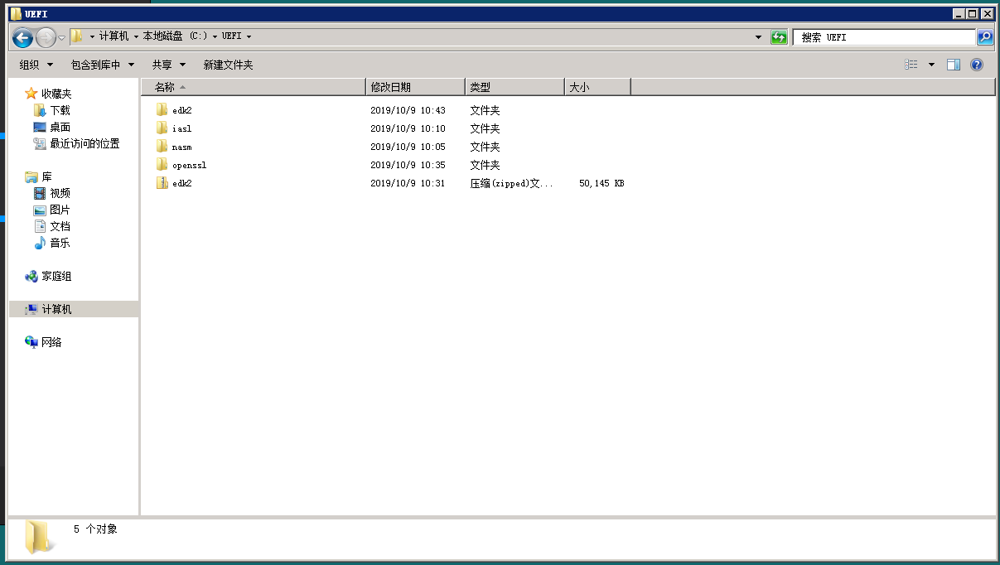
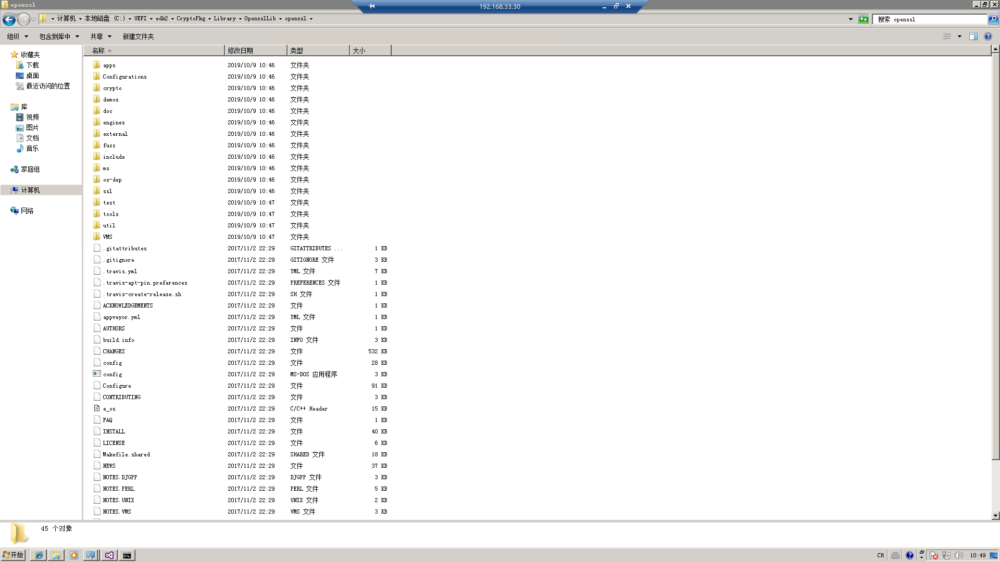
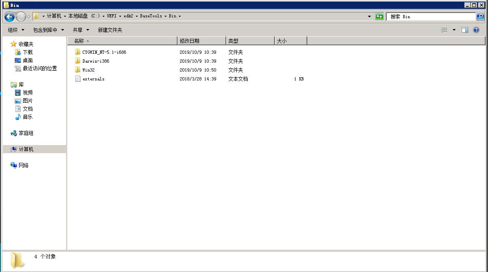
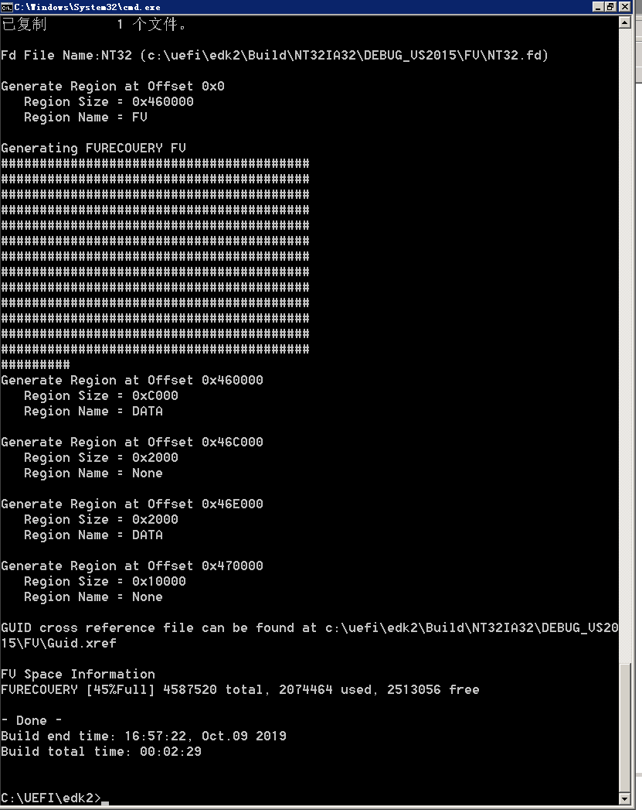

## 概述

不同的厂商对UEFI有不同的实现, 一种比较常用的开源实现是EDK2. EDK2是一个遵循UEFI标准和PI标准的跨平台固件开发环境.
 

EDK2支持多种操作系统, 也支持跨平台编译.
 

## Windows下开发环境配置
 

之前在物理机win10上进行安装, 折腾了一天也没配好环境, 包括wsl全都试过了, 全部以失败告终. 这一次直接开了一个Win7的虚拟机来安装..

 

### 安装开发工具

1. 安装 VS 2015 (VS2017 亦可, 但感觉 VS2015 文件小一点 / VS2019 在 2018 的 EDK2 中无支持, 2019 的 EDK 虽然有支持, 但由于改了很多部分, 网络上并没有对应的教程), 微软把官方的下载链接藏得比较深, 可以看这篇文章 [https://www.cnblogs.com/yilezhu/p/10857134.html](https://www.cnblogs.com/yilezhu/p/10857134.html). 另外安装之前可能需要 [Microsoft .NET Framework 4.6.1](https://www.microsoft.com/zh-CN/download/details.aspx?id=49982)

2. 安装 Python2.7 [https://www.python.org/downloads/release/python-2716/](https://www.python.org/downloads/release/python-2716/). 新建环境变量 `PYTHON_HOME`，值为 `C:\Python27\`

3. 下载 IASL 编译器. [https://acpica.org/downloads/binary-tools](https://acpica.org/downloads/binary-tools)

4. 下载 NASM. [https://www.nasm.us/](https://www.nasm.us/). 往环境变量 `PATH` 中添加 `C:\UEFI\nasm`, 并设置 `NASM_PREFIX=C:\UEFI\nasm\` (`NASM_PREFIX`不设置也可以, 但是会报warning. 如果设置必须设置正确, 一旦填错, 必须把 udk2 文件夹删除干净重来)

5. 下载 Openssl. [http://wiki.overbyte.eu/arch/openssl-1.1.0g-win32.zip](http://wiki.overbyte.eu/arch/openssl-1.1.0g-win32.zip). 往环境变量 `PATH` 中添加 `C:\UEFI\nasm\和C:\UEFI\openssl\`.

6. 下载 edk2 开发包, 解压: [https://codeload.github.com/tianocore/edk2/zip/vUDK2018](https://codeload.github.com/tianocore/edk2/zip/vUDK2018).

此时在根目录下应有这些文件:



7. 生成OPENSSL加密库。从 [https://github.com/openssl/openssl/archive/OpenSSL_1_1_0g.zip](https://github.com/openssl/openssl/archive/OpenSSL_1_1_0g.zip) 下载，下载后解压到 `edk2\CryptoPkg\Library\OpensslLib` 中，重命名为 openssl.



8. 预搭建 base tools。从 [https://github.com/tianocore/edk2-BaseTools-win32](https://github.com/tianocore/edk2-BaseTools-win32) 并解压到 `edk2\BaseTools\Bin`，重命名为 Win32, 注意忽略此步会在接下来的搭建中遇到报错环境变量PYTHON_HOME的问题。



### 配置EDK2开发环境

```bash
cd .\edk2\
.\edksetup.bat
```

之后会在 Conf 目录下建立 target.txt 等文件.

编辑 target.txt. 修改第60行为 `TOOL_CHAIN_TAG = VS2015` , 之后检查 tools_def.txt, 确保编译器路径正确.

### 编译UEFI模拟器和UEFI工程

#### 1. 编译UEFI模拟器

```bash
edksetup.bat rebuild
edksetup.bat --nt32
build
```

之后会看到build成功




 该过程可能会出现脚本去 `C:\Program Files\` 下找 `Windows Kits` 的情况, 但一般 `Windows Kits在C:\Program Files(x86)\` 下, 而 `C:\Program Files\` 中并无此文件夹, 故而导致报错. 此时可以以管理员身份执行 `mklink /j "C:\Program Files\Windows Kits" "C:\Program Files (x86)\Windows Kits"` 创建一个软链接.

之后:

```bash
build run
```


## 历史记录

| Version | Action   | Time        |
| ------- | -------- | ----------- |
| 1.0     | Init     | 2019-10-09  |
| 迁移至 blog     | Init     | 2020-04-25  |