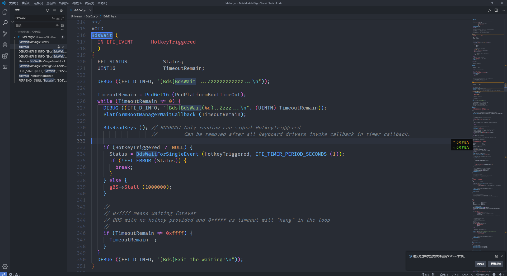

## 修改启动图标

找到路径 `<HOME>\MdeModulePkg\Logo` 下的 logo.bmp 文件, 替换.

重新编译运行.

## 修改启动时间

搜索 "Wait", 找到 `<HOME>\MdeModulePkg\Universal\BdsDxe\BdsEntry.c`, `Line 316`, `BdsWait` 函数. 

可以发现, 倒计时由 `TimeoutRemain` 进行控制, 于是添加一句 `TimeoutRemain = 15;`, 即可将倒计时时间修改为15s;

重新编译运行.

## 历史记录

|Version| Action|Time|
|:-------:|:--------:|:-----------:|
|1.0|Init|2019-10-10 02:38|
|1.0|迁移至 blog |2020-04-26 22:51|