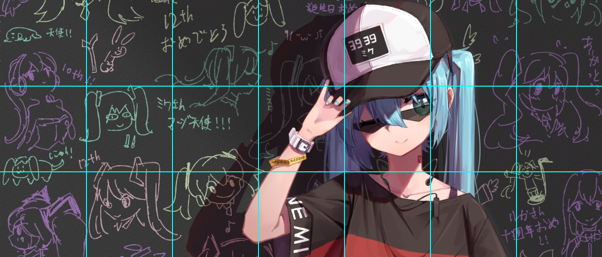
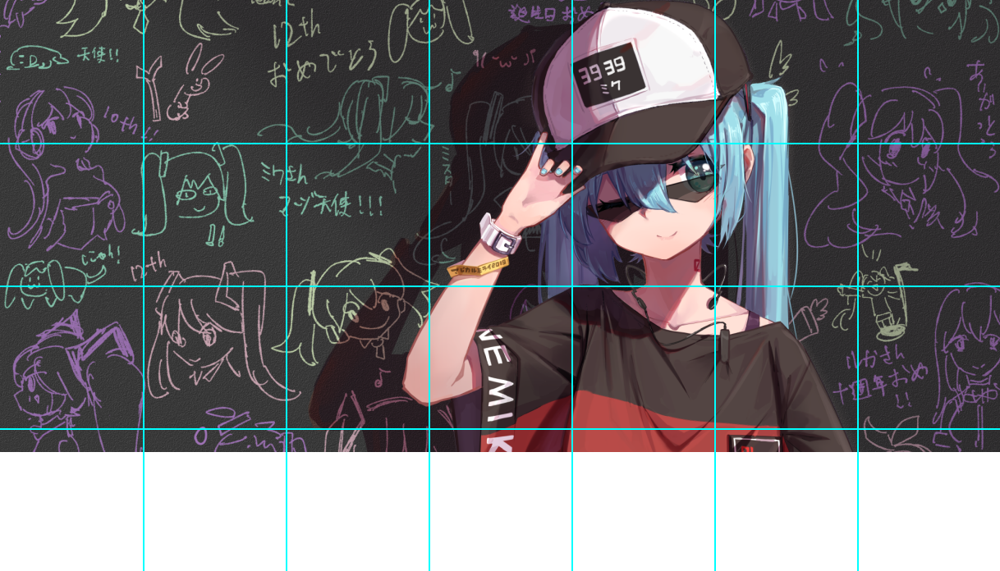

## 前言

项目地址: [https://github.com/acdzh/Github_Organizations_Jigsaw](https://github.com/acdzh/Github_Organizations_Jigsaw)

首先看一下效果: [https://github.com/acdzh](https://github.com/acdzh)


我们要实现的是左下角Organization的拼图效果:


因为涉及内容比较多, 所以拆分成3篇文章来叙述. 本篇主要讲一下原始图像的切割.

## Github 页面上组织的排列规律

首先观察一下 Github 页面上组织头像的排列. 

1. 组织与组织头像的间隔是3px, 头像的边长是25px.
1. 每一行显示7个组织.
1. 最多可以显示25个组织, 在每行7个的前提下, 排列为3行零4个. 当组织数大于25个时, 多余的组织不会显示在页面上. 如下图:


## 工具

编程语言是`Python`, 使用PIL库来完成操作. 依赖安装:

```bash
pip install pillow
```

## 四种不同的切割方式

### 两个选择

#### 1. 是否裁剪原图

首先, 由于每张头像都是正方形, 而一张图片有很大的可能无法被完美地切成正方形的小块, 因此有两种处理方式.

1. 将原图多余的部分切去.
2. 用白边(或者其他颜色)来补全长度.

#### 2. 是否计算空隙

这个很好理解, 很容易发现, Github 在排列组织时, 头像之间是有间隔的. 两种处理:

1. 不考虑间隔, 直接用 `原图长度 / 一行有多少个小图` 来得到每张小图的边长. 这种最终显示会有失真, 表现为小图对接不上. 例如:


2. 考虑间隔, 在裁剪时丢弃间隔部分的内容. 这种方式的好处在于不会失真, 但会损失部分内容. 例如:


### 四种方式的示意图

1. 不考虑间隔, 切除原图部分高度



2. 不考虑间隔, 补全白边



3. 考虑间隔, 切除原图部分高度


4. 考虑间隔, 补全白边


这些配置单独保存在一个python文件`config.py`中

```python
# config.py

config = {
    'pic_path': './test.png', # 源图片路径

    'GITHUB_WIDTH_COUNT': 7,    # github 一行的图片数
    'whether_crop_image_height': False,   # 是否在纵向裁剪图片, 以适应高度 / 否则在底部以白色填充图片高度
    'color_to_fill_in_blank': (255, 255, 255), # 补全图片的背景色
    'whether_with_gap': True, # 裁剪是直接裁剪还是算上图片间的间隔

    'user_name': 'acdzh',
    'passwd': '123456',
    'email': 'example@example.com'
}
```

## 实现: `cut_pic.py`

引入必要的依赖

```python
# cut_pic.py

from math import ceil
from PIL import Image
import os
from config import config
```

### 计算小图边长 `sub_length`

首先获取每行有几个小图

```python
w_count = config['GITHUB_WIDTH_COUNT']
```

不考虑间隔的情况下, 计算`h_count`:

```python
sub_length = int(img.size[0] / 7)
new_width = sub_length * w_count
if config['whether_crop_image_height']:
    # 切割图像 => 向下取整
    h_count = int(img.size[1] / sub_length)
else:
    # 补全白边 => 向上取整
    h_count = ceil(img.size[1] / sub_length)
new_height = sub_length * h_count
```

如果考虑间隔, 就要稍微复杂一点


$$\cfrac{\text{sub\_length}}{\text{gap\_length}} = \cfrac{35}{3}$$

$$\text{sub\_length} * \text{w\_count} + \text{gap\_length} * (\text{w\_count} - 1) = \text{img.size[0]}$$

可以推得:

$$\text{sub\_length} = \cfrac{35 * \text{img.size[0]}}{35 * \text{w\_count} + 3 * \text{w\_count} - 3}$$

$$\text{gap\_length} = \cfrac{\text{sub\_length} * 3}{35} = \cfrac{3 * \text{img.size[0]}}{35 * \text{w\_count} + 3 * \text{w\_count} - 3}$$

对应的代码:

```py
sub_length = int(35 * img.size[0] / (35 * w_count + 3 * w_count - 3))
gap_length = int((sub_length * 3) / 35)
new_width = sub_length * w_count + gap_length * (w_count - 1)
if config['whether_crop_image_height']:
    h_count = int((img.size[1] + gap_length )/ (sub_length + gap_length))
else:
    h_count = ceil((img.size[1] + gap_length )/ (sub_length + gap_length))
new_height = sub_length * h_count + gap_length * (h_count - 1)
```

之后是根据获得的 `new_width` 和 `new_eight` resize图片. 这里先构建出一个新的空白画布, 之后将原图贴上去, 获得新图.

```py
img_t = Image.new('RGBA', (new_width, new_height), config['color_to_fill_in_blank'])
img_t.paste(img)
img = img_t
```

再之后是切割并保存小图. 使用 `img.crop()`, 它接受一个参数, 一个四元组, 分别是小图距原图上, 左, 右, 下的距离.

不考虑间隔的情况:

```python
for x_i in range(0, w_count):
    for y_i in range(0, h_count):
        img_t = img.crop((x_i * sub_length, y_i * sub_length, (x_i + 1) * sub_length, (y_i + 1) * sub_length))
        img_t.save(f'./out/{y_i}-{x_i}.png')
```

考虑间隔的情况:

```python
for x_i in range(0, w_count):
    for y_i in range(0, h_count):
        img_t = img.crop((
            x_i * (sub_length + gap_length), 
            y_i * (sub_length + gap_length), 
            (x_i + 1) * (sub_length + gap_length) - gap_length, 
            (y_i + 1) * (sub_length + gap_length) - gap_length
        ))
        img_t.save(f'./out/{y_i}-{x_i}.png')
```

`cut_pic.py`总的代码如下:

```python
from math import ceil
from PIL import Image
import os
from config import config

def cut_without_gap(img):
    w_count = config['GITHUB_WIDTH_COUNT']
    sub_length = int(img.size[0] / 7)
    new_width = sub_length * w_count
    if config['whether_crop_image_height']:
        h_count = int(img.size[1] / sub_length)
    else:
        h_count = ceil(img.size[1] / sub_length)
    new_height = sub_length * h_count
    img_t = Image.new('RGBA', (new_width, new_height), config['color_to_fill_in_blank'])
    img_t.paste(img)
    img = img_t
    for x_i in range(0, w_count):
        for y_i in range(0, h_count):
            img_t = img.crop((x_i * sub_length, y_i * sub_length, (x_i + 1) * sub_length, (y_i + 1) * sub_length))
            img_t.save(f'./out/{y_i}-{x_i}.png')
    return (h_count, w_count)
    
def cut_with_gap(img):
    w_count = config['GITHUB_WIDTH_COUNT']
    sub_length = int(35 * img.size[0] / (35 * w_count + 3 * w_count - 3))
    gap_length = int((sub_length * 3) / 35)
    new_width = sub_length * w_count + gap_length * (w_count - 1)
    if config['whether_crop_image_height']:
        h_count = int((img.size[1] + gap_length )/ (sub_length + gap_length))
    else:
        h_count = ceil((img.size[1] + gap_length )/ (sub_length + gap_length))
    new_height = sub_length * h_count + gap_length * (h_count - 1)
    img_t = Image.new('RGBA', (new_width, new_height), config['color_to_fill_in_blank'])
    img_t.paste(img)
    img = img_t
    for x_i in range(0, w_count):
        for y_i in range(0, h_count):
            img_t = img.crop((
                x_i * (sub_length + gap_length), 
                y_i * (sub_length + gap_length), 
                (x_i + 1) * (sub_length + gap_length) - gap_length, 
                (y_i + 1) * (sub_length + gap_length) - gap_length
            ))
            img_t.save(f'./out/{y_i}-{x_i}.png')
    return (h_count, w_count)

def cut():
    img = Image.open(config['pic_path'])
    if os.path.exists('./out'):
        for i in os.listdir('./out'):
            os.remove(f'./out/{i}')
    else:
        os.mkdir('./out')
    if config['whether_with_gap']:
        return cut_with_gap(img)
    else:
        return cut_without_gap(img)

if __name__ == "__main__":
    cut()
```

## 历史记录

|Version| Action|Time|
|:-------:|:--------:|:-----------:|
|1.0|Init|2019-12-11 22:16|
|1.0|迁移至 blog|2020-04-27 00:16|