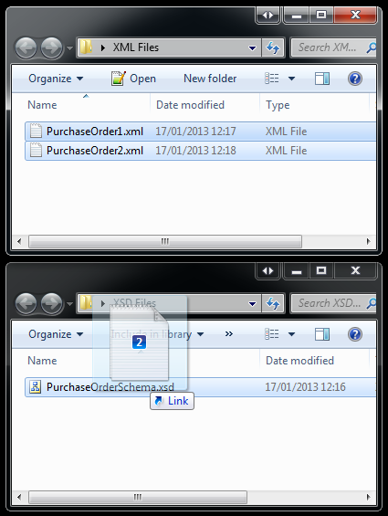

使用 .Net 快速创建 Shell 拖拽处理程序.

## 介绍

Shell 提示信息处理程序是在系统中注册的 DLL, 用来扩展 Shell 中的拖放功能. 您可以使用该扩展使文件成为其他文件的放置目标, 或者使用标准的拖放功能来调用您自己的业务逻辑. 在本文中, 我将向您展示如何使用 .Net 和 `SharpShell`库来创建提示拖放处理扩展.



**上图: 我们将两个 XML 文件拖放到 XSD 文件上, 扩展程序启动, 并显示 'Link'. 用户释放鼠标, 扩展会根据 XSD 来验证 XML 文件, 并在对话框中显示结果.**

## 系列文章

本文是 ".NET Shell扩展" 系列的一部分，其中包括：

1. [.NET Shell扩展-Shell 上下文菜单](https://blog.acdzh.ltd/tec/2020-03/sharpshell_tutorial_1)
2. [.NET Shell扩展-Shell 图标处理程序](https://blog.acdzh.ltd/tec/2020-03/sharpshell_tutorial_2)
3. [.NET Shell扩展-Shell 信息提示处理程序](https://blog.acdzh.ltd/tec/2020-03/sharpshell_tutorial_3)
4. [.NET Shell扩展-Shell 拖拽处理程序](https://blog.acdzh.ltd/tec/2020-03/sharpshell_tutorial_4)
5. [.NET Shell扩展-Shell 预览处理程序](https://blog.acdzh.ltd/tec/2020-03/sharpshell_tutorial_5)
6. [.NET Shell扩展-Shell 图标叠加处理程序](https://blog.acdzh.ltd/tec/2020-03/sharpshell_tutorial_6)
7. [.NET Shell扩展-Shell 缩略图处理程序](https://blog.acdzh.ltd/tec/2020-03/sharpshell_tutorial_7)
8. [.NET Shell扩展-Shell 属性表](https://blog.acdzh.ltd/tec/2020-03/sharpshell_tutorial_8)
9. [.NET Shell扩展-部署 SharpShell 服务](https://blog.acdzh.ltd/tec/2020-03/sharpshell_tutorial_9)

## 第一步: 建立项目

首先, 创建一个新的 C# 类库 (C# Class Library) 项目.

> **提示**: 您可以使用 Visual Basic 而不是 C#. 虽然本文中的源代码是 C#, 但是创建 Visual Basic Shell 扩展的方法是相同的.

在这个例子中, 我们将项目叫做 '` XsdDropHandler`'. 将 'Class1.cs' 文件重命名为 ' XsdDropHandler.cs'.

现在添加下列引用:

1. `System.WIndows.Forms`
2. `System.Drawing`

这些引用被 SharpShell 库的其他部分所需, 例如图标和上下文菜单.

> **提示**: 如果您使用 Nuget 来安装 `SharpShell` (见 "第二步"), 您就不再需要添加这些引用了 - 它们将会被自动添加

## 第二步: 引用 SharpShell

现在我们需要添加核心库 `SharpShell` 的引用. 您可以通过几种不同的方式进行此操作.

### 添加引用

下载文章顶部名为 "SharpShell Library" 的 zip 文件, 并对下载的 SharpShell.dll 添加引用.

> **提示**: 撰写本文时, 本文的下载是正确的. 如果需要最新版本, 请使用 Nuget (如下所述) 或从 [sharpshell.codeplex.com](http://sharpshell.codeplex.com/)获取该库.

### 使用 Nuget

如果已安装 Nuget, 则只需要快速 SharpShell 并直接安装即可. 或者在[https://www.nuget.org/packages/SharpShell](https://www.nuget.org/packages/SharpShell)中获取软件包的详细信息.

### 使用 CodePlex

该页面上的库可能不是最新版本, 但是您可以从 CodePlex 获取最新版本 - 在 SharpShell 的主页上: [https://sharpshell.codeplex.com](https://sharpshell.codeplex.com). Nuget 可以下载最新的稳定版本, 而 CodePlex 有可能有 beta 版本, 文章顶部的链接则是在撰写本是时测试通过的版本.

> **译者注**: 这个项目的 CodePlex 主页已经停用了. 请前往 [Github 主页](https://github.com/dwmkerr/sharpshell)查看最新版本.

## 第三步: 从 SharpDropHandler 继承 (Deriving from SharpDropHandler)

现在, 我们已经建立了项目, 我们可以使类 ` XsdDropHandler` 继承 `SharpDropHandler`. `SharpDropHandler` 是拖拽处理 Shell 扩展的基类, 它将提供所需的所有 COM 管道和互操作 - 我们将仅实现几个抽象成员来提供业务逻辑.

```csharp
public class XsdDropHandler : SharpDropHandler 
{
} 
```
对于拖拽处理程序, 我们必须在派生类中实现基类的两个抽象函数.

### DragEnter

```csharp
protected abstract void DragEnter(DragEventArgs dragEventArgs);
```

当用户选择了一些 Shell 项, 并将其拖拽到您注册过关联的项上面时, `DragEnter` 会被调用. 在我们的例子中, 当用户拖动任何内容到 XSD 文件上时, 就会发生这种情况. 您必须在 `DragEnter` 函数中执行以下操作:

1. 检查拖过来的文件集合 (存在 '`DragItems`' 变量中)
2. 根据您允许的操作, 将 `dragEventArgs.Effect` 变量设置为要允许的效果. (Depending on what drag operations you'll allow, set the `dragEventArgs.Effect` member to the effect you are going to allow.)

因此, 在拖拽处理程序中, 我们需要确保每个被拖动的文件都是 XML 文件. 如果满足的话, 我们就将拖拽效果设置为 'link'.

### Drop

```csharp
protected abstract void Drop(DragEventArgs dragEventArgs);
```

当用户释放鼠标后, 此函数被调用. `DragEventArgs` 记录了一些信息, 例如被按下的键或是当前鼠标位置.

在我们的示例中, 我们将在此函数中打开验证窗口.

## 第四步: 实现 DragEnter

如上所述, 只有当每个文件都是 XML 文件时, `DragEnter` 才允许显示 'link' 效果. 代码:

```csharp
/// <summary>
/// Checks what operations are available for dragging onto the target with the drag files.
/// </summary>
/// <param name="dragEventArgs">The <see cref="System.Windows.Forms.DragEventArgs"/> 
/// instance containing the event data.</param>
protected override void DragEnter(DragEventArgs dragEventArgs) {
    //  Check the drag files - if they're all XML, we can validate them against the XSD.
    dragEventArgs.Effect = 
        DragItems.All(
            di => string.Compare(
                Path.GetExtension(di), 
                ".xml", 
                StringComparison.InvariantCultureIgnoreCase
            ) == 0
        ) ? DragDropEffects.Link : DragDropEffects.None;
}
```

这很简单, 不需要太多解释. 我们使用 Linq 语句 '`ALL`' 验证每个分支上的条件 (扩展名为 XML), 如果为 `true`, 则将拖动效果设置为 link.

## 第五步: 实现 Drop

Drop 更简单, 我们只需要将路径传递给窗体即可.

> **提示**: 请记住, 对于 `SharpDropHandler`, 被拖动的文件从处在属性 '`DragFiles`' 中, 而被拖拽到的文件则存储在属性 '`SelectedItemPath`' 中.

```csharp
/// <summary>
/// Performs the drop.
/// </summary>
/// <param name="dragEventArgs">The <see cref="System.Windows.Forms.DragEventArgs"/> 
///  instance containing the event data.</param>
protected override void Drop(DragEventArgs dragEventArgs) {
    //  Create the validator output form.
    var validatorOutputForm = new ValidationOutputForm 
            {XsdFilePath = SelectedItemPath, XmlFilePaths = DragItems};
    validatorOutputForm.ShowDialog();
}
```

## 第六步: 验证窗口

在这里不做过多详细介绍, 这部分在源代码中的示例 `XsdDropHandler` 中. 从本质上讲, 这是一个非常简单的 WinForms 表单, 其中显示了验证结果列表, 验证结果来自使用 `XmlReader` 读取XML文件并针对提供的模式文件进行验证.

## 第七步: 处理 COM 注册

还有一些事情要做. 首先, 我们必须将 `COMVisible` 属性添加到我们的类中. 这是因为我们的类是 COM 服务, 因此它必须可见.

```csharp
[ComVisible(true)]
public class  XsdDropHandler : SharpDropHandler
```

接下来, 我们必须给这个程序集一个强名称 (strong name). 有很多方式可以实现此需求, 不过我们有一个最好的方法. 为此, 我们需要在项目上单击鼠标右键, 然后点击 "**属性**", 然后转到 "**签名**", 选择 "**为程序集签名**", 单击 "**选择强名称密钥文件**" 下的下拉列表, 选择 "**新建**". 之后新建一个密钥, 您可以根据需要对密钥进行密码保护, 但这不是必需的.

最后一步, 我们需要将我们的扩展与部分 Shell 项的类型关联. 我们可以通过 `COMServerAssociation` 属性来做到这一点:

```csharp
[COMServerAssociation(AssociationType.ClassOfExtension, ".xsd")]
public class  XsdDropHandler : SharpDropHandler 
```

那么, 我们在这一步都做了什么? 我们告诉 SharpShell 当注册这个服务时, 我们希望它与系统中的 XSD 文件类型进行关联. 

您可以与文件夹, 驱动器, 未知文件, 以及特定的扩展名相关联. 有关此功能的完整文档, 请访问[SharpShell CodePlex](http://sharpshell.codeplex.com/)页面上的[COM 服务关联](http://sharpshell.codeplex.com/wikipage?title=COM%20Server%20Associations&referringTitle=Documentation).

> **译者注**: 这个页面已经停止服务了. 文档请访问此 [Github链接](https://github.com/dwmkerr/sharpshell/blob/master/docs/com-server-associations.md).

就这样, 构建该项目将创建 `XsdDropHandler` 程序集. 这个程序集可以注册为 COM 服务, 从而允许您将 XML 文件拖到 XSD 文件上来进行验证. 


## 调试 Shell 扩展

如果您看过 [.Net Shell 扩展 - 上下文菜单](https://zhuanlan.zhihu.com/p/111444537) 一文, 可能会会想起工具 '**Server Manager**'. 这是一个包含在 `SharpShell` 源码中的工具, 可以用来帮助调试 Shell 扩展.

> **提示**: 如果您想要这个工具的最新版本  可以从 CodePlex 页面预先构建

> **译者注**: 请前往 [Github release](https://github.com/dwmkerr/sharpshell/releases) 页面下载. 另外如果使用 scoop 的话, 同样可以在[我的 buckets](https://github.com/acdzh/zpt) 中找到该程序

打开 Server Manager, 然后使用 '**File**' > '**Load Server**' 来加载构建好的的 server 文件（DLL）. 您同样可以直接将 server 文件拖拽进主窗口. 选中这个 server , 右侧将会显示它的一些细节信息. 选中这个服务.

现在按下 '**Test Server**' 或使用 '**Server** > **Test**'. 这将打开测试 Shell, 该 Shell 将模拟将要对服务进行的调用, 就像 Windows Shell正在进行调用一样. 因为这是一个托管应用程序, 因此您可以快速将调试器附加到这个 Shell 上, 然后查看您的服务是怎么运行的. 它可以让你测试你的服务, 而不需要在系统安装或注册它, 这将节省**大量**时间 (当在资源管理器中进行实际测试时, 您将不得不多次重启资源管理器来释放您的 dll, 这样您才可以更新您的 dll 文件).

## 安装和注册 Shell 扩展

您可以查看文章 ".Net Shell 扩展 - 上下文菜单" 中的 "[安装和注册 Shell 扩展](https://zhuanlan.zhihu.com/p/111444537)" 部分, 以获取有关如何安装和注册这些扩展的详细信息, 过程是相同的.

## 历史

* 2013年1月19日: 最新版本

## License

本文以及所有相关的源代码和文件均已获得 [The Code Project Open License（CPOL）](http://www.codeproject.com/info/cpol10.aspx) 的许可.

## 译注

1. 文章来源: [.NET Shell Extensions - Shell Drop Handlers - CodeProject](https://www.codeproject.com/Articles/529515/NET-Shell-Extensions-Shell-Drop-Handlers) 

2. 原文作者: Dave Kerr, A softer Developer from UK. Blog: [www.dwmkerr.com](http://www.dwmkerr.com/), Github: [dwmkerr@Github](https://github.com/dwmkerr)

3. 本文最早发表于 **2013年1月19日**, 截至翻译时最新更新为 **2013年1月19日**, 翻译日期为 **2020年3月7日**. **互联网日新月异, 请注意信息时效**.

4. 文中的代码均测试通过, 文中除了标有 "译者注" 的部分之外均为原文, 译者水平有限, 如有疑惑之处请戳原文或 PM 我, 谢谢茄子. 

5. 纠结了好久, 最终还是决定代码中的英文注释不翻译. 这部分与代码相关较大, 希望能尽量保持原汁原味.

|Version| Action|Time|
|:-------:|:--------:|:-----------:|
|1.0|Init|2020-03-0723:46|
|1.0|迁移至 blog|2020-04-28 20:54|