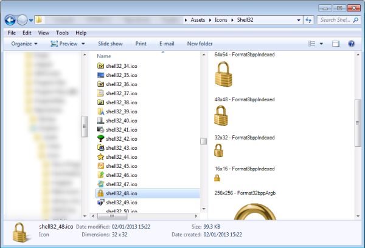

使用 .Net 快速为 Windows 资源管理器或 Outlook 创建 Shell 预览处理程序!

## 介绍

Shell Preview Handler 是在系统中注册的 DLL, 它可以使您直接在 Windows 资源管理器中为选中的项目创建外观丰富的预览. 它们也可以在 Outlook 中使用. 在本文中, 我将向您展示如何使用 .Net 和 `SharpShell`库来创建提示 Preview Handler 扩展.



**上图: 我的机器上充满图表的文件夹. 当选择图标并打开预览窗格后, "图标预览处理程序" 扩展将显示文件中每个图标不同大小的图标图像.**

## 系列文章

本文是 ".NET Shell扩展" 系列的一部分，其中包括：

1. [.NET Shell扩展-Shell 上下文菜单](https://blog.acdzh.ltd/tec/2020-03/sharpshell_tutorial_1)
2. [.NET Shell扩展-Shell 图标处理程序](https://blog.acdzh.ltd/tec/2020-03/sharpshell_tutorial_2)
3. [.NET Shell扩展-Shell 信息提示处理程序](https://blog.acdzh.ltd/tec/2020-03/sharpshell_tutorial_3)
4. [.NET Shell扩展-Shell 拖拽处理程序](https://blog.acdzh.ltd/tec/2020-03/sharpshell_tutorial_4)
5. [.NET Shell扩展-Shell 预览处理程序](https://blog.acdzh.ltd/tec/2020-03/sharpshell_tutorial_5)
6. [.NET Shell扩展-Shell 图标叠加处理程序](https://blog.acdzh.ltd/tec/2020-03/sharpshell_tutorial_6)
7. [.NET Shell扩展-Shell 缩略图处理程序](https://blog.acdzh.ltd/tec/2020-03/sharpshell_tutorial_7)
8. [.NET Shell扩展-Shell 属性表](https://blog.acdzh.ltd/tec/2020-03/sharpshell_tutorial_8)
9. [.NET Shell扩展-部署 SharpShell 服务](https://blog.acdzh.ltd/tec/2020-03/sharpshell_tutorial_9)

## 预览处理程序如何工作

预览处理程序非常酷. 自从 `SharpShell` 增加了对它的支持以来, 我就一直保持预览窗格的打开状态, 并为它们的实用性感到惊讶. 本质上, 当您在资源管理器中选择一个文件并打开预览处理程序时, 系统将执行以下操作:

1. 检查注册表以查看该文件类型是否有预览处理程序.
2. 如果存在, 则创建一个 `prevhost` 进程的实例并加载预览处理程序的 DLL.
3. 实例化对象. 该对象实现了 `IPreviewHandler`.
4. 告诉该对象父窗口以及其大小等信息
5. 通知该对象渲染预览, 并提供文件详细信息 (路径, 文件流或 `IshellItem`)

这是一个非常简单的过程, 预览处理程序的文档也十分详细. 然而, 编写所有的 COM 管道需要大量的平台调用 (P/Invoke), 一个小错误就会导致在资源管理器中引发异常, 并且通常还很麻烦. 而 `SharpShell` 会为您预先实现这些管道, 您所要做的也仅剩创建 UI 和处理逻辑了.

让我们开始创建图标预览处理程序.


## 第一步: 建立项目

首先, 创建一个新的 C# 类库 (C# Class Library) 项目.

> **提示**: 您可以使用 Visual Basic 而不是 C#. 虽然本文中的源代码是 C#, 但是创建 Visual Basic Shell 扩展的方法是相同的.

在这个例子中, 我们将项目叫做 '`IconPreviewHandler`'. 将 'Class1.cs' 文件重命名为 'IconPreviewHandler.cs'.

现在添加下列引用:

1. `System.WIndows.Forms`
2. `System.Drawing`

这些引用被 SharpShell 库的其他部分所需, 例如图标和上下文菜单.

> **提示**: 如果您使用 Nuget 来安装 `SharpShell` (见 "第二步"), 您就不再需要添加这些引用了 - 它们将会被自动添加

## 第二步: 引用 SharpShell

现在我们需要添加核心库 `SharpShell` 的引用. 您可以通过几种不同的方式进行此操作.

### 添加引用

下载文章顶部名为 "SharpShell Library" 的 zip 文件, 并对下载的 SharpShell.dll 添加引用.

> **提示**: 撰写本文时, 本文的下载是正确的. 如果需要最新版本, 请使用 Nuget (如下所述) 或从 [sharpshell.codeplex.com](http://sharpshell.codeplex.com/)获取该库.

### 使用 Nuget

如果已安装 Nuget, 则只需要快速 SharpShell 并直接安装即可. 或者在[https://www.nuget.org/packages/SharpShell](https://www.nuget.org/packages/SharpShell)中获取软件包的详细信息.

## 第三步: 从 SharpPreviewHandler 继承 (Deriving from SharpPreviewHandler)

现在我们已经建立了项目. 使你的类 `IconPreviewHandler` 继承 `SharpPreviewHandler`. `SharpPreviewHandler` 是预览程序 Shell 扩展的基类.

```csharp
public class IconPreviewHandler : SharpPreviewHandler
{
} 
```

对于预览处理程序, 必需在子类中实现基类的一个抽象函数.

### DoPreview

```csharp
protected abstract PreviewHandlerControl DoPreview();
```

`DoPreview` 当类需要为预览创建用户界面时被调用. 它返回一个 `PreviewHandlerControl` - 这仅仅是一个 `UserControl`, 以及一些额外的虚函数. 通常, 将发生下列情况:

1. 子类创建一些用户控件的实例.
2. 用户控件根据 `SelectFilePath` 属性来填充数据.
3. 返回用户控件

这些实际上就是您需要做的.

因此, 对于该项目而言, 添加一个新的用户控件, 并称其为 `IconHandlerPreviewControl`. 将其基类更改为 `PreviewHandlerControl`, 然后将 "`DoPreview`" 功能添加到您的 `IconPreviewHandler` 类中:

```csharp
/// <summary>
/// DoPreview must create the preview handler user interface and initialize it with data
/// provided by the shell.
/// </summary>
/// <returns>
/// The preview handler user interface
/// </returns>
protected override PreviewHandlerControl DoPreview() {
    //  Create the handler control
    var handler = new IconPreviewHandlerControl();
    //  Do we have a file path? If so, we can do a preview
    if(!string.IsNullOrEmpty(SelectedFilePath))
        handler.DoPreview(SelectedFilePath);
    //  Return the handler control
    return handler;
}
```

这里, 我们实际上调用了 `IconHandlerPreviewControl` 的函数 `DoPreview`, 它还没有被实现. 如果您需要细节的话, 可以在文章的顶部获取源码. 不过它非常简单, 可以插入到此处:

```csharp
public void DoPreview(string selectedFilePath) {
    //  Load the icons
    try {
        var multiIcon = new MultiIcon();
        multiIcon.Load(selectedFilePath);
        //  Add the icon images
        foreach (var iconImage in multiIcon.SelectMany(singleIcon => singleIcon))
            iconImages.Add(iconImage);
        //  Add the icons to the control
        AddIconsToControl();
    }
    catch {
        //  Maybe we could show something to the user in the preview
        //  window, but for now we'll just ignore any exceptions.
    }
}
```

我们使用出色的 [IconLib](http://www.codeproject.com/Articles/16178/IconLib-Icons-Unfolded-MultiIcon-and-Windows-Vista) 库加载图标, 然后存储每个对象. 之后调用 `AddIconsToControl` 函数将它们实际添加至 UI:

```csharp
private void AddIconsToControl()
{
    //  Go through each icon, keep track of y pos
    int yPos = 12;
    foreach (var iconImage in iconImages) {
        //  Create the description
        var descriptionLabel = new Label {
            Location = new Point(12, yPos),
            Text = string.Format("{0}x{1} - {2}",
                   iconImage.Size.Width, iconImage.Size.Height, iconImage.PixelFormat),
            AutoSize = true,
            BackColor = Color.White
        };
        yPos += 20;
 
        //  Create the picture box
        var pictureBox = new PictureBox {
            Location = new Point(12, yPos),
            Image = iconImage.Icon.ToBitmap(),
            Width = iconImage.Size.Width,
            Height = iconImage.Size.Height
        };
        yPos += iconImage.Size.Height + 20;
        panelImages.Controls.Add(descriptionLabel);
        panelImages.Controls.Add(pictureBox);
 
        //  Keep track of generated labels
        generatedLabels.Add(descriptionLabel);
    }
}
```

其他的一些成员变量在这里不再赘述. 上面的部分是核心功能 - 遍历每个图标图像并创建一个描述它的标签和一个包含图像的图片框.

## 第四步: 处理 COM 注册

还有一些事情要做. 首先, 我们必须将 `COMVisible` 属性添加到我们的类中. 这是因为我们的类是 COM 服务, 因此它必须可见.

```csharp
[ComVisible(true)]
public class IconPreviewHandler : SharpPreviewHandler
```

接下来, 我们必须给这个程序集一个强名称 (strong name). 有很多方式可以实现此需求, 不过我们有一个最好的方法. 为此, 我们需要在项目上单击鼠标右键, 然后点击 "**属性**", 然后转到 "**签名**", 选择 "**为程序集签名**", 单击 "**选择强名称密钥文件**" 下的下拉列表, 选择 "**新建**". 之后新建一个密钥, 您可以根据需要对密钥进行密码保护, 但这不是必需的.

最后一步, 我们需要将我们的扩展与部分 Shell 项的类型关联. 我们可以通过 `COMServerAssociation` 属性来做到这一点:

```csharp
[COMServerAssociation(AssociationType.ClassOfExtension, ".ico")]
[DisplayName("Icon Preview Handler")]
public class IconPreviewHandler : SharpPreviewHandler 
```

那么, 我们在这一步都做了什么? 我们告诉 SharpShell 当注册这个服务时, 我们希望它与系统中的 `icofile` 类型进行关联. 

您可以与文件夹, 驱动器, 未知文件, 以及特定的扩展名相关联. 有关此功能的完整文档, 请访问[SharpShell CodePlex](http://sharpshell.codeplex.com/)页面上的[COM 服务关联](http://sharpshell.codeplex.com/wikipage?title=COM%20Server%20Associations&referringTitle=Documentation).

> **译者注**: 这个页面已经停止服务了. 文档请访问此 [Github链接](https://github.com/dwmkerr/sharpshell/blob/master/docs/com-server-associations.md).

我们也设置了 `DispalyName` 属性. `DisplayName` 会被注册在注册表中. 如果处理程序失败, 也会使用到它 (在预览窗格里显示 "图标预览处理程序无法加载" 或类似内容的消息).

就这样, 构建该项目将创建 `IconPreviewHandler` 程序集. 这个程序集可以注册为 COM 服务, 从而允许您快速查看 ico 文件包含的图像. 

## 高级特性

`PreviewHandlerControl` 类包含下列虚函数:

```csharp
/// <summary>
/// Sets the color of the background, if possible, to coordinate with the windows
/// color scheme.
/// </summary>
 /// <param name="color">The color.</param>
protected virtual void SetVisualsBackgroundColor(Color color){}
 
/// <summary>
/// Sets the color of the text, if possible, to coordinate with the windows
/// color scheme.
/// </summary>
/// <param name="color">The color.</param>
protected virtual void SetVisualsTextColor(Color color){}
 
/// <summary>
/// Sets the font, if possible, to coordinate with the windows
/// color scheme.
/// </summary>
/// <param name="font">The font.</param>
protected virtual void SetVisualsFont(Font font){}
```

您可以重写它们来改变您 UI 的颜色和字体, 以匹配当前系统主题中自定义的颜色和字体.

## 调试 Shell 扩展

如果您看过 [.Net Shell 扩展 - 上下文菜单](https://zhuanlan.zhihu.com/p/111444537) 一文, 可能会会想起工具 '**Server Manager**'. 这是一个包含在 `SharpShell` 源码中的工具, 可以用来帮助调试 Shell 扩展.

> **提示**: 如果您想要这个工具的最新版本  可以从 CodePlex 页面预先构建

> **译者注**: 请前往 [Github release](https://github.com/dwmkerr/sharpshell/releases) 页面下载. 另外如果使用 scoop 的话, 同样可以在[我的 buckets](https://github.com/acdzh/zpt) 中找到该程序

打开 Server Manager, 然后使用 '**File**' > '**Load Server**' 来加载构建好的的 server 文件（DLL）. 您同样可以直接将 server 文件拖拽进主窗口. 选中这个 server , 右侧将会显示它的一些细节信息. 选中这个服务.

现在按下 '**Test Server**' 或使用 '**Server** > **Test**'. 这将打开测试 Shell, 该 Shell 将模拟将要对服务进行的调用, 就像 Windows Shell正在进行调用一样. 因为这是一个托管应用程序, 因此您可以快速将调试器附加到这个 Shell 上, 然后查看您的服务是怎么运行的. 它可以让你测试你的服务, 而不需要在系统安装或注册它, 这将节省**大量**时间 (当在资源管理器中进行实际测试时, 您将不得不多次重启资源管理器来释放您的 dll, 这样您才可以更新您的 dll 文件).

## 安装和注册 Shell 扩展

您可以查看文章 ".Net Shell 扩展 - 上下文菜单" 中的 "[安装和注册 Shell 扩展](https://zhuanlan.zhihu.com/p/111444537)" 部分, 以获取有关如何安装和注册这些扩展的详细信息, 过程是相同的.

## 有用的资源

[Building Preview Handlers](http://msdn.microsoft.com/en-us/library/windows/desktop/cc144139): MSDN 上关于 Shell 扩展的页面. 注意, 有很少的一部分是关于提示信息处理程序的.

[CodePlex上的SharpShell](http://sharpshell.codeplex.com/): `SharpShell` 项目的所在地-包括文档，讨论以及最新的源代码和发行版. (译者注: 已迁移至 [Github](https://github.com/dwmkerr/sharpshell))

## What's Next?

随着时间的推移, SharpShell 将提供一种使用 .Net 创建所有可用 Shell 扩展的机制. 到目前为止, 上下文菜单扩展, 图标处理程序和信息提示处理程序已完全受支持 - follow CodePlex项目以在添加新功能时保持最新状态.

## 历史

* 2014年5月20日: 最新版本

## License

本文以及所有相关的源代码和文件均已获得 [MIT 许可证](http://www.opensource.org/licenses/mit-license.php)许可.

## 译注

1. 文章来源: [.NET-Shell-Extensions-Shell-Preview-Handlers - CodeProject](https://www.codeproject.com/Articles/533948/NET-Shell-Extensions-Shell-Preview-Handlers) 

2. 原文作者: Dave Kerr, A softer Developer from UK. Blog: [www.dwmkerr.com](http://www.dwmkerr.com/), Github: [dwmkerr@Github](https://github.com/dwmkerr)

3. 本文最早发表于 **2014年5月20日**, 截至翻译时最新更新为 **2014年5月21日**, 翻译日期为 **2020年3月8日**. **互联网日新月异, 请注意信息时效**.

4. 文中的代码均测试通过, 文中除了标有 "译者注" 的部分之外均为原文, 译者水平有限, 如有疑惑之处请戳原文或 PM 我, 谢谢茄子. 

5. 纠结了好久, 最终还是决定代码中的英文注释不翻译. 这部分与代码相关较大, 希望能尽量保持原汁原味.

|Version| Action|Time|
|:-------:|:--------:|:-----------:|
|1.0|Init|2020-03-08 15:47|
|1.0|迁移至 blog|2020-04-28 20:54|