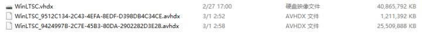
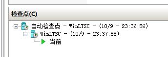
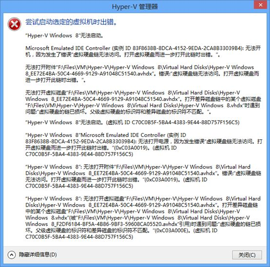
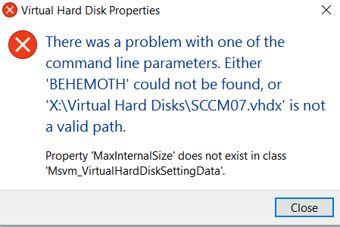
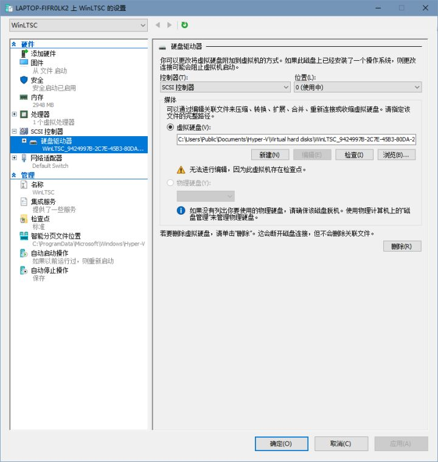
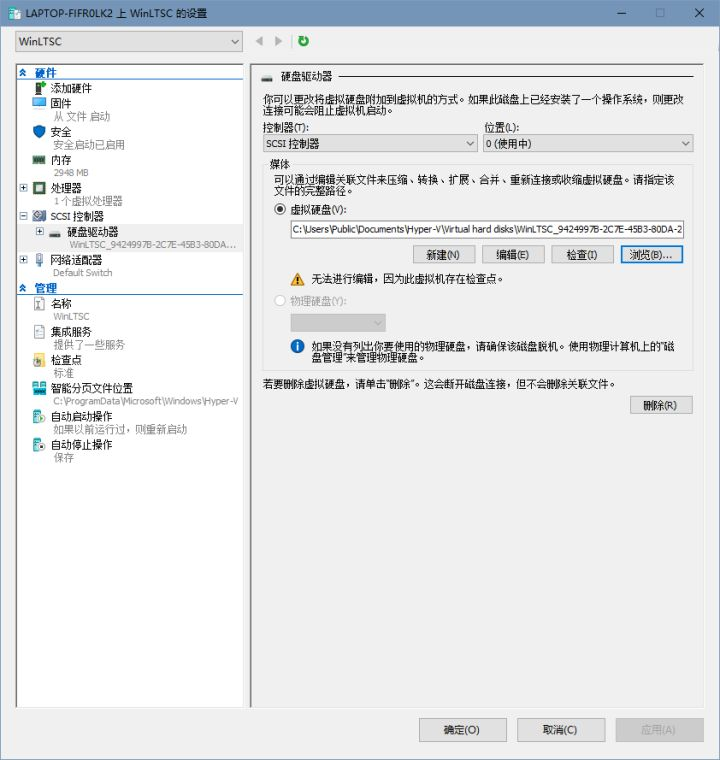

> 这是一篇水文, 仅作记录之用

本文最后修改于 2020-03-01 03:48, 互联网日新月异, 请注意内容时效.

刚刚想在 tim 里搜索一个月前发过的一条消息, 结果搜索结果是空的. 去消息管理器中看了一眼, 发现从 2019 年 10 月份, 到 2 月 15 日左右的消息全都不见了. (具体时间未作记录, 不过也差不多.

回想了一下, 之前 tim 一直在 Hyper-v 虚拟机里, 2 月15 日左右, 我在物理机上装了 tim, 并打算把数据迁移出来. 虚拟机的 C 盘通过文件共享映射到了物理机的 Z 盘, 本来打算直接复制文件夹 `Z:\Users\xxx\Documents\Tencent Files` 至物理机下同样位置, 然后当时嫌这样太慢, 于是直接把虚拟机的虚拟磁盘挂载到物理机上了.



问题就出在这里..当时一时糊涂, 直接把 `WinLTSC.vhdx` 直接挂上了..这个虚拟机有两个快照, `WinLTSC.vhdx` 中的文件实际上停留在了去年 10 月份....换句话说, 我迁移的文件实际上是去年 10 月份的版本...而在差异磁盘中的新版本被我忽视了...



ok, 那就启动虚拟机, 把较新的文件迁移出来就 ok 了. 不过问题来了, 另两个差异虚拟磁盘文件连不上父虚拟磁盘了.....

启动虚拟机会有磁盘错误:



当时没有截图, 此为网图

emmm.. 因为挂载, WinLTSC.vhdx 的id变掉了 (哪怕是仅读取也不行), 所以其子磁盘指向它的链断掉了....

遂去该文件夹尝试手动把链挂上:

```bash
sudo set-vhd -Path '.\WinLTSC_9512C134-2C43-4EFA-8EDF-D398DB4C34CE.avhdx' -ParentPath '.\WinLTSC.vhdx'
```

结果gg:

> set-vhd : 无法为虚拟磁盘设置新的父磁盘。 在差异虚拟硬盘和父磁盘之间存在 ID 不匹配。

看来这是行不通了.

去 Hyper-v 虚拟机设置里, 对磁盘进行检查, 结果报错找不到磁盘



网图

网上的解决方案大多都是让点击检查, 之后根据检测结果的提示, 进行重新连接....显然这么是行不通的......比如这个

[Hyper-V初涉_虚拟磁盘链错误的解决方案 - 绝对零度0o - 博客园](https://www.cnblogs.com/Abs-Zero/p/hyper-V-5-how-to-deal-with-disk-error.html)
​
实际上, 对磁盘进行检查是没有必要的..想要重新连接的话, 直接编辑就可以了, 没必要等检查的结果出来, 根据建议跳转到编辑选项卡.

但是一般情况下编辑是被禁止的 (这也是其他人的文章要求进行检查的原因):



这时候点击浏览, 随便换一块磁盘, 之后再换回来, 编辑就为可用状态了.



之后进行重新链接即可.

当然最重要的还是, 如果一块虚拟磁盘已经有了子差异磁盘, 就不要在虚拟机外对其进行操作了.

## 历史记录

|Version| Action|Time|
|:-------:|:--------:|:-----------:|
|1.0|Init|2020-03-01|
|1.0|迁移至 blog|2020-04-28 18:43|