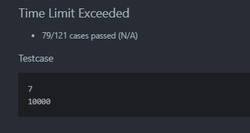
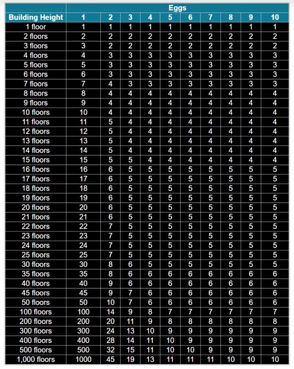

[10. 鸡蛋掉落 - 力扣 leetcode-cn.com](https://leetcode-cn.com/problems/super-egg-drop/)

Google的面试题, 网上的题解太多了, 所以这篇文章就不做题解之用了. 主要是这里遇到的反向 dp 有点意思, 记录一下.


以下:

K: 鸡蛋总数, k: 鸡蛋数

N: 楼层总数, n: 楼层数, f: 某一楼层

T: 所需总次数, t: 次数

## 1. dp[鸡蛋数][楼层数] = (所需要的最少)次数

正常人第一想法, 叙述一下实现

### 初始条件

如果鸡蛋只有 1 个, 楼层为 n, 显然所需要的次数 $dp[1][n] = n$.

如果鸡蛋有 k 个, 楼层只有 1 层, 显然 $dp[k][1] = 1$.

### 递推实现

对于 k 个鸡蛋, n 层楼而言, 我们先引入一个函数 $timesWhenFromF(f)$ , 简写 $Twf(f)$ . 它的意思是, 如果我们的第一个鸡蛋从 $f$ 层扔下的话 $(0<f<n)$ , 所需要的总次数.

我们的第一个鸡蛋可以从第一层扔下, 也可从第 n 层扔下, 我们需要取最佳做法, 也就是要使得 $Twf(f)$ 最小. 因此我们取 $f_0$ 使得 当 $f = f_0$ 时, $Twf(f)$ 最小. 即:

$$
Twf(f_0) = min\{Twf(1), Twf(2), ... , Twf(n)\}
$$

那么, 显然, $dp[k][n] = Twf(f_0)$


下面的问题是, $Twf()$ 怎么实现呢?

现在让第一个鸡蛋从第 $f$ 层扔下, 分类讨论一下:

1. **假如鸡蛋碎掉了**, 则蛋数退化为 $k-1$ ,楼层数退化为 $f-1$ , 还需要的次数: $timesIFBreak  = dp[k-1][f-1]$

2. **假如鸡蛋没有碎**, 则蛋数不变, 楼层数退化为 $n-f$ , 仍需要的次数: $timesIFNotBreak = dp[k][n-f]$

两种情况取最坏一种, 再加上我们已经用掉的一次, 即

$$
Twf(f) = max\{timesIFBreak, timesIFNotBreak\} + 1 = max\{dp[k-1][f-1], dp[k][n-f]\}+1
$$

返回即可.

下面是具体的实现代码;

```go
func max(a, b int) int {
	if a > b {
		return a
	}
	return b
}

func timesWhenFromF(k, n, f int, dp [][]int) int {
	timesIFBreak := dp[k-1][f-1]
	timesIFNotBreak := dp[k][n-f]
	return max(timesIFBreak, timesIFNotBreak) + 1
}

func best(k, n int, dp [][]int) int {
	minTimes := 10000
	for f := 1; f <= n; f++ {
		t := timesWhenFromF(k, n, f, dp)
		if t < minTimes {
			minTimes = t
		}
	}
	return minTimes
}

func superEggDrop(K, N int) int {
	dp := make([][]int, K+1)
	for k := 0; k < K+1; k++ {
		dp[k] = make([]int, N+1)
		dp[k][1] = 1
	}
	for n := 0; n < N+1; n++ {
		dp[1][n] = n
	}
	for n := 2; n < N+1; n++ {
		for k := 2; k < K+1; k++ {
			dp[k][n] = best(k, n, dp)
		}
	}
	return dp[K][N]
}
```

看起来没什么问题, 运行起来也没什么问题. 但是 leetcode 会超时......



如果我们看一眼别人算出来的结果的话, 会发现 dp 增长得极为缓慢... 遍历填 dp 是一件很蛋痛的事.....




所以需要改进一下算法, 既然楼层涨幅大, 就让楼层来做 dp 的内容


## 2. dp[蛋数][次数] = (所能验证的最大)楼层数

### 初始条件

一个蛋, 验证 $dp[1][t] = t$ 次, $dp[1][t] = t$

k 个蛋, 验证 1 次, $dp[k][1] = 1$

### 递推条件

增加一次试验次数, 鸡蛋在某楼层扔下, 结合以后的实验, 能验证的楼层数可以分为三部分

当前楼层: 1

之下的楼层数: $dp[k-1][t-1]$

之上的楼层数: $dp[k][t-1]$

即: $dp[k][t] = dp[k][t-1] + dp[k-1][t-1] +1$

现在我们已知 $k = K$ , 要求一个 $t$ 使得 $dp[K][t] \geq N$ , 很容易写出代码 (让 $t$ 一直增加, 试就完事了):

```go
func superEggDrop(K, N int) int {
	dp := make([][]int, K+1)
	for i := 0; i < K+1; i++ {
		dp[i] = make([]int, N+1)
		dp[i][1] = 1
	}
	for t := 1; ; t++ {
		dp[1][t] = t
		for k := 2; k < K+1; k++ {
			dp[k][t] = dp[k-1][t-1] + dp[k][t-1] + 1
		}
		if dp[K][t] >= N {
			return t
		}
	}
	return 0
}

func superEggDrop(K, N int) int {
	dp := make([]int, K+1)
	t := 0
	for ; dp[K] < N; t++ {
		for k := K; k > 0; k-- {
			dp[k] = dp[k] + dp[k-1] + 1 // using old data(dp's data times is t-1 before overwrite)
		}
		fmt.Println(t, dp)
	}
	return t
}
```


让 dp 原地更新

现在每次更新 dp 时, dp 里面还存着次数是 (t-1) 时候的旧数据. 对于新的 dp[i] 来说, dp[i] 需要旧的 dp[i] 和 dp[i-1] 的数据, 所以只能从后向前更新. 否则旧数据就被覆盖掉了.

时间复杂度: $O(K\sqrt{N})$

空间复杂度: $O(K+1) = O(K)$

over.


## 历史记录

|Version| Action|Time|
|:-------:|:--------:|:-----------:|
|1.0|Init|2020-04-11 00:00|
|1.0|迁移至 blog|2020-04-28 22:46|