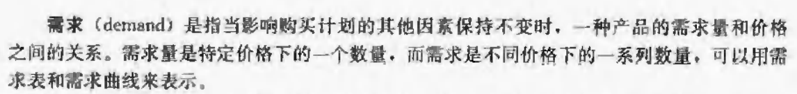
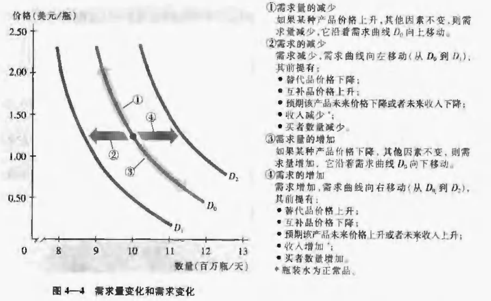

[lecture - SEE.ch02.lecture.pdf](files/2020/04/SEE.ch02.lecture.pdf)

## Goal

1. Distinguish between quantity demanded and demand, and explain what determines demand.
2. Distinguish between quantity supplied and supply, and explain what determines supply.
3. Explain how demand and supply determine price and quantity in a market, and explain the effects of changes in demand and supply.

## 2.1 Demand

### 2.1.1 Law of Demand

price down -> demand up

### 2.1.2 Demand Schedule & Demand Curve

**Demand**: the relationship between the quantity demanded and the price of a good when all other influences on buying plans remain the same.

**Quantity demanded**: the amount of a good, service, or resource that people are willing and able to buy during a specified period at a specified price.

**Demand Schedule**: 

### 2.1.3 Individual D. and Market D.

Market D. = the sum of individual D.

### 2.1.4 Changes in D.

因素:

* 价格
* 收入
* 预期
* 购买者数量
* 偏好

替代品变化相反, 互补品变化相同.

#### 收入
正常品 (normal good): 收入增加买的更多.
劣等品 (inferior good): 收入增加买的更少.

#### 预期

预期价格增加 -> 需求增加.
预期收入增加 -> 需求增加.

#### 买者数量

买者多 -> 需求量大.

#### 偏好

个人因素. 或者新产品(等)改变人们偏好.

### 总结

## 2.2 Supply

**Quantity supplied** is the amount of a good, service, or resource that people are **willing and able** to **sell** during a specified period at a specified price.

### 2.2.1 The Law of Supply

price ↓ -> supply ↓

### 2.2.2 S. Schedule & S. Curve

### 2.2.3 Individual S. and Market S.

Market S. = the sum of individual S.

### Changes in S.

A change in supply is a change in the quantity that suppliers plan to sell when any influence on selling plans other than the price of the good changes. A change in supply means that there is a new supply schedule and a new supply curve.

因素:

####  相关产品的价格

生产性替代品变化相反. 生产性互补品变化相同.

#### 资源和其他投入的价格

资源和其他投入的价格增加 -> 供给减少.

#### 预期

预期价格增加 -> 供给增加.

#### 销售者的数量

销售者数量越多, 供给量越大.

#### 生产率

生产率增加, 成本降低, 供给增加.

### 总结

## 2.3 Market Equilibrium 市场均衡

市场均衡: 需求 = 供给 (此时的价格 => 均衡价格, 此时交易的数量 => 均衡数量)

### 2.3.1 Price: A Market’s Automatic Regulator (调节器)


短缺 / 超额需求, 价格上升
过剩 / 超额供给, 价格下降


### 2.3.2 需求变化的影响

### 2.3.3 供给变化的影响

## 历史记录

|Version| Action|Time|
|:-------:|:--------:|:-----------:|
|1.0|Init|2020-04-30 00:14|
|1.1|补充完整|2020-05-06 22:13|