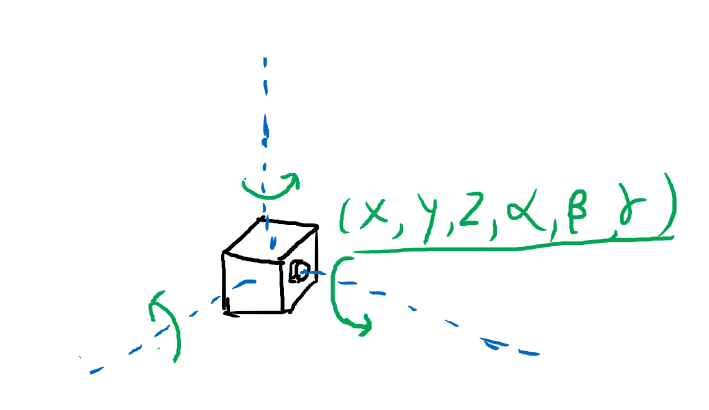

### 其他

#### 改进摄像机

我们之前实现的摄像机十分简陋, 其中视野范围是直接在空间中划定了一个矩形来描述的. 我们这里将这个描述改为更合理的两个参数: [FOV](https://en.wikipedia.org/wiki/Field_of_view) 和屏幕比例 `aspect`.

这是 Minecraft 在不同 FOV 下的视觉效果:

FOV: 60°


FOV: 110°


通过这两个参数我们可以计算出之前定义的参数:

```ts
constructor(origin: Vec3, vfov: number, aspect = 2) {
  const θ = (vfov * Math.PI) / 180;
  const harfHeight = Math.tan(θ / 2);
  const harfWidth = harfHeight * aspect;

  this.origin = origin;
  this.leftBottom = new Vec3(-harfWidth, -harfHeight, -1).add(origin);
  this.vertical = new Vec3(0, harfHeight * 2, 0);
  this.horizontal = new Vec3(harfWidth * 2, 0, 0);
}
```

修改一下摄像机的定义

```ts
const camera = new Camera(new Vec3(0, 0, 1), 60, 2);
```


下一步是相机的方向. 我们已经有了相机的位置, 因为三维空间的自由度是 6, 因此要完全确定相机的姿态, 还需要另外三个角度数值, 如下图所示



但是通过旋转角度来定义太不直观了, 写起来也难写. 我们用两外一种方式来确定姿态. 我们用两个向量, 一个是相机的朝向, 也是相机所在平面的法线向量, 这个向量确定了两个自由度, 另外再用一个向量来指定相机的 "上" 方向, 这个向量确定了最后一个自由度. 这两个向量共同确定了相机平面的一个垂直平面, 相机的姿态就可以确定下来了.


修改后的代码如下

```ts
  constructor(origin: Vec3, lookto: Vec3, vup: Vec3, vfov: number, aspect = 2) {
    const θ = (vfov * Math.PI) / 180;
    const harfHeight = Math.tan(θ / 2);
    const harfWidth = harfHeight * aspect;

    const front = lookto.sub(origin).unitVec();
    const right = Vec3.cross(front, vup).unitVec();
    const up = Vec3.cross(right, front).unitVec();

    this.origin = origin;

    this.vertical = up.mul(harfHeight * 2);
    this.horizontal = right.mul(harfWidth * 2);
    this.leftBottom = origin.sub(up.mul(harfHeight)).sub(right.mul(harfWidth)).add(front);
  }
```

```ts
const camera = new Camera(
  new Vec3(-2,2,1),
  new Vec3(0,0,-1),
  new Vec3(0,1,0),
  90,2
);
```


### 平面

下面放个大球当地面多少还是有点奇怪, 我们可以再做一个平面的形状放在下面. 平面可以由一个点和一条法线向量来确定.

```ts
export default class Plane implements Hitable {
  origin: Vec3;
  normal: Vec3;
  material: Material;

  constructor(origin: Vec3, normal: Vec3, material: Material) {
    this.origin = origin;
    this.normal = normal.unitVec();
    this.material = material;
  }

  hit(ray: Ray, t_min: number, t_max: number): HitResult {
    const nd = Vec3.dot(this.normal, ray.direction);
    if (nd === 0) {
      return null;
    }
    const t = -1 * Vec3.dot(this.normal, ray.origin.sub(this.origin)) / nd;

    if (t < t_min || t > t_max) {
      return null;
    }

    const p = ray.getPoint(t);
    const hit = new HitRecord(t, p, Vec3.dot(ray.direction, this.normal) < 0 ? this.normal : this.normal.mul(-1));
    const [rayOut, attenuation] = this.material.scatter(ray, hit);
    return [hit, rayOut, attenuation];
  }
}
```


### 景深与光圈

最后实现的功能是散焦模糊 (Defocus Blur), 也被称作是*景深*. 摄像机的散焦会受到物距与光圈大小的影响, 不在镜头焦点上的物体会有一定的模糊, 我们可以近似地模拟这种现象.


由上图可知, 弥散的程度与光圈大小和焦距有关. 我们新增两个属性: `aspect` 和 `focusDist` 分别来表示这两个量. 后者则默认取一半 `origin` 和 `lookto` 之间的距离.

我们先放一个生成平面单位圆内随机向量的函数在这里, 待会要用到:

```ts
// get a Vec(a, b, 0) that: a ∈ (-1, 1) && b ∈ (-1, 1) & a^2 + b^2 < 1
function randomInUnitDist(): Vec3 {
  while (true) {
    let p = (new Vec3(Math.random(), Math.random(), 0)).mul(2).sub(new Vec3(1, 1, 0))
    if (Vec3.dot(p, p) < 1) return p;
  }
};
```

我们没有必要去完全模拟真实的镜头内部 (况且我们成像都是在镜头前侧成的), 只要能模拟成像效果即可. 在之前的模型中, 我们的光线是从一个点发出的, 现在我们改一下, 让光线从一个圆发出.

另外, 之前的成像屏是在一个固定的位置 (可以回去看看旧的 `Camera` 的 `getRay` 方法实现), 现在我们为了偷懒, 直接把成像屏放在 `lookto` 处. 然后给光线的方向添加随机扰动, 全部代码如下:

```ts
export default class Camera {
  origin: Vec3;
  vertical: Vec3;
  horizontal: Vec3;
  leftBottom: Vec3;

  lensRadius:number
  focusDist:number

  front: Vec3; // w
  right: Vec3; // u
  up: Vec3; // v

  constructor(origin: Vec3, lookto: Vec3, vup: Vec3, vfov: number, aspect = 2, aperture:number, focuDist?: number) {
    const θ = (vfov * Math.PI) / 180;
    const harfHeight = Math.tan(θ / 2);
    const harfWidth = harfHeight * aspect;

    this.front = lookto.sub(origin).unitVec();
    this.right = Vec3.cross(this.front, vup).unitVec();
    this.up = Vec3.cross(this.right, this.front).unitVec();

    this.origin = origin;
    this.lensRadius = aperture / 2;
    this.focusDist = focuDist ? focuDist : origin.sub(lookto).length();
    this.vertical = this.up.mul((harfHeight * 2) * this.focusDist);
    this.horizontal = this.right.mul((harfWidth * 2) * this.focusDist);
    this.leftBottom = origin
    .sub(this.vertical.mul(0.5))
    .sub(this.horizontal.mul(0.5))
    .add(this.front.mul(this.focusDist));
  }

  getRay(x: number, y: number): Ray {
    const rd  = randomInUnitDist().mul(this.lensRadius)
    const offset = this.right.mul(rd.e0).add(this.up.mul(rd.e1))

    return new Ray(
      this.origin.add(offset),
      this.leftBottom
        .add(this.horizontal.mul(x))
        .add(this.vertical.mul(y))
        .sub(this.origin)
        .sub(offset)
    );
  }
}
```


### 最终效果图实现

为保证不同 worker 里随机数的一致性, 我们使用自己的随机函数:

```ts
function random(seed: number) {
  return parseFloat(`0.${ Math.sin(seed).toString().substr(6)}`);
}
```

之后创建一个场景.

```ts
function createSence(): Hitable {
  const list: Hitable[] = new Array(20)
    .fill(0)
    .map((v, _a) =>
      new Array(20).fill(0).map((v, _b) => {
        const a = _a - 11;
        const b = _b - 11;
        const choose_mat = random(a * 310 + b);
        const center = new Vec3(a + 0.9 * random(a * 311 + b), 0.2, b + 0.9 * random(a * 312 + b));
        if (center.sub(new Vec3(4, 0.2, 0)).length() > 0.9) {
          if (choose_mat < 0.4) {
            return new Sphere(
              center,
              0.2,
              new Lambertian(
                new Vec3(
                  random(a * 313 + b) * random(a * 314 + b),
                  random(a * 315 + b) * random(a * 316 + b),
                  random(a * 317 + b) * random(a * 318 + b)
                )
              )
            );
          } else if (choose_mat < 0.7) {
            return new Sphere(
              center,
              0.2,
              new Metal(
                new Vec3(0.5 * random(a * 319 + b), 0.5 * (1 + random(a * 320 + b)), 0.5 * (1 + random(a * 321 + b))),
                0.5 * (1 + random(a * 322 + b))
              )
            );
          } else {
            return new Sphere(center, 0.2, new Dielectric(new Vec3(1, 1, 1), 1.5));
          }
        }
      })
    )
    .reduce((a, b) => a.concat(b))
    .filter(i => i);

  list.push(new Sphere(new Vec3(4, 1, 0), 1, new Metal(new Vec3(0.7, 0.6, 0.5), 0)));
  list.push(new Sphere(new Vec3(-4, 1, 0), 1, new Lambertian(new Vec3(0.4, 0.2, 0.1))));
  list.push(new Sphere(new Vec3(0, 1, 0), 1, new Dielectric(new Vec3(1, 1, 1), 1.5)));
  list.push(new Sphere(new Vec3(0, -1000, 0), 1000, new Lambertian(new Vec3(0.5, 0.5, 0.5))));

  return new HitList(list);
}

const world = createSence();
```

再放一个摄像机(我不喜欢景深, 在这里没有开)

```ts
const camera = new Camera(new Vec3(9, 1.1, 2), new Vec3(0, 0.6, -1), new Vec3(0, 1, 0), 30, 2, 0);
```

这样效果图就渲染出来了:


## 历史记录

|Version| Action|Time|
|:-------:|:--------:|:-----------:|
|1.0|Init|2021-03-18 15:39:22|
