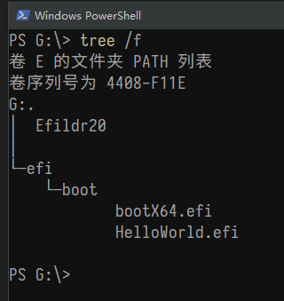
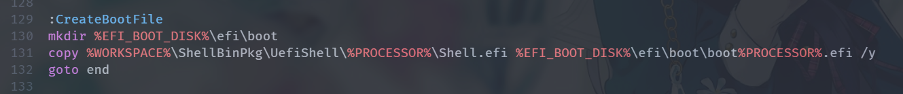

---
title: "UEFI 原理与编程 3 - EDK2 U盘启动盘制作"
date: 2019-10-24T16:38:00+08:00
draft: false
comment: true
description: ""
slug: uefi_tutorial_3-edk2_boot_disk
tags: [EDK2, UEFI]
series: [UEFI 原理与编程]
categories: [技术, 嵌入式开发]
---

## 传统Legacy模式启动盘

编译DuetPkg

```bash
build --nt32
build -a X64 -p DuetPkg\DuetPkgX64.dsc
cd DuetPkg
createbookdisk.bat usb E: FAT32 X64
createbookdisk.bat usb E: FAT32 X64 step2
cd ..\Build\DuetPkgX64\DEBUG_VS2015\X64
cp HelloWorld.efi E:\efi\boot\HelloWorld.efi /y
```

现在, U盘内的结构应如下



Efildr20 用于在Legacy模式下引导进入 UEFI 环境

bootX64.efi 是开机后进入的 shell, HelloWorld.efi 是刚刚复制过去的测试程序.

这里的 bootX64.efi 实际上来源是 `<Workspace>\ShellBinPkg\UefiShell\X64\Shell.efi`, 是 edk2 预先编译好的 shell. 这个可在 `createbookdisk.bat` 中看出: 




如果要使用较新的 Shell, 可以

```bash
build -a X64 -p ShellPkg\ShellPkg.dsc
cp Build\Shell\DEBUG_VS2015\X64\Shell.efi E:\efi\boot\bootX64.efi /y
```

之后上机测试. 开机按 F2 进入 bios, 再按 F8 启动设备选择界面 (华硕), 选择U盘. 之后进入 Shell


## 历史记录

|Version| Action|Time|
|:-------:|:--------:|:-----------:|
|1.0|Init|2019-10-24 16:38|
|1.0|迁移至 blog|2020-04-26 23:18|