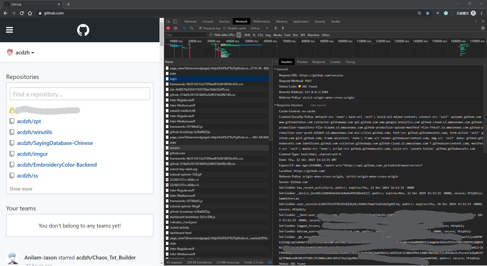
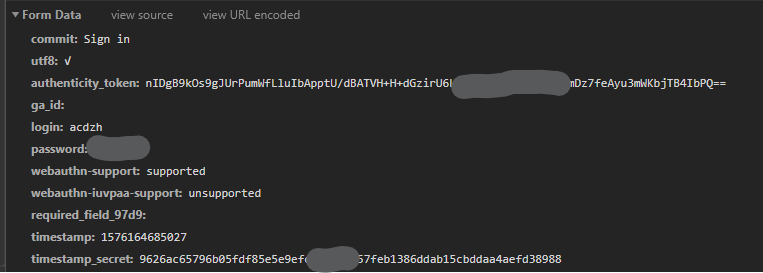
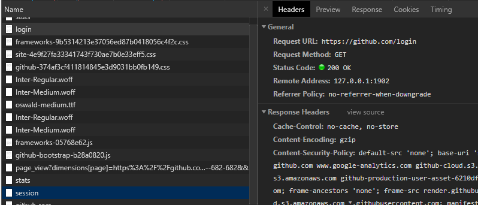
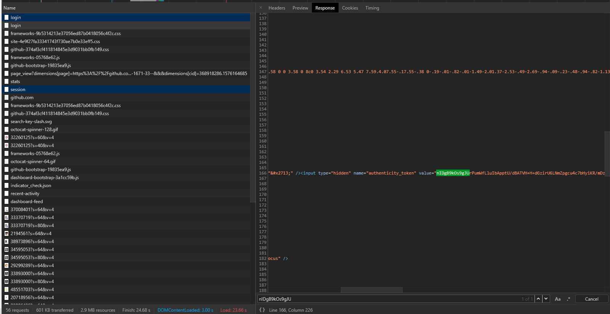
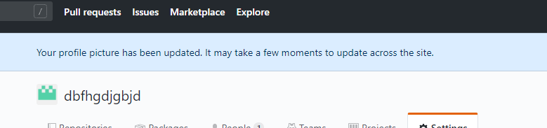

## 前言

[上一篇文章](tec/2019-12/github_organizations_puzzle_1-cut_image) 介绍了如何将图片切开, 那么下一步的操作就是与 Github 进行交互, 将图片上传上去.

Github有官方的api, 但是遗憾的是, 涉及的 Organizations 的 api 比较少. 所需的新建组织, 修改头像等功能均没有...... 干脆退而求其次, 自己用模拟网页请求的方式来修改.

## 工具
Python库: `requests`, `lxml`

安装: `pip install requests lxml`

## 结构

大致需要以下几个功能:

1. 登录
1. 新建组织
1. 删除组织
1. 修改组织头像
1. 将组织的可见性设为公开 (实际上是让陌生人可以看到自己在组织内
1. 列出自己的所有组织 (这个有api支持

这里将所有操作封装至一个类中, 结构如下:

```python
import requests
import os
from lxml import etree

class github_api:
    def __init__(self, user_name, passwd):
        ## TODO

    def login(self):
        ## TODO
        
    def organizations_new(self, name, email="none@none.com"):
        ## TODO

    def organizations_del(self, name):
        ## TODO

    def organizations_edit_avatar(self, name, path):
        ## TODO

    def organizations_turn_to_public(self, name):
        ## TODO
   
    def organizations_list(self):
        # TODO
```

## 实现

### 类的初始化

这部分没有什么好解释的.

```python
def __init__(self, user_name, passwd):
    self.headers = {
        'Referer': 'https://github.com/',
        'User-Agent': 'Mozilla/5.0 (Windows NT 10.0; Win64; x64) AppleWebKit/537.36 (KHTML, like Gecko) Chrome/78.0.3904.108 Safari/537.36',
    }
    self.session = requests.Session()
    self.user_name = user_name
    self.passwd = passwd
```

### 登录

转到网址[https://github.com/login](https://github.com/login), 登录, 浏览器抓一下请求.

可以看到登录操作对应的请求:




实际上请求的项中, 只有5个是有实际作用的: `commit`, `utf8`, `login`, `password`, `authenticity_token`

前4个都好理解, 第5个是什么呢? 这个是 Github 防止 CSRF 攻击设置的 token. 这个 token 和表单一起返回给客户端, 并且客户端在提交表单时需要带上这个 token.

很容易找到这个 token 的来源: 上一个请求, 即拿到登录表单的请求.



这一串值可以使用这句 xpath 来获取: `//div//input[2]/@value`

因此, 登录功能最终的代码如下:

```python
def login(self):
    print("start login: " + self.user_name)
    # get token
    response = self.session.get('https://github.com/login', headers = self.headers, proxies = proxy)
    selector = etree.HTML(response.text)
    token = selector.xpath('//div//input[2]/@value')[0]
    print("____get token: " + token)
    post_data = {
        'commit': 'Sign in',
        'utf8': '✓',
        'authenticity_token': token,
        'login': self.user_name,
        'password': self.passwd
    }
    self.session.post('https://github.com/session', data = post_data, headers = self.headers, proxies = proxy)
    print('____login complish')
```

### 组织的新建和删除, 组织设置公开

这些功能的实现和登录类似, 并没有新的技巧, 不再赘述. 

代码见文章最后.


### 修改头像

这个的实现和之前的几个有较大的不同.

一个完整的流程中的几个关键步骤如下(组织名是 `dbfhgdjgbjd` ):

#### 1. GET https://github.com/organizations/dbfhgdjgbjd/settings/profile

#### 2. POST https://github.com/upload/policies/avatars

这一步并没有真正地上传图像, 而是发了一个"申请", 获得了两个后续上传需要的token: `GitHub-Remote-Auth` 和 `upload_authenticity_token`.

当然这个包也是要带上token的, 这个 token 在页面里可以提取到.

req:

``` http
POST https://github.com/upload/policies/avatars HTTP/1.1
Host: github.com
Connection: keep-alive
Content-Length: 853
Accept: application/json
Origin: https://github.com
[[[[[[部分header省略]]]]]]

------WebKitFormBoundarysz99ttGms1oGX1ja
Content-Disposition: form-data; name="name"

968.jpg
------WebKitFormBoundarysz99ttGms1oGX1ja
Content-Disposition: form-data; name="size"

3629
------WebKitFormBoundarysz99ttGms1oGX1ja
Content-Disposition: form-data; name="content_type"

image/jpeg
------WebKitFormBoundarysz99ttGms1oGX1ja
Content-Disposition: form-data; name="authenticity_token"

8ou0uxgcQpvBHLHIcjFaVrvb+8tRRO4TYQB/gl4+x+PSv/8OSuARnveUEyGtcuP2mxK5J04zAYH7IzP4jmlq+w==
------WebKitFormBoundarysz99ttGms1oGX1ja
Content-Disposition: form-data; name="organization_id"

58733060
------WebKitFormBoundarysz99ttGms1oGX1ja
Content-Disposition: form-data; name="owner_type"

User
------WebKitFormBoundarysz99ttGms1oGX1ja
Content-Disposition: form-data; name="owner_id"

58733060
------WebKitFormBoundarysz99ttGms1oGX1ja--
```

res.payload:

```json
1ed
{"upload_url":"https://uploads.github.com/avatars","header":{"Accept":"application/vnd.github.assets+json; charset=utf-8","GitHub-Remote-Auth":"AHWEAHL5XGH75XMA4DUY3ZC5563NW"},"asset":{"owner_type":"User","owner_id":58733060,"size":3629,"content_type":"image/jpeg"},"form":{"owner_type":"User","owner_id":58733060,"size":3629,"content_type":"image/jpeg"},"same_origin":true,"upload_authenticity_token":"HLuk4ulaztY+QynqbQcsCJfOGIr5L+1CWBveomUxuaCHFQ7s4xe7ugj7vaFPCwh2fcyyUjJbdvLlkKmKrQGegA=="}
0
```

#### 3. OPTIONS https://uploads.github.com/avatars

话说我也不是很明白这个是不是必需的...

#### 4. POST https://uploads.github.com/avatars

这一步是真正的上传图像了. 会返回图像上传后的地址.

req:

```http
POST https://uploads.github.com/avatars HTTP/1.1
Host: uploads.github.com
Connection: keep-alive
Content-Length: 4411
[[[[[[部分header省略]]]]]]

------WebKitFormBoundary1I5xiJATYdIERWZ3
Content-Disposition: form-data; name="authenticity_token"

HLuk4ulaztY+QynqbQcsCJfOGIr5L+1CWBveomUxuaCHFQ7s4xe7ugj7vaFPCwh2fcyyUjJbdvLlkKmKrQGegA==
------WebKitFormBoundary1I5xiJATYdIERWZ3
Content-Disposition: form-data; name="owner_type"

User
------WebKitFormBoundary1I5xiJATYdIERWZ3
Content-Disposition: form-data; name="owner_id"

58733060
------WebKitFormBoundary1I5xiJATYdIERWZ3
Content-Disposition: form-data; name="size"

3629
------WebKitFormBoundary1I5xiJATYdIERWZ3
Content-Disposition: form-data; name="content_type"

image/jpeg
------WebKitFormBoundary1I5xiJATYdIERWZ3
Content-Disposition: form-data; name="file"; filename="968.jpg"
Content-Type: image/jpeg

?? JFIF     xxxxxxxxxx这一部分是图片, 略
------WebKitFormBoundary1I5xiJATYdIERWZ3--
```

res:

```http
HTTP/1.1 201 Created
Date: Tue, 10 Dec 2019 14:16:44 GMT
Content-Type: application/json
Content-Length: 197
[[[[[[部分header省略]]]]]]

{"id":11958391,"cropped_dimensions":"0,10,178,178","width":178,"height":198,"url":"https://media.githubusercontent.com/avatars/11958391?token=AHWEAHM37N54S53GF6S72BS5563NY","path_prefix":"alambic"}
```

#### 5. GET https://github.com/settings/avatars/11958391

这个请求返回的是这个裁剪框


#### 6. POST https://github.com/settings/avatars/11958391

这个请求发送裁剪的结果给服务器. 至此整个流程结束.

req & res:

```http
POST https://github.com/settings/avatars/11958391 HTTP/1.1
Host: github.com
Connection: keep-alive
Content-Length: 199
Cache-Control: max-age=0
Origin: https://github.com
Upgrade-Insecure-Requests: 1
[[[[[[部分header省略]]]]]]

op=save&utf8=%E2%9C%93&authenticity_token=qmPVHdKXdln1o2%2BnWm6sXzODj%2B55TYqvg5RoOeBsSvkmPj6uLZ9BzAe9fIvEazw8uwd2ebvFAhMY9AxmVDkBBQ%3D%3D&cropped_x=0&cropped_y=0&cropped_width=178&cropped_height=178

HTTP/1.1 302 Found
Date: Tue, 10 Dec 2019 14:16:51 GMT
Content-Type: text/html; charset=utf-8
Server: GitHub.com
Status: 302 Found
Location: https://github.com/organizations/dbfhgdjgbjd/settings/profile
[[[[[[部分header省略]]]]]]
X-GitHub-Request-Id: 1FFE:3C3A:57AB8E4:79FAF0A:5DEFA8CD

7f
<html><body>You are being <a href="https://github.com/organizations/dbfhgdjgbjd/settings/profile">redirected</a>.</body></html>
0
```

这个返回的也很有意思, 是表示设置成功的横幅 (就那个蓝条)



#### 代码实现

你应该发现了, 上面的流程中, 2和4的请求很特殊, `Content-Type` 都不是普通的 `application/x-www-form-urlencoded` 而是 `multipart/form-data`. 

4这个包是因为含有文件, 所以才以这种形式上传. 实现如下:

```python
requests.post(
    'https://uploads.github.com/avatars', 
    data = {
            "authenticity_token": token,
            "owner_type": "User",
            "owner_id": org_id,
            "size": img_size,
            "content_type": "image/png"
    }, 
    headers = headers, 
    files = {
        ('file', open('./968.jpg', 'rb'))
    }
)
```
这个没什么好说的. 但是2就不行了. 如果简单的使用

```python
requests.post(
    'https://github.com/upload/policies/avatars', 
    data = {
            'name': img_name,
            'size': img_size,
            'content_type': 'image/png' ,
            'authenticity_token': token,
            'organization_id': org_id,
            'owner_type': 'User',
            'owner_id': org_id
    }, 
    headers = headers, 
)
```

的话, 发出的包并不会是自己想要的 `multipart/form-data`. requests会以 `application/x-www-form-urlencoded` 的形式发出. 有两种解决方案: 

1. 使用 `requests-toolbelt` 这个库来自定义请求头 `Content-Type` (自定义包的形式)
1. 偷懒的方式, 如下:

```python
requests.post(
    'https://github.com/upload/policies/avatars', 
    data = {
            'name': img_name,
            'size': img_size,
            'content_type': 'image/png' ,
            'authenticity_token': token,
            'organization_id': org_id,
            'owner_type': 'User',
            'owner_id': org_id
    }, 
    file = {'f': 'f'},
    headers = headers, 
)
```

因为加入了一个不为空的 file 参数, requests 会自动以 `multipart/form-data` 的形式生成 request 包.......(虽然多发出去一个参数, 但是并没有什么影响(....

综合一下, 这部分的代码:

```python
def organizations_edit_avatar(self, name, path):
    print('start upload new avatar ' + path + ' for organization: ' + name)
    response = self.session.get(f'https://github.com/organizations/{name}/settings/profile', headers = self.headers, proxies = proxy)
    selector = etree.HTML(response.text)
    token = selector.xpath('//file-attachment/@data-upload-policy-authenticity-token')[0]
    org_id = selector.xpath('//form/@data-scope-id')[0]
    print("____get token: " + token)
    img_size = os.path.getsize(path)
    img_name = os.path.basename(path)
    img = open(path, 'rb')
    post_data = {
        'name': img_name,
        'size': img_size,
        'content_type': 'image/png' ,
        'authenticity_token': token,
        'organization_id': org_id,
        'owner_type': 'User',
        'owner_id': org_id
    }
    response = self.session.post('https://github.com/upload/policies/avatars', data = post_data, files = {'f': 'f'}, headers = self.headers, proxies = proxy)
    token = response.json()['upload_authenticity_token']
    remote_auth = response.json()['header']['GitHub-Remote-Auth']
    print("____get token2: " + token)
    print("____get remote auth: " + remote_auth)
    self.session.options('https://uploads.github.com/avatars', headers = self.headers, proxies = proxy)
    post_data = {
        "authenticity_token": token,
        "owner_type": "User",
        "owner_id": org_id,
        "size": img_size,
        "content_type": "image/png"
    }
    post_files = [
        ('file', img)
    ]
    headers = self.headers
    headers["GitHub-Remote-Auth"] = remote_auth
    response = self.session.post('https://uploads.github.com/avatars', data = post_data, headers = headers, files = post_files, proxies = proxy)
    upload_id = response.json()['id']
    img_width = response.json()['width']
    img_height = response.json()['height']
    print("____get avatar upload id: " + str(upload_id))
    print('____avatar upload url: ' + response.json()['url'])
    print('____width: ' + str(img_width))
    print('____height: ' + str(img_height))
    response = self.session.get(f'https://github.com/settings/avatars/{upload_id}', headers = self.headers, proxies = proxy)
    selector = etree.HTML(response.text)
    token = selector.xpath('//input[@name="authenticity_token"]/@value')[0]
    post_data = {
        'op': 'save',
        'utf8': '✓',
        'authenticity_token': token,
        'cropped_x': 0,
        'cropped_y': 0,
        'cropped_width': min(img_width, img_height),
        'cropped_height': min(img_width, img_height)
    }
    self.session.post(f'https://github.com/settings/avatars/{upload_id}', headers = self.headers, data = post_data, proxies = proxy)
    img.close()
    print("____edit finish")
```

### 获取所有组织列表

这个有api, 直接调用即可

```python
def organizations_list(self):
    return (self.session.get(f'https://api.github.com/users/{self.user_name}/orgs', headers = self.headers, proxies = proxy).json())
```

## 总的代码

```python
import requests
import os
from lxml import etree

proxy = {
    'http': 'socks5://127.0.0.1:1902',
    'https': 'socks5://127.0.0.1:1902'
}

class github_api:
    def __init__(self, user_name, passwd):
        self.headers = {
            'Referer': 'https://github.com/',
            'User-Agent': 'Mozilla/5.0 (Windows NT 10.0; Win64; x64) AppleWebKit/537.36 (KHTML, like Gecko) Chrome/78.0.3904.108 Safari/537.36',
        }
        self.session = requests.Session()
        self.user_name = user_name
        self.passwd = passwd

    def login(self):
        print("start login: " + self.user_name)
        # get token
        response = self.session.get('https://github.com/login', headers = self.headers, proxies = proxy)
        selector = etree.HTML(response.text)
        token = selector.xpath('//div//input[2]/@value')[0]
        print("____get token: " + token)
        post_data = {
            'commit': 'Sign in',
            'utf8': '✓',
            'authenticity_token': token,
            'login': self.user_name,
            'password': self.passwd
        }
        self.session.post('https://github.com/session', data = post_data, headers = self.headers, proxies = proxy)
        print('____login complish')
        
    def organizations_new(self, name, email="none@none.com"):
        print('start new organization: ' + name)
        response = self.session.get('https://github.com/account/organizations/new?coupon=&plan=team_free', headers = self.headers, proxies = proxy)
        selector = etree.HTML(response.text)
        token = selector.xpath('//form[@id="org-new-form"]//input[@name="authenticity_token"]/@value')[0]
        print("____get token: " + token)
        post_data = {
            'utf8': '✓',
            'authenticity_token': token,
            'coupon': '',
            'organization[plan]': 'free',
            'organization[login]': name,
            'organization[billing_email]': email,
            'terms_of_service_type': 'standard',
            'organization[company_name]': ''
        }
        self.session.post('https://github.com/organizations', data = post_data, headers = self.headers, proxies = proxy)
        print(f'____new organization {name} complish')

    def organizations_del(self, name):
        print('start delete organization: ' + name)
        response = self.session.get(f'https://github.com/organizations/{name}/settings/profile?_pjax=%23js-pjax-container', headers = self.headers, proxies = proxy)
        selector = etree.HTML(response.text)
        token = selector.xpath('//form[@id="cancel_plan"]//input[@name="authenticity_token"]//@value')[0]
        danger_zone_token = selector.xpath('//input[@name="dangerzone"]/@value')[0]
        print("____get token: " + token)
        post_data = {
            'utf8': '✓',
            'authenticity_token': token,
            '_method': 'delete',
            'dangerzone': danger_zone_token
        }
        self.session.post(f'https://github.com/organizations/{name}', data = post_data, headers = self.headers, proxies = proxy)
        print(f'____delete organization {name} complish')

    def organizations_edit_avatar(self, name, path):
        print('start upload new avatar ' + path + ' for organization: ' + name)
        response = self.session.get(f'https://github.com/organizations/{name}/settings/profile', headers = self.headers, proxies = proxy)
        selector = etree.HTML(response.text)
        token = selector.xpath('//file-attachment/@data-upload-policy-authenticity-token')[0]
        org_id = selector.xpath('//form/@data-scope-id')[0]
        print("____get token: " + token)
        img_size = os.path.getsize(path)
        img_name = os.path.basename(path)
        img = open(path, 'rb')
        post_data = {
            'name': img_name,
            'size': img_size,
            'content_type': 'image/png' ,
            'authenticity_token': token,
            'organization_id': org_id,
            'owner_type': 'User',
            'owner_id': org_id
        }
        response = self.session.post('https://github.com/upload/policies/avatars', data = post_data, files = {'f': 'f'}, headers = self.headers, proxies = proxy)
        token = response.json()['upload_authenticity_token']
        remote_auth = response.json()['header']['GitHub-Remote-Auth']
        print("____get token2: " + token)
        print("____get remote auth: " + remote_auth)
        self.session.options('https://uploads.github.com/avatars', headers = self.headers, proxies = proxy)
        post_data = {
            "authenticity_token": token,
            "owner_type": "User",
            "owner_id": org_id,
            "size": img_size,
            "content_type": "image/png"
        }
        post_files = [
            ('file', img)
        ]
        headers = self.headers
        headers["GitHub-Remote-Auth"] = remote_auth
        response = self.session.post('https://uploads.github.com/avatars', data = post_data, headers = headers, files = post_files, proxies = proxy)
        upload_id = response.json()['id']
        img_width = response.json()['width']
        img_height = response.json()['height']
        print("____get avatar upload id: " + str(upload_id))
        print('____avatar upload url: ' + response.json()['url'])
        print('____width: ' + str(img_width))
        print('____height: ' + str(img_height))
        response = self.session.get(f'https://github.com/settings/avatars/{upload_id}', headers = self.headers, proxies = proxy)
        selector = etree.HTML(response.text)
        token = selector.xpath('//input[@name="authenticity_token"]/@value')[0]
        post_data = {
            'op': 'save',
            'utf8': '✓',
            'authenticity_token': token,
            'cropped_x': 0,
            'cropped_y': 0,
            'cropped_width': min(img_width, img_height),
            'cropped_height': min(img_width, img_height)
        }
        self.session.post(f'https://github.com/settings/avatars/{upload_id}', headers = self.headers, data = post_data, proxies = proxy)
        img.close()
        print("____edit finish")

    def organizations_turn_to_public(self, name):
        print(f"start to set organization {name} to public.")
        response = self.session.get(f'https://github.com/orgs/{name}/people', headers = self.headers, proxies = proxy)
        selector = etree.HTML(response.text)
        token = selector.xpath('//div[@class="select-menu-list"][1]/form/input[@name="authenticity_token"]/@value')[0]
        member_id = selector.xpath('//div[@class="select-menu-list"][1]/form/input[@name="member_ids"]/@value')[0]
        print("____get token: " + token)
        print("____get member id: " + member_id)
        post_data = {
            'publicize': 1,
            'utf8': '✓',
            '_method': 'put',
            'authenticity_token': token,
            'member_ids': member_id,
            'publicize': 1
        }
        self.session.post(f'https://github.com/orgs/{name}/people/set_visibility', headers = self.headers, data = post_data, proxies = proxy)
        print("____set finish")
   
    def organizations_list(self):
        return (self.session.get(f'https://api.github.com/users/{self.user_name}/orgs', headers = self.headers, proxies = proxy).json())
```

## 历史记录

|Version| Action|Time|
|:-------:|:--------:|:-----------:|
|1.0|Init|2019-12-13 00:27:00|
|1.0|迁移至 blog|2020-04-27T01:30:30+08:00|