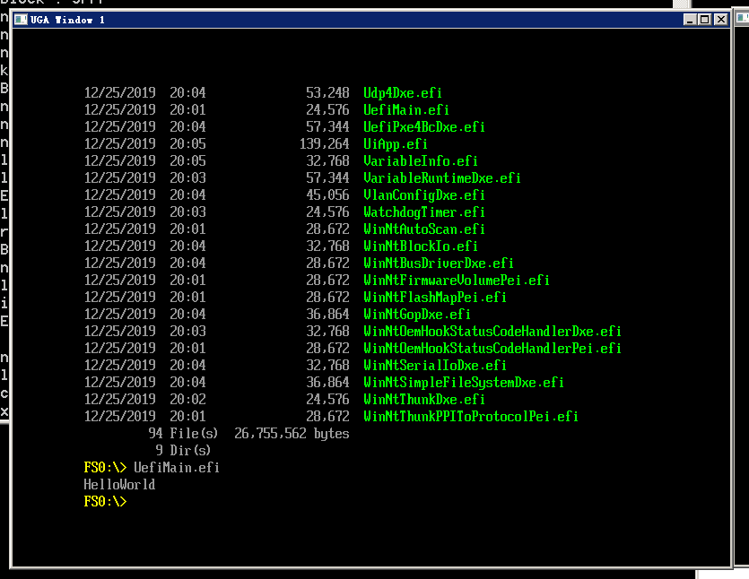

## UEFI工程模块文件

在工作区新建目录 `infs/UefiMain`

添加文件: `UefiMain.c`, 内容如下:

```c
#include <Uefi.h>
EFI_STATUS
UefiMain (
          IN EFI_HANDLE        ImageHandle,
          IN EFI_SYSTEM_TABLE  *SystemTable
          )
{
   SystemTable -> ConOut-> OutputString(SystemTable->ConOut, L"HelloWorld\n"); 
   return EFI_SUCCESS;
}
```

再添加一个文件: `UefiMain.inf`, 内容如下:

```ini
[Defines]
  INF_VERSION                    = 0x00010006
  BASE_NAME                      = UefiMain 
  FILE_GUID                      = 4ea97c46-7491-4dfd-b442-747010f3ce5f
  MODULE_TYPE                    = UEFI_APPLICATION
  VERSION_STRING                 = 0.1
  ENTRY_POINT                    = UefiMain 
[Sources]
  UefiMain.c

[Packages]
  MdePkg/MdePkg.dec

[LibraryClasses]   
  UefiApplicationEntryPoint
  UefiLib
[FixedPcd]
gEfiMdePkgTokenSpaceGuid.PcdFSBClock|600000000
gEfiMdePkgTokenSpaceGuid.PcdMaximumUnicodeStringLength
[FeaturePcd]
gEfiMdePkgTokenSpaceGuid.PcdComponentNameDisable|FALSE
gEfiMdePkgTokenSpaceGuid.PcdDriverDiagnosticsDisable
[PatchPcd]
gEfiMdePkgTokenSpaceGuid.PcdUefiVariableDefaultLangCodes
[BuildOptions]  
MSFT:DEBUG_*_IA32_CC_FLAGS = /Od
```

之后修改 `Nt32Pkg\Nt32Pkg.dsc`, 在 356 行添加一行

```ini
infs/UefiMain/UefiMain.inf
```

之后编译, 运行模拟器
```bash
edksetup.bat --nt32
build -p Nt32Pkg\Nt32Pkg.dsc -a IA32
build run
```

进入模拟器后, 

```bash
cd fs0:
UefiMain.efi
```

看到结果:



## 使用 C 标准库

修改文件: `UefiMain.c`, 内容如下:

```c
#include <Uefi.h>
#include <stdio.h>
int main (int argc, char **argv  )
{
  printf("HelloWorld\n"); 
  return 0;
}
```

修改文件: `UefiMain.inf`, 内容如下:

```ini
## @file main.inf
[Defines]
  INF_VERSION                    = 0x00010006
  BASE_NAME                      = UefiMain
  FILE_GUID                      = 4ea97c46-7491-4dfd-b442-747010f3ce5f
  MODULE_TYPE                   = UEFI_APPLICATION
  VERSION_STRING               = 0.1
  ENTRY_POINT                    = ShellCEntryLib 
[Sources]
  main.c
[Packages]
  MdePkg/MdePkg.dec
  ShellPkg/ShellPkg.dec
  StdLib/StdLib.dec
[LibraryClasses]   
  LibC
  LibStdio
  ShellCEntryLib

```

之后修改 `Nt32Pkg\Nt32Pkg.dsc`, 在 最后再添加一行

```ini
!include StdLib/StdLib.inc
```

之后编译, 运行模拟器

```bash
edksetup.bat --nt32
build -p Nt32Pkg\Nt32Pkg.dsc -a IA32
build run
```

进入模拟器后, 

```bash
cd fs0:
UefiMain.efi
```

可以看到同样的结果:


## Shell App

修改文件: `UefiMain.c`, 内容如下:

```c
#include <Uefi.h>
#include <Library/UefiBootServicesTableLib.h>

INTN
EFIAPI
ShellAppMain (
  IN UINTN Argc,
  IN CHAR16 **Argv
  )
{
	gST -> ConOut-> OutputString(gST -> ConOut, L"HelloWorld\n"); 
	return 0;
}

```

修改文件: `UefiMain.inf`, 内容如下:

```ini
[Defines]
  INF_VERSION                    = 0x00010006
  BASE_NAME                      = UefiMain
  FILE_GUID                    = 4ea97c46-7491-4dfd-b442-747010f3ce5f
  MODULE_TYPE                   = UEFI_APPLICATION
  VERSION_STRING               = 0.1
  ENTRY_POINT                    = ShellCEntryLib
#
#  VALID_ARCHITECTURES           = IA32 X64 IPF
#
[Sources]
  Main.c

[Packages]
  MdePkg/MdePkg.dec
  ShellPkg/ShellPkg.dec

[LibraryClasses]   
  ShellCEntryLib
  UefiLib

[BuildOptions]  
```

之后修改 `Nt32Pkg\Nt32Pkg.dsc`, 在 最后再添加一行

```ini
!include StdLib/StdLib.inc
```

之后编译, 运行模拟器

```bash
edksetup.bat --nt32
build -p Nt32Pkg\Nt32Pkg.dsc -a IA32
build run
```

进入模拟器后, 

```bash
cd fs0:
UefiMain.efi
```

也可以看到同样的结果:


## 历史记录

|Version| Action|Time|
|:-------:|:--------:|:-----------:|
|1.0|Init|2019-12-25 20:29|
|1.0|迁移至 blog|2020-04-27 02:04|