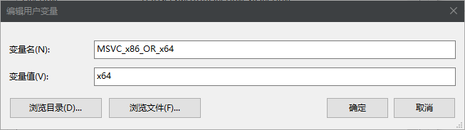
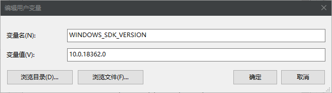
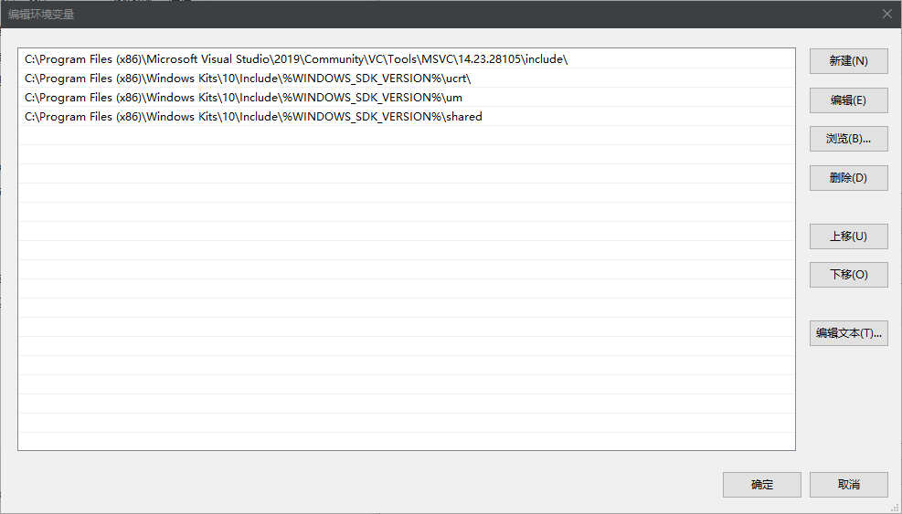
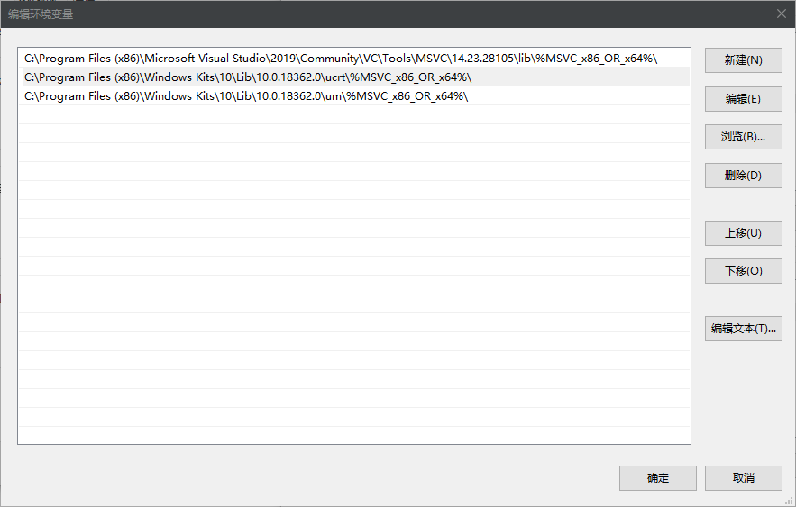

本来网上已经有很多教程了, 但是要么老旧, 要么习惯x差, dll文件复制来复制去......

把自己的配置发上来, 作为一个存档.

## 配置

新建环境变量 `MSVC_x86_OR_x64`, 值为 `x64`. ( 使用 x64 编译器



新建环境变量 `WINDOWS_SDK_VERSION`, 值为 `10.0.18362.0`. ( 去目录 `C:\Program Files (x86)\Windows Kits\10\Include` 看



在 PATH 里添加一项 (注意版本号以实际为准

`C:\Program Files (x86)\Microsoft Visual Studio\2019\Community\VC\Tools\MSVC\14.23.28105\bin\Host%MSVC_x86_OR_x64%\%MSVC_x86_OR_x64%`

新建环境变量 `INCLUDE`, 添加以下几项

```bash
C:\Program Files (x86)\Microsoft Visual Studio\2019\Community\VC\Tools\MSVC\14.23.28105\include\
C:\Program Files (x86)\Windows Kits\10\Include\%WINDOWS_SDK_VERSION%\ucrt\
C:\Program Files (x86)\Windows Kits\10\Include\%WINDOWS_SDK_VERSION%\um
C:\Program Files (x86)\Windows Kits\10\Include\%WINDOWS_SDK_VERSION%\shared
```



新建环境变量 `LIB`, 添加以下几项

```bash
C:\Program Files (x86)\Microsoft Visual Studio\2019\Community\VC\Tools\MSVC\14.23.28105\lib\%MSVC_x86_OR_x64%\
C:\Program Files (x86)\Windows Kits\10\Lib\10.0.18362.0\ucrt\%MSVC_x86_OR_x64%\
C:\Program Files (x86)\Windows Kits\10\Lib\10.0.18362.0\ucrt\%MSVC_x86_OR_x64%\
```



之后重启终端, 即可使用 `cl.exe` 了. 示例如下:

```bash
cd D://example/a.cpp
cl /EHsc a.cpp
```

如果在使用 [Code-Runner](https://marketplace.visualstudio.com/items?itemName=formulahendry.code-runner) 的话, 可以将下面的脚本添加进配置中

> 为一个简单的命令行计时小程序, 如果没有, 简单删掉即可 (你可以在[这里](https://github.com/acdzh/winutils/tree/master/ConsoleTimer)找到这个小程序

```bash
"c":"cd $dir && cl /EHsc '$fileName' && del .\\'$fileNameWithoutExt.obj' && ConsoleTimer .\\'$fileNameWithoutExt'",
"cpp" : "cd $dir && cl /EHsc '$fileName' ; del '$fileNameWithoutExt.obj' && ConsoleTimer .\\'$fileNameWithoutExt'",
```

## 扩展 - Opencv

在环境变量 `INCLUDE` 中添加一项

```
D:\Packages\opencv\build\include
```

在 `PATH` 中添加

```bash
D:\Packages\opencv\build\x64\vc15\bin
```

确保环境变量 `MSVC_x86_OR_x64` 值为 `x64`. 

Code-Runner 脚本 ( 这里为了减小污染把引用的lib放进了命令行中, 如果不想这么做, 将其所在目录放进环境变量 `LIB` 中亦可

```bash
"cpp":"cd $dir && cl /c /EHsc '$fileName' && link '$fileNameWithoutExt.obj' 'D:\\Packages\\opencv\\build\\x64\\vc15\\lib\\opencv_world340.lib' && del '$fileNameWithoutExt.obj' && ConsoleTimer .\\'$fileNameWithoutExt'",
```

## 扩展2 - Sqllite

Code-Runner 脚本

```bash
"cpp" : "cd $dir && cl /EHsc '$fileName' /link 'D:\\Program Files\\sqlite\\lib\\x64\\sqlite3.lib' && del '$fileNameWithoutExt.obj' && ConsoleTimer .\\'$fileNameWithoutExt'"
```

## 历史记录

|Version| Action|Time|
|:-------:|:--------:|:-----------:|
|1.0|Init|2019-12-20 01:03|
|1.0|迁移至 blog|2020-04-27 01:44|
|1.1|添加 ConsoleTimer 介绍|2020-04-27 01:51|