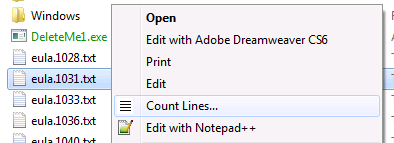
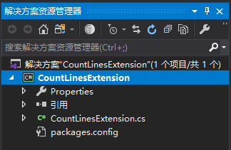
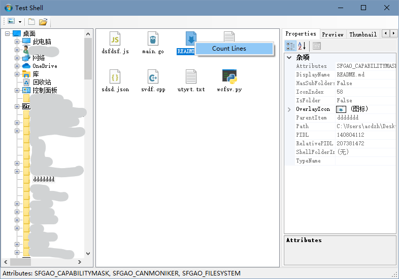
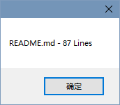

使用 .Net 快速创建 Shell 上下文菜单扩展.

## 介绍

在 .NET 4.0 之前, 不可能使用 .NET 代码可靠地创建 Windows Shell 扩展. 通过对框架的改进, 现在可以使用 .NET 创建这些扩展. 在本文中, 我将向您展示如何快速将 Shell 上下文菜单创建为 C＃ 类库. 



***上图是本文的一个例子, 这是一个Shell上下文菜单扩展- "Count Lines...". 本文将使用这个例子来演示如何创建的自定义Shell扩展.***

## 系列文章

本文是 ".NET Shell扩展" 系列的一部分，其中包括：

1. [.NET Shell扩展-Shell 上下文菜单](https://blog.acdzh.ltd/tec/2020-03/sharpshell_tutorial_1)
2. [.NET Shell扩展-Shell 图标处理程序](https://blog.acdzh.ltd/tec/2020-03/sharpshell_tutorial_2)
3. [.NET Shell扩展-Shell 信息提示处理程序](https://blog.acdzh.ltd/tec/2020-03/sharpshell_tutorial_3)
4. [.NET Shell扩展-Shell 拖拽处理程序](https://blog.acdzh.ltd/tec/2020-03/sharpshell_tutorial_4)
5. [.NET Shell扩展-Shell 预览处理程序](https://blog.acdzh.ltd/tec/2020-03/sharpshell_tutorial_5)
6. [.NET Shell扩展-Shell 图标叠加处理程序](https://blog.acdzh.ltd/tec/2020-03/sharpshell_tutorial_6)
7. [.NET Shell扩展-Shell 缩略图处理程序](https://blog.acdzh.ltd/tec/2020-03/sharpshell_tutorial_7)
8. [.NET Shell扩展-Shell 属性表](https://blog.acdzh.ltd/tec/2020-03/sharpshell_tutorial_8)
9. [.NET Shell扩展-部署 SharpShell 服务](https://blog.acdzh.ltd/tec/2020-03/sharpshell_tutorial_9)

## 什么是 Shell 上下文菜单?

Shell 上下文菜单是在系统中中注册的 COM servers, 它允许对 Shell 对象的上下文菜单进行扩展. 扩展的对象可以是特定的文件类型 (例如 *.txt 文件), 也可以是驱动器或者文件夹. 上下文菜单可以提供一些可以用 Windows 资源管理器进行快速访问的高级功能.

## 入门

开发 Shell 扩展需要设计很多工作. 必须实现特定的 COM 接口, 必须构建服务器, 必须使用多种方式更新注册表. 我们将使用我开发的一个名为 `SharpShell` 的库来完成所有这些艰苦的工作, 我们所需要做的仅仅是创建一个轻量级类库, 它包含我们要实现的扩展类.

## 我们的目标

下面的代码创建了一个 Shell 扩展, 您可以通过右键单击任意文本文件并选择 "计数行" 来对统计其行数. 在本文的剩余部分, 我将向您展示如何创建这样的库. 之所以先展示这些代码, 是因为我想强调编写这些库到底有多么简单, 如果使用 `SharpShell` 的话.

```csharp
/// <summary>
/// The CountLinesExtensions is an example shell context menu extension,
/// implemented with SharpShell. It adds the command 'Count Lines' to text
/// files.
/// </summary>
[ComVisible(true)]
[COMServerAssociation(AssociationType.ClassOfExtension, ".txt")]
public class CountLinesExtension : SharpContextMenu {
    /// <summary>
    /// Determines whether this instance can a shell
    /// context show menu, given the specified selected file list
    /// </summary>
    /// <returns>
    /// <c>true</c> if this instance should show a shell context
    /// menu for the specified file list; otherwise, <c>false</c>
    /// </returns>
    protected override bool CanShowMenu() {
        //  We always show the menu
        return true;
    }
 
    /// <summary>
    /// Creates the context menu. This can be a single menu item or a tree of them.
    /// </summary>
    /// <returns>
    /// The context menu for the shell context menu.
    /// </returns>
    protected override ContextMenuStrip CreateMenu() {
        //  Create the menu strip
        var menu = new ContextMenuStrip();
 
        //  Create a 'count lines' item
        var itemCountLines = new ToolStripMenuItem {
            Text = "Count Lines...",
            Image = Properties.Resources.CountLines
        };
 
        //  When we click, we'll count the lines
        itemCountLines.Click += (sender, args) => CountLines();
 
        //  Add the item to the context menu.
        menu.Items.Add(itemCountLines);
 
        //  Return the menu
        return menu;
    }
 
    /// <summary>
    /// Counts the lines in the selected files
    /// </summary>
    private void CountLines() {
        //  Builder for the output
        var builder = new StringBuilder();
 
        //  Go through each file.
        foreach (var filePath in SelectedItemPaths) {
            //  Count the lines
            builder.AppendLine(string.Format("{0} - {1} Lines", 
              Path.GetFileName(filePath), File.ReadAllLines(filePath).Length));
        }
 
        //  Show the output
        MessageBox.Show(builder.ToString());
    }
}
```

代码非常干净, 实现起来也很简单. 现在让我们详细了解如何使用 `SharpShell` 来创建此 Shell 的上下文菜单.

## 第一步: 建立项目

首先, 创建一个新的 C# 类库 (C# Class Library) 项目.

> **提示**: 您可以使用 Visual Basic 而不是 C#. 虽然本文中的源代码是 C#, 但是创建 Visual Basic Shell 扩展的方法是相同的.

在这个例子中, 我们将项目叫做 '`CountLinesExtension`'.

现在添加下列引用:

1. `System.WIndows.Forms`
2. `System.Drawing`

`System.Windows.Forms` 是必需的, 因为我们将使用 Winforms `ContextMenuStrip` 来定义上下文菜单. 因为我们要使用图标, 因此 `System.Draeing` 也是必需的.

将 'Class1.cs' 文件重命名为 'CountLinesExtension.cs'. 现在, 我们的项目结构应该像下图一样:



> **译者注**: 原文这里似乎确实缺了一张图, 此为译者补图. 另外关于此部分, 建议去看看第二篇文章的注释.

## 第二步: 引用 SharpShell 

现在我们需要添加核心库 `SharpShell` 的引用. 您可以通过几种不同的方式进行此操作.

### 添加引用

下载文章顶部名为 "SharpShell Library" 的 zip 文件, 并对下载的 SharpShell.dll 添加引用.

> **提示**: 撰写本文时, 本文的下载是正确的. 如果需要最新版本, 请使用 Nuget (如下所述) 或从 [sharpshell.codeplex.com](http://sharpshell.codeplex.com/)获取该库.

### 使用 Nuget

如果已安装 Nuget, 则只需要快速 SharpShell 并直接安装即可. 或者在[https://www.nuget.org/packages/SharpShell](https://www.nuget.org/packages/SharpShell)中获取软件包的详细信息.

### 使用 CodePlex

该页面上的库可能不是最新版本, 但是您可以从 CodePlex 获取最新版本 - 在 SharpShell 的主页上: [https://sharpshell.codeplex.com](https://sharpshell.codeplex.com). Nuget 可以下载最新的稳定版本, 而 CodePlex 有可能有 beta 版本, 文章顶部的链接则是在撰写本是时测试通过的版本.

> **译者注**: 这个项目的 CodePlex 主页已经停用了. 请前往 [Github 主页](https://github.com/dwmkerr/sharpshell)查看最新版本.

## 第三步: 从 SharpContextMenu 继承 (Deriving from SharpContextMenu)

现在事情变得有趣了. 使你的类 `CountLinesExtension` 继承 `SharpContextMenu`:

```csharp
/// <summary>
/// The Count Lines Context Menu Extension
/// </summary>
public class CountLinesExtension : SharpContextMenu {

}
```

现在我们必须实现该类的抽象函数. 右键单击这一行的 `SharpContextMenu`, 然后选择 "**实现抽象类**" ('**Implement Abstract Class**')

> **译者注**: 原文如此. 但在 VS 2019 中未找到此选项. 也可以通过在 `CountLinesExtension` 上按 `Alt` + `Enter`, 选择 "实现抽象类" 亦可. (当然自己不使用代码生成, 自己手动补全也是可以的

这将创建所需的两个函数的实现 - `CanShowMenu` 和 `CreateMenu`: 

```csharp
/// <summary>
/// The Count Lines Context Menu Extension
/// </summary>
public class CountLinesExtension : SharpContextMenu {
    protected override bool CanShowMenu() {
        throw new NotImplementedException();
    }
 
    protected override ContextMenuStrip CreateMenu() {
        throw new NotImplementedException();
    }
}
```

通过实现这两个方法, 我们可以提供所需的所有功能. 它们的作用如下:

### CanShowMenu

对于给定的文件扩展名集合, 通过调用此函数来确定我们是否显示其上下文菜单. 用户选择的文件在属性 `SelectedItemPaths` 中. 我们可以检查这些文件路径, 来判断我们是否需要显示菜单. 如果需要显示菜单, 返回 `true` , 否则返回 `false`.

### CreateMenu

这个函数会被调用, 来实际创建上下文菜单. 我们只需要返回一个标准 Winforms `ContextMenuStrip`.

这是我们对这两个方法的实现:

```csharp
protected override bool CanShowMenu() {
    //  We will always show the menu
    return true;
}
 
protected override ContextMenuStrip CreateMenu() {
    //  Create the menu strip
    var menu = new ContextMenuStrip();
 
    //  Create a 'count lines' item
    var itemCountLines = new ToolStripMenuItem {
        Text = "Count Lines"
    };
 
    //  When we click, we'll call the 'CountLines' function
    itemCountLines.Click += (sender, args) => CountLines();
 
    //  Add the item to the context menu
    menu.Items.Add(itemCountLines);
 
    //  Return the menu
    return menu;
}
 
private void CountLines() {
    //  Builder for the output
    var builder = new StringBuilder();
 
    //  Go through each file
    foreach (var filePath in SelectedItemPaths) {
        //  Count the lines
        builder.AppendLine(string.Format("{0} - {1} Lines", 
          Path.GetFileName(filePath), File.ReadAllLines(filePath).Length));
    }
 
    //  Show the output
    MessageBox.Show(builder.ToString());
} 
```

对于 `CanShowMenu`, 我们总是返回 `true`, 我们不需要验证文件是否是文本文件, 并且很快就会看到这样做的原因. 对于 `CreateMenu`, 我们构造一个仅包含一项的上下文菜单条 (context menu strip), 它拥有标题 '**Count Lines**', 并且调用 `CountLines` 函数.

`CountLines` 函数遍历 `SelectedItemPaths`, 并计算每一个文件的行数, 之后再显示一个带有摘要的消息框 (MessageBox).

## 第四步: 处理 COM 注册

还有一些事情要做. 首先, 我们必须将 `COMVisible` 属性添加到我们的类中.

```csharp
[ComVisible(true)]
public class CountLinesExtension : SharpContextMenu
```

为什么这么做? 好吧, 尽管我们的类看起来并不太像, 但它实际上确实是一个 COM 服务器 (COM server). 如果你去查看基类, 你将会看到, 我们在实现 COM 接口, 比如 `IShellExtInit`, `IContextMenu`, `ISharpShellServer`. 我们不必关心它们做什么, 但是为了系统能创建我们的扩展, 它必须要有此属性.

接下来, 我们必须给这个程序集一个强名称 (strong name). 有很多方式可以实现此需求, 不过我们有一个最好的方法. 为此, 我们需要在项目上单击鼠标右键, 然后点击 "**属性**", 然后转到 "**签名**", 选择 "**为程序集签名**", 单击 "**选择强名称密钥文件**" 下的下拉列表, 选择 "**新建**". 之后新建一个密钥, 您可以根据需要对密钥进行密码保护, 但这不是必需的.

最后一步, 我们需要将我们的扩展与一些文件类型关联. 我们可以通过 `COMServerAssociation` 属性 (由 SharpShell 提供) 来做到这一点:

```csharp
[ComVisible(true)]
[COMServerAssociation(AssociationType.ClassOfExtension, ".txt")]
public class CountLinesExtension : SharpContextMenu
```

那么, 我们在这一步都做了什么? 我们告诉 SharpShell 当注册这个服务时, 我们希望它与 *.txt 文件的**类型**进行关联. 这意味着, 我们不仅可以使其对任何文件名以 *.txt 结尾的文件有效, 同样对同类的文件同样有效. 从根本上来讲, 多数情况下, 这些文件与 *.txt 具有相同的图标.

> **译者注**: 这一段直译过来有些拗口, 实际上原作者想表达的意思是, *.txt 文件的文件类型(Contene-Type)是 text/plain. 当我们让其与 *.txt 进行关联, 实际上是与 *.txt 的文件类型 text/plain 进行关联, 因此这个扩展不仅仅对 *.txt 有效, 同样对其他 text/plain 文件类型也有效

您可以使用 `COMServerAssociation` 属性来做一些非常酷的事. 您可以将其与文件夹, 驱动器, 未知文件, 以及特定的扩展名相关联. 有关此功能的完整文档, 请访问[SharpShell CodePlex](http://sharpshell.codeplex.com/)页面上的[COM 服务关联](http://sharpshell.codeplex.com/wikipage?title=COM%20Server%20Associations&referringTitle=Documentation).

> **译者注**: 这个页面已经停止服务了. 文档请访问此 [Github链接](https://github.com/dwmkerr/sharpshell/blob/master/docs/com-server-associations.md).

就这样, Build 该项目将创建 `CountLinesExtension` 程序集. 这个程序集可以作为一个 COM server 进行注册, 添加到系统的上下文菜单中. 为了注册这个 COM 服务器, 我们需要对其进行调试和部署. 我们将在下一节讨论细节.

## 调试 Shell 扩展

Shell 扩展程序会被托管在 Windows 资源管理器中. 因为 .Net COM 服务迂回的加载方式, 让调试器进入进程托管代码并逐步执行进行调试几乎是不可能的. 但是, 有一种方法可以快速调试扩展. `SharpShell`附带了一些工具, 能让 `SharpShell` COM 服务加载更简单一些, 其中之一就是 Server Manager. (SharpShell comes with some tools that make working with SharpShell COM servers a bit easier, and one of them is the Server Manager.) 我们可以使用此工具来 debug 我们的扩展.

打开 Server Manager, 然后使用 '**File**' > '**Load Server**' 来加载构建好的的 server 文件（DLL）. 您同样可以直接将 server 文件拖拽进主窗口. 选中这个 server , 右侧将会显示它的一些细节信息.

Server Manager 非常有用, 他可以告诉您, 这个 server 是否已经安装 (32 或者 64位模式), 以及其他的一些细节.

如果您加载了 `SharpContextMenu` server 并选中, 您可以打开 '**Tools**' 菜单, 选择 '**Test Context Menu**'.

当您使用 '**Test Context Menu**' 后, 您将获得一个 Test Shell 窗口. 这是一个 Windows 资源管理器的基本实现. 您可以在任意文件上右键来测试这个 Shell 上下文菜单.

**提示**: 无论您设置了**哪种 COMServerAssocations**, Test Shell 都会尝试为所有项目创建上下文菜单.

将调试器附加到 *ServerManager.exe* 进程可以允许您调试您的上下文菜单并且进行测试, 而不必真正在 Windows 中注册. 这是当运行 Count Line 上下文菜单扩展时, TestShell 的样子:





> **译者注**: 原文这里似乎确实又缺了一些图, 这两张图是我自己补上的

## 安装和注册 Shell 扩展

有多种安装和注册 SharpShell Shell 扩展的方法. 在本节中, 我将详细地介绍它们.

### The regasm Tool

您可以使用工具 'regasm' 来安装和注册 Shell 扩展. 使用 regasm 时, Shell 扩展将被安装至注册表中(COM Server 的 Class ID 将被放进 COM Server Class 部分中, 并与实际文件路径相关联), 这同样会注册文件类型关联.

### The Server Manager Tool

Server Manager Tool 是我用来安装/卸载和注册/注销的首选方法, 至少在开发过程中如此. 因为它可以使你一键安装和注册. 它还可以让您指定是以 32 位还是以 64 位模式安装/卸载等.

### 手动注册表操作

通常, 这是一种不好的方法, 但是如果必须这样做的话, 则 Shell Extensions 的 MSDN 文档描述了一些必须对注册表进行的更改, 才能手动注册COM服务器或托管COM服务器. 该文档在 "有用的资源" 部分中列出. 

## 有用的资源

* [Creating Shortcut Menu Handlers in Windows](http://msdn.microsoft.com/en-us/library/windows/desktop/cc144171.aspx): 最重要的资源 - 有关 Shell 上下文菜单扩展如何在 Windows 中工作的详细信息.

* [CodePlex上的SharpShell](http://sharpshell.codeplex.com/): `SharpShell` 项目的所在地-包括文档，讨论以及最新的源代码和发行版. (译者注: 已迁移至 [Github](https://github.com/dwmkerr/sharpshell))

## What's Next?

随着时间的推移, `SharpShell` 将提供一种使用 .Net 创建所有可用 Shell 扩展的机制. 目前已经实现了图标处理程序 (我正在处理文档), 并且实现了属性表处理程序 (Property Sheet Handlers)(仍需要解决一些错误). 每个扩展类型都会有一篇文章.

希望本文对您有所帮助. 对于功能请求, 错误或注释, 您可以使用下面的注释部分或CodePlex网站.

## 历史

* 2014年11月27日: 初始版本

## License

本文以及所有相关的源代码和文件均已获得 [The Code Project Open License（CPOL）](http://www.codeproject.com/info/cpol10.aspx) 的许可.

## 译注

1. 文章来源: [.NET Shell Extensions - Shell Context Menus - CodeProject](https://www.codeproject.com/Articles/512956/NET-Shell-Extensions-Shell-Context-Menus) 

2. 原文作者: Dave Kerr, A softer Developer from UK. His blog: [www.dwmkerr.com](http://www.dwmkerr.com/), Github: [dwmkerr@Github](https://github.com/dwmkerr)

3. 本文最早发表于 **2014年11月27日**, 截至翻译时最新更新为 **2019年6月29日**, 翻译日期为 **2020年3月6日**. **互联网日新月异, 请注意信息时效**.

4. 文中的代码均测试通过, 文中除了标有 "译者注" 的部分之外均为原文, 译者水平有限, 如有疑惑之处请戳原文或 PM 我, 谢谢茄子. 

5. 纠结了好久, 最终还是决定代码中的英文注释不翻译. 这部分与代码相关较大, 希望能尽量保持原汁原味.

|Version| Action|Time|
|:-------:|:--------:|:-----------:|
|1.0|Init|2020-03-07 15:20|
|1.0|迁移至 blog|2020-04-28 19:49|