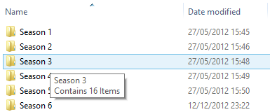

使用 .Net 快速自定义 Shell 提示信息.

## 介绍

Shell 提示信息处理程序是在系统中注册的 DLL, 用来自定义 Shell 中项目的提示. 在本文中, 我将向您展示如何使用 .Net 和 `SharpShell`库来创建提示信息处理扩展.



**上图: 一个实际的示例信息提示处理程序扩展, 此扩展更改了 Shell 的 "文件夹提示", 以显示文件夹名称及其包含的项目数.**

## 系列文章

本文是 ".NET Shell扩展" 系列的一部分，其中包括：

1. [.NET Shell扩展-Shell 上下文菜单](https://blog.acdzh.ltd/tec/2020-03/sharpshell_tutorial_1)
2. [.NET Shell扩展-Shell 图标处理程序](https://blog.acdzh.ltd/tec/2020-03/sharpshell_tutorial_2)
3. [.NET Shell扩展-Shell 信息提示处理程序](https://blog.acdzh.ltd/tec/2020-03/sharpshell_tutorial_3)
4. [.NET Shell扩展-Shell 拖拽处理程序](https://blog.acdzh.ltd/tec/2020-03/sharpshell_tutorial_4)
5. [.NET Shell扩展-Shell 预览处理程序](https://blog.acdzh.ltd/tec/2020-03/sharpshell_tutorial_5)
6. [.NET Shell扩展-Shell 图标叠加处理程序](https://blog.acdzh.ltd/tec/2020-03/sharpshell_tutorial_6)
7. [.NET Shell扩展-Shell 缩略图处理程序](https://blog.acdzh.ltd/tec/2020-03/sharpshell_tutorial_7)
8. [.NET Shell扩展-Shell 属性表](https://blog.acdzh.ltd/tec/2020-03/sharpshell_tutorial_8)
9. [.NET Shell扩展-部署 SharpShell 服务](https://blog.acdzh.ltd/tec/2020-03/sharpshell_tutorial_9)

## 我们的目标

为了展示 `SharpShell` 和 Shell 信息提示处理程序的工作方式, 我们将创建一个 DLL 来更改 文件夹的提示. 在我们自定义的提示信息中, 我们将显示文件夹的名称和文件夹中的项目数. 使用 SharpShell 来完成此工作是一件特别容易的事. 这是最终的类的代码:

```csharp
/// <summary>
/// The FolderInfoTip handler is an example SharpInfoTipHandler that provides an info tip
/// for folders that shows the number of items in the folder.
/// </summary>
[ComVisible(true)]
[COMServerAssociation(AssociationType.Directory)]
public class FolderInfoTipHandler : SharpInfoTipHandler {
    /// <summary>
    /// Gets info for the selected item (SelectedItemPath)
    /// </summary>
    /// <param name="infoType">Type of info to return.</param>
    /// <param name="singleLine">if set to <c>true</c>, put the info in a single line.</param>
    /// <returns>
    /// Specified info for the selected file
    /// </returns>
    protected override string GetInfo(RequestedInfoType infoType, bool singleLine) {
        //  Switch on the tip of info we need to provide
        switch (infoType) {
            case RequestedInfoType.InfoTip:
 
                //  Format the formatted info tip
                return string.Format(singleLine
                                       ? "{0} - {1} Items"
                                       : "{0}" + Environment.NewLine + "Contains {1} Items",
                                       Path.GetFileName(SelectedItemPath), 
                                       Directory.GetFiles(SelectedItemPath).Length);
 
            case RequestedInfoType.Name:
                
                //  Return the name of the folder
                return string.Format("Folder '{0}'", Path.GetFileName(SelectedItemPath));
                
            default:
 
                //  We won't be asked for anything else, like shortcut paths, 
                //  for folders, so we 
                //  can return an empty string in the default case.
                return string.Empty;
        }
    }
} 
```

## 第一步: 建立项目

首先, 创建一个新的 C# 类库 (C# Class Library) 项目.

> **提示**: 您可以使用 Visual Basic 而不是 C#. 虽然本文中的源代码是 C#, 但是创建 Visual Basic Shell 扩展的方法是相同的.

在这个例子中, 我们将项目叫做 '`FolderInfoTipHandler`'. 将 'Class1.cs' 文件重命名为 'FolderInfoTipHandler.cs'.

现在添加下列引用:

1. `System.WIndows.Forms`
2. `System.Drawing`

这些引用被 SharpShell 库的其他部分所需, 例如图标和上下文菜单.

> **提示**: 如果您使用 Nuget 来安装 `SharpShell` (见 "第二步"), 您就不再需要添加这些引用了 - 它们将会被自动添加

## 第二步: 引用 SharpShell

现在我们需要添加核心库 `SharpShell` 的引用. 您可以通过几种不同的方式进行此操作.

### 添加引用

下载文章顶部名为 "SharpShell Library" 的 zip 文件, 并对下载的 SharpShell.dll 添加引用.

> **提示**: 撰写本文时, 本文的下载是正确的. 如果需要最新版本, 请使用 Nuget (如下所述) 或从 [sharpshell.codeplex.com](http://sharpshell.codeplex.com/)获取该库.

### 使用 Nuget

如果已安装 Nuget, 则只需要快速 SharpShell 并直接安装即可. 或者在[https://www.nuget.org/packages/SharpShell](https://www.nuget.org/packages/SharpShell)中获取软件包的详细信息.

### 使用 CodePlex

该页面上的库可能不是最新版本, 但是您可以从 CodePlex 获取最新版本 - 在 SharpShell 的主页上: [https://sharpshell.codeplex.com](https://sharpshell.codeplex.com). Nuget 可以下载最新的稳定版本, 而 CodePlex 有可能有 beta 版本, 文章顶部的链接则是在撰写本是时测试通过的版本.

> **译者注**: 这个项目的 CodePlex 主页已经停用了. 请前往 [Github 主页](https://github.com/dwmkerr/sharpshell)查看最新版本.

## 第三步: 从 SharpInfoTipHandler 继承 (Deriving from SharpInfoTipHandler)

现在, 我们来为提示处理程序创建功能. 使你的类 `FolderInfoTipHandler` 继承 `SharpInfoTipHandler`:

```csharp
/// <summary>
/// The FolderInfoTip handler is an example SharpInfoTipHandler that provides an info tip
/// for folders that shows the number of items in the folder.
/// </summary>
public class FolderInfoTipHandler : SharpInfoTipHandler
{
}  
```

`SharpInfoTipHandler` 只有一个功能 `GetInfo`, 您需要对其进行重写. 调用此函数可获得提示信息. 在 MSDN 中, 信息提示处理程序有可能收到其他类型的详细信息的请求, 例如当前项的名称, 快捷方式的详细信息 (如果该项是快捷方式的话), 或者它自己的信息 (如果该项是一个快捷方式的目标的话). 请求的提示信息位于 `infoType` 参数中. 如果返回的信息是单行的话, 则需要将 `singleLine` 参数设置为 `true`. 这是我们的实现:

```csharp
/// <summary>
/// Gets info for the selected item (SelectedItemPath)
/// </summary>
/// <param name="infoType">Type of info to return.</param>
/// <param name="singleLine">if set to <c>true</c>, put the info in a single line.</param>
/// <returns>
/// Specified info for the selected file
/// </returns>
protected override string GetInfo(RequestedInfoType infoType, bool singleLine) {
    //  Switch on the tip of info we need to provide
    switch (infoType) {
        case RequestedInfoType.InfoTip:
            //  Format the formatted info tip
            return string.Format(
                                    singleLine
                                        ? "{0} - {1} Items"
                                        : "{0}" + Environment.NewLine + "Contains {1} Items",
                                    Path.GetFileName(SelectedItemPath), 
                                    Directory.GetFiles(SelectedItemPath).Length
            );
 
        case RequestedInfoType.Name:
            //  Return the name of the folder
            return string.Format("Folder '{0}'", Path.GetFileName(SelectedItemPath));
            
        default:
            //  We won't be asked for anything else, like shortcut paths, for folders, 
            //  so we can return an empty string in the default case.
            return string.Empty;
    }
}
```

在这个简单的示例中, 我们将仅提供有关对象名称及其提示的信息.

> **提示**: 据我所知, 该项的名称不会显示在 Shell 上. 即便是 Shell 向我们程序请求了项的名称, 也不会将其显示出来.

## 第四步: 处理 COM 注册

还有一些事情要做. 首先, 我们必须将 `COMVisible` 属性添加到我们的类中. 这是因为我们的类是 COM 服务, 因此它必须可见.

```csharp
[ComVisible(true)]
public class FolderInfoTipHandler : SharpInfoTipHandler
```

接下来, 我们必须给这个程序集一个强名称 (strong name). 有很多方式可以实现此需求, 不过我们有一个最好的方法. 为此, 我们需要在项目上单击鼠标右键, 然后点击 "**属性**", 然后转到 "**签名**", 选择 "**为程序集签名**", 单击 "**选择强名称密钥文件**" 下的下拉列表, 选择 "**新建**". 之后新建一个密钥, 您可以根据需要对密钥进行密码保护, 但这不是必需的.

最后一步, 我们需要将我们的扩展与部分 Shell 项的类型关联. 我们可以通过 `COMServerAssociation` 属性来做到这一点:

```csharp
[ComVisible(true)]
[COMServerAssociation(AssociationType.Directory)]
public class FolderInfoTipHandler : SharpInfoTipHandler 
```

那么, 我们在这一步都做了什么? 我们告诉 SharpShell 当注册这个服务时, 我们希望它与系统中的文件夹进行关联. 

您可以与文件夹, 驱动器, 未知文件, 以及特定的扩展名相关联. 有关此功能的完整文档, 请访问[SharpShell CodePlex](http://sharpshell.codeplex.com/)页面上的[COM 服务关联](http://sharpshell.codeplex.com/wikipage?title=COM%20Server%20Associations&referringTitle=Documentation).

> **译者注**: 这个页面已经停止服务了. 文档请访问此 [Github链接](https://github.com/dwmkerr/sharpshell/blob/master/docs/com-server-associations.md).

就这样, 构建该项目将创建 `FolderInfoTipHandler` 程序集. 这个程序集可以注册为 COM 服务, 从而为文件夹的工具提示添加更多细节. 


## 调试 Shell 扩展

如果您看过 [.Net Shell 扩展 - 上下文菜单](https://zhuanlan.zhihu.com/p/111444537) 一文, 可能会会想起工具 '**Server Manager**'. 这是一个包含在 `SharpShell` 源码中的工具, 可以用来帮助调试 Shell 扩展.

> **提示**: 如果您想要这个工具的最新版本  可以从 CodePlex 页面预先构建

> **译者注**: 请前往 [Github release](https://github.com/dwmkerr/sharpshell/releases) 页面下载. 另外如果使用 scoop 的话, 同样可以在[我的 buckets](https://github.com/acdzh/zpt) 中找到该程序

打开 Server Manager, 然后使用 '**File**' > '**Load Server**' 来加载构建好的的 server 文件（DLL）. 您同样可以直接将 server 文件拖拽进主窗口. 选中这个 server , 右侧将会显示它的一些细节信息. 选中这个服务.

现在按下 '**Test Server**' 或使用 '**Server** > **Test**'. 这将打开测试 Shell, 该 Shell 将模拟将要对服务进行的调用, 就像 Windows Shell正在进行调用一样. 因为这是一个托管应用程序, 因此您可以快速将调试器附加到这个 Shell 上, 然后查看您的服务是怎么运行的. 它可以让你测试你的服务, 而不需要在系统安装或注册它, 这将节省**大量**时间 (当在资源管理器中进行实际测试时, 您将不得不多次重启资源管理器来释放您的 dll, 这样您才可以更新您的 dll 文件).

## 安装和注册 Shell 扩展

您可以查看文章 ".Net Shell 扩展 - 上下文菜单" 中的 "[安装和注册 Shell 扩展](https://zhuanlan.zhihu.com/p/111444537)" 部分, 以获取有关如何安装和注册这些扩展的详细信息, 过程是相同的.

## 有用的资源

[Creating Shell Extension Handlers](http://msdn.microsoft.com/en-us/library/windows/desktop/cc144067.aspx): MSDN 上关于 Shell 扩展的页面. 注意, 有很少的一部分是关于提示信息处理程序的.

[CodePlex上的SharpShell](http://sharpshell.codeplex.com/): `SharpShell` 项目的所在地-包括文档，讨论以及最新的源代码和发行版. (译者注: 已迁移至 [Github](https://github.com/dwmkerr/sharpshell))

## What's Next?

随着时间的推移, SharpShell 将提供一种使用 .Net 创建所有可用 Shell 扩展的机制. 到目前为止, 上下文菜单扩展, 图标处理程序和信息提示处理程序已完全受支持 - follow CodePlex项目以在添加新功能时保持最新状态.

## 历史

* 2013年4月6日: 最新版本

## License

本文以及所有相关的源代码和文件均已获得 [The Code Project Open License（CPOL）](http://www.codeproject.com/info/cpol10.aspx) 的许可.

## 译注

1. 文章来源: [.NET Shell Extensions - Shell Info Tip Handlers - CodeProject](https://www.codeproject.com/Articles/527058/NET-Shell-Extensions-Shell-Info-Tip-Handlers) 

2. 原文作者: Dave Kerr, A softer Developer from UK. Blog: [www.dwmkerr.com](http://www.dwmkerr.com/), Github: [dwmkerr@Github](https://github.com/dwmkerr)

3. 本文最早发表于 **2013年4月6日**, 截至翻译时最新更新为 **2013年4月5日**, 翻译日期为 **2020年3月7日**. **互联网日新月异, 请注意信息时效**.

4. 文中的代码均测试通过, 文中除了标有 "译者注" 的部分之外均为原文, 译者水平有限, 如有疑惑之处请戳原文或 PM 我, 谢谢茄子. 

5. 纠结了好久, 最终还是决定代码中的英文注释不翻译. 这部分与代码相关较大, 希望能尽量保持原汁原味.

|Version| Action|Time|
|:-------:|:--------:|:-----------:|
|1.0|Init|2020-03-07 15:45|
|1.0|迁移至 blog|2020-04-28 20:54|