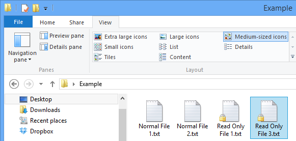
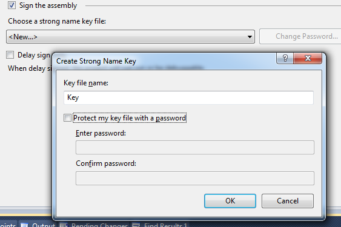
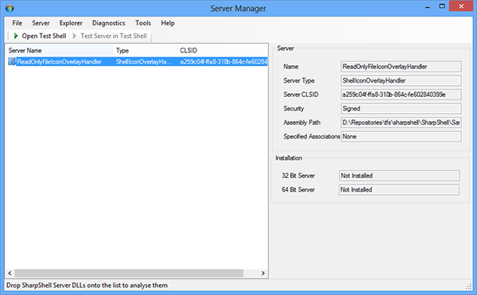
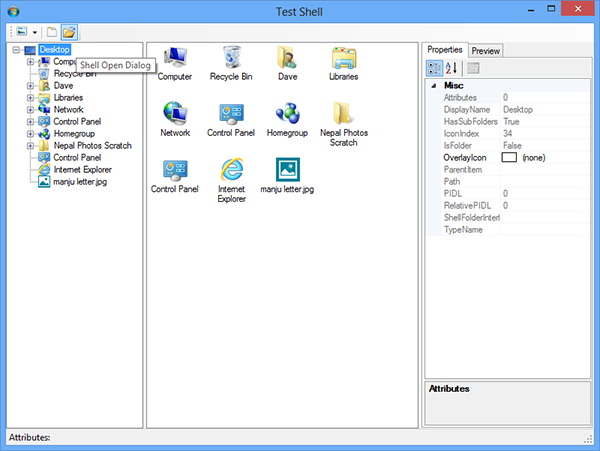

使用.Net 创建 Shell 图标叠加层处理程序(Shell Icon Overlay Handlers)! (为图标添加叠加层)

## 介绍

Shell 图标叠加层处理程序很有用. 它们可以让你在Shell 对象上显示图标叠加层, 以提供更多信息. Dropnox 之类的程序使用这些覆盖在图标上的图案来显示文件是否同步. 在本文中, 我将向您展示如何立即使用 [SharpShell](http://sharpshell.codeplex.com/) 创建 Shell 图标叠加层处理程序!

下面是我们将创建的实力的屏幕截图 - 它会使只读文件的图标在左下角显示一个挂锁图案.



*上图: 文件夹中的一些文本文件. 安装此扩展后, 只读文件的图标会有挂锁图案.*

## 系列文章

本文是 ".NET Shell扩展" 系列的一部分，其中包括：

1. [.NET Shell扩展-Shell 上下文菜单](https://blog.acdzh.ltd/tec/2020-03/sharpshell_tutorial_1)
2. [.NET Shell扩展-Shell 图标处理程序](https://blog.acdzh.ltd/tec/2020-03/sharpshell_tutorial_2)
3. [.NET Shell扩展-Shell 信息提示处理程序](https://blog.acdzh.ltd/tec/2020-03/sharpshell_tutorial_3)
4. [.NET Shell扩展-Shell 拖拽处理程序](https://blog.acdzh.ltd/tec/2020-03/sharpshell_tutorial_4)
5. [.NET Shell扩展-Shell 预览处理程序](https://blog.acdzh.ltd/tec/2020-03/sharpshell_tutorial_5)
6. [.NET Shell扩展-Shell 图标叠加处理程序](https://blog.acdzh.ltd/tec/2020-04/sharpshell_tutorial_6)
7. [.NET Shell扩展-Shell 缩略图处理程序](https://blog.acdzh.ltd/tec/2020-04/sharpshell_tutorial_7)
8. [.NET Shell扩展-Shell 属性表](https://blog.acdzh.ltd/tec/2020-04/sharpshell_tutorial_8)
9. [.NET Shell扩展-部署 SharpShell 服务](https://blog.acdzh.ltd/tec/2020-04/sharpshell_tutorial_9)

## 入门

Shell 扩展通常使用 C 或 C++ 编写. 在 .Net Framework 4 发布之前, 我们无法用 .Net 可靠地创建 Shell Extension. 但是现在你可以. 使用 `SharpShell` 库, 可以为您处理所有的 COM 管道, 您只需要为扩展名创建一个类, 添加一些属性, 重写一些功能即可.

为了说明这是多么容易, 让我们看一下只读文件图标覆盖处理程序的完整代码.

## 我们的目标

这是程序的完整代码, 确实非常精简. 下面我将逐步介绍如何创建自己的扩展程序.

```csharp
/// <summary>
/// The ReadOnlyFileIconOverlayHandler is an IconOverlayHandler that shows
/// a padlock icon over files that are read only.
/// </summary>
[ComVisible(true)]
public class ReadOnlyFileIconOverlayHandler : SharpIconOverlayHandler {
    /// <summary>
    /// Called by the system to get the priority, which is used to determine
    /// which icon overlay to use if there are multiple handlers. The priority
    /// must be between 0 and 100, where 0 is the highest priority.
    /// </summary>
    /// <returns>
    /// A value between 0 and 100, where 0 is the highest priority.
    /// </returns>
    protected override int GetPriority() {
        //  The read only icon overlay is very low priority
        return 90;
    }
 
    /// <summary>
    /// Determines whether an overlay should be shown for the shell item 
    /// with the path 'path' and
    /// the shell attributes 'attributes'
    /// </summary>
    /// <param name="path">The path for the shell item. This is not necessarily the path
    /// to a physical file or folder.</param>
    /// <param name="attributes">The attributes of the shell item.</param>
    /// <returns>
    ///   <c>true</c> if this an overlay should be shown for the specified item; 
    ///  otherwise, <c>false</c>.
    /// </returns>
    protected override bool CanShowOverlay(string path, FILE_ATTRIBUTE attributes) {
        try {
            //  Get the file attributes
            var fileAttributes = new FileInfo(path);
 
            //  Return true if the file is read only, meaning we'll show the overlay
            return fileAttributes.IsReadOnly;
        }
        catch (Exception) {
            return false;
        }
    }
 
    /// <summary>
    /// Called to get the icon to show as the overlay icon
    /// </summary>
    /// <returns>
    /// The overlay icon
    /// </returns>
    protected override System.Drawing.Icon GetOverlayIcon() {
        //  Return the read only icon
        return Properties.Resources.ReadOnly;
    }
}
```
其中大部分都是注释 - 您可以看到, 使用 SharpShell 创建图标叠加层处理程序非常简单.

## 第一步: 建立项目

首先, 创建一个新的 C# 类库 (C# Class Library) 项目.

> **提示**: 您可以使用 Visual Basic 而不是 C#. 虽然本文中的源代码是 C#, 但是创建 Visual Basic Shell 扩展的方法是相同的.

在这个例子中, 我们将项目叫做 '`ReadOnlyFileIconOverlayHandler`'. 

> **提示**: 如果您使用 Nuget 来安装 `SharpShell` (见 "第二步"), 您就不再需要添加下面这些引用了 - 它们将会被自动添加

现在添加下列引用:

1. `System.WIndows.Forms`
2. `System.Drawing`

将 'Class1.cs' 文件重命名为 'ReadOnlyFileIconOverlayHandler.cs'.

## 第二步: 引用 SharpShell

现在我们需要添加核心库 `SharpShell` 的引用. 您可以通过几种不同的方式进行此操作.

### 添加引用

下载文章顶部名为 "SharpShell Library" 的 zip 文件, 并对下载的 SharpShell.dll 添加引用.

> **提示**: 撰写本文时, 本文的下载是正确的. 如果需要最新版本, 请使用 Nuget (如下所述) 或从 [sharpshell.codeplex.com](http://sharpshell.codeplex.com/)获取该库.

### 使用 Nuget

如果已安装 Nuget, 则只需要快速 SharpShell 并直接安装即可. 或者在[https://www.nuget.org/packages/SharpShell](https://www.nuget.org/packages/SharpShell)中获取软件包的详细信息.

## 第三步: 从 SharpIconOverlayHandler 继承 (Deriving from SharpIconOverlayHandler)

现在我们已经建立了项目. 使你的类 `ReadOnlyFileIconOverlayHandler` 继承 `SharpIconOverlayHandler`. 

```csharp
/// <summary>
/// The ReadOnlyFileIconOverlayHandler is an IconOverlayHandler that shows
/// a padlock icon over files that are read only.
/// </summary>
public class ReadOnlyFileIconOverlayHandler : SharpIconOverlayHandler
```

现在, 我们必须实现该类的抽象成员. 右键单击 `SharpIconOverlayHandler` 该行的部分, 然后选择 "**实现抽象类**" ('**Implement Abstract Class**').


```csharp
 /// <summary>
/// The ReadOnlyFileIconOverlayHandler is an IconOverlayHandler that shows
/// a padlock icon over files that are read only.
/// </summary>
public class ReadOnlyFileIconOverlayHandler : SharpIconOverlayHandler {
    protected override int GetPriority() {
        throw new NotImplementedException();
    }
 
    protected override bool CanShowOverlay(string path, FILE_ATTRIBUTE attributes) {
        throw new NotImplementedException();
    }
 
    protected override System.Drawing.Icon GetOverlayIcon() {
        throw new NotImplementedException();
    }
}
```

这是功能和使用方法的说明:

### GetPriority

此函数只需返回此处理程序的优先级. 当图标有两个覆盖层时, Shell 会使用优先级更高的覆盖层. 最高优先级是 0, 最低优先级是 100.

### CanShowOverlay

每次显示 Shell Item 时, 都会调用此函数. Shell Item 的路径在 path 参数中提供. 参数也提供了标志 (flags) `FILE_ATTRIBUTE` (它包括了一些像 `FILE_ATTRIBUTE_DIRECTORY` 这种类型的参数). 如果你想让这个 Item 的图标显示覆盖层, 返回 `true`.

### GetOverlayIcon

此函数返回一个标准的 .Net `System.Drawing.Icon` 对象, 作为覆盖层.

## 第四步: 实现功能

这些功能的实现如下. 首先, `GetPriority`:

```csharp
protected override int GetPriority() {
    //  The read only icon overlay is very low priority.
    return 90;
}
```

我们程序的覆盖很有用, 但不如 TortoiseSVN 的状态图标重要, 因此我们降低优先级.

现在, `CanShowOverlay`:

```csharp
protected override bool CanShowOverlay(string path, FILE_ATTRIBUTE attributes) {
    try {
        //  Get the file attributes
        var fileAttributes = new FileInfo(path);
 
        //  Return true if the file is read only, meaning we'll show the overlay
        return fileAttributes.IsReadOnly;
    }
    catch (Exception) {
        return false;
    }
} 
```

当我们可以获取文件属性并且没有引发异常, 而且文件(或目录)的属性是只读时返回 `true` (显示覆盖图). 之所以不适用 `FILE_ATTRIBUTE_READONLY` 是因为其不适用于目录.

最后一个功能 `GetOverlayIcon`:

```csharp
protected override System.Drawing.Icon GetOverlayIcon() {
    //  Return the read only icon
    return Properties.Resources.ReadOnly;
}
```

我往此项目中的资源添加了一个名为 ``ReadOnly` 的图标, 这个函数将返回它.

## 第五步: 处理 COM 注册

还有一些事情要做. 首先, 我们必须将 `COMVisible` 属性添加到我们的类中.

```csharp
[ComVisible(true)]
public class ReadOnlyFileIconOverlayHandler : SharpIconOverlayHandler
```

接下来, 我们必须给这个程序集一个强名称 (strong name). 有很多方式可以实现此需求, 不过我们有一个最好的方法. 为此, 我们需要在项目上单击鼠标右键, 然后点击 "**属性**", 然后转到 "**签名**", 选择 "**为程序集签名**", 单击 "**选择强名称密钥文件**" 下的下拉列表, 选择 "**新建**". 之后新建一个密钥, 您可以根据需要对密钥进行密码保护, 但这不是必需的:



## 调试 Shell 扩展

Shell 扩展程序会被托管在 Windows 资源管理器中. 因为 .Net COM 服务迂回的加载方式, 让调试器进入进程托管代码并逐步执行进行调试几乎是不可能的. 但是, 有一种方法可以快速调试扩展. `SharpShell`附带了一些工具, 能让 `SharpShell` COM 服务加载更简单一些, 其中之一就是 Server Manager. (SharpShell comes with some tools that make working with SharpShell COM servers a bit easier, and one of them is the Server Manager.) 我们可以使用此工具来 debug 我们的扩展. 打开 Server Manager, 并加载扩展. 选择 "**安装**", 然后选择 "**注册**", 现在打开 Test Shell, 然后选择 "**Shell Open Dialog**", 现在当你切换目录时, 扩展中的断点会被命中.



*上图: Server Manager*



*上图: Test Shell*

## 安装和注册 Shell 扩展

有多种安装和注册 SharpShell Shell 扩展的方法. 在本节中, 我将详细地介绍它们.

### The regasm Tool

您可以使用工具 'regasm' 来安装和注册 Shell 扩展. 使用 regasm 时, Shell 扩展将被安装至注册表中(COM Server 的 Class ID 将被放进 COM Server Class 部分中, 并与实际文件路径相关联), 这同样会注册文件类型关联.

### The Server Manager Tool

Server Manager Tool 是我用来安装/卸载和注册/注销的首选方法, 至少在开发过程中如此. 因为它可以使你一键安装和注册. 它还可以让您指定是以 32 位还是以 64 位模式安装/卸载等.

### 手动注册表操作

通常, 这是一种不好的方法, 但是如果必须这样做的话, 则 Shell Extensions 的 MSDN 文档描述了一些必须对注册表进行的更改, 才能手动注册COM服务器或托管COM服务器. 该文档在 "有用的资源" 部分中列出. 

## 提示

以下是使用 SharpShell 和图标覆盖处理程序的一些有用提示.

* 看起来您的叠加层不起作用? 打开regedit并检查路径:
`HKLM\Software\Microsoft\Windows\CurrentVersion\Explorer\ShellIconOverlayHandlers `
Windows仅支持有限数量的处理程序-按字母顺序, 可能安装了太多.
* 如果需要记录事件, 请以管理员身份运行服务器管理器, 然后选择 '**Diagnostics > Enable SharpShell Log**'. 现在, 您可以在您的类中使用以下功能：
    `Log`
    `LogError`
    `LogWarning`
, 这些消息将被写入Windows事件日志（在 '**Application**' 中）.

## 历史

* 2013年9月14日: 初始版本

## License

本文以及所有相关的源代码和文件均已获得 [The Code Project Open License（CPOL）](http://www.codeproject.com/info/cpol10.aspx) 的许可.

## 译注

1. 文章来源: [.NET-Shell-Extensions-Shell-Preview-Handlers - CodeProject](https://www.codeproject.com/Articles/533948/NET-Shell-Extensions-Shell-Preview-Handlers) 

2. 原文作者: Dave Kerr, A softer Developer from UK. Blog: [www.dwmkerr.com](http://www.dwmkerr.com/), Github: [dwmkerr@Github](https://github.com/dwmkerr)

3. 本文最早发表于 **2013年9月14日**, 翻译日期为 **2020年4月29日**. **互联网日新月异, 请注意信息时效**.

4. 本文中的代码未测试通过, 文中除了标有 "译者注" 的部分之外均为原文, 译者水平有限, 如有疑惑之处请戳原文或 PM 我, 谢谢茄子. 

5. 纠结了好久, 最终还是决定代码中的英文注释不翻译. 这部分与代码相关较大, 希望能尽量保持原汁原味.

|Version| Action|Time|
|:-------:|:--------:|:-----------:|
|1.0|Init|2020-04-29 15:23:08|