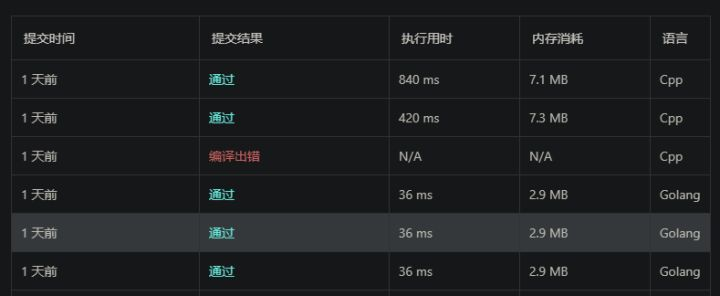

[10. 正则表达式匹配 - 力扣 leetcode-cn.com](https://leetcode-cn.com/problems/regular-expression-matching/)


这个题本来没什么好说的, 简单的动态规划.

本来想直接糊个动态规划过去..然后看到题解里一个有限自动机的解法. 不过感觉废话挺多, 有些写法有些复杂, 比如下面这部分

```go
type Node struct {
	C        byte
	Parent   *Node
	Children map[byte][]*Node
	End      bool
	Size     int
}

func (n *Node) Append(c byte, child *Node) {
	m := n.Children
	if m == nil {
		m = make(map[byte][]*Node)
		n.Children = m
	}
	list := m[c]
	if list == nil {
		list = make([]*Node, 0)
	}
	for _, v := range list {
		if v == child {
			m[c] = list
			return
		}
	}
	list = append(list, child)
	m[c] = list
}

作者：qianjigui
链接：https://leetcode-cn.com/problems/regular-expression-matching/solution/yi-bu-dao-wei-zhi-jie-an-zheng-ze-biao-da-shi-de-s/
来源：力扣（LeetCode）
著作权归作者所有。商业转载请联系作者获得授权，非商业转载请注明出处。
```

有些迷惑..明明一句就好了, 实在不清楚为什么写这么多

```go
type Node struct {
	C          byte
	isEnd      bool
	router     map[byte]([]*Node)
	parentNode []*Node
	canBack    bool
}

func (node *Node) appendRouter(c byte, next *Node) {
	node.router[c] = append(node.router[c], next)
}
```

我的编译原理当年就没好好学...年代久远, 折腾一阵子, 最后总算用了80行实现了下面这堆垃圾:

```go
type Node struct {
	C          byte
	isEnd      bool
	router     map[byte]([]*Node)
	parentNode []*Node
	canBack    bool
}

func (node *Node) appendRouter(c byte, next *Node) {
	node.router[c] = append(node.router[c], next)
}

func getDFA(p string) *Node {
	pLen := len(p)
	begin := Node{'>', true, make(map[byte]([]*Node)), []*Node{nil}, false}
	last := &begin
	for i := 0; i < pLen; i++ {
		if p[i] == '.' {
			t := &Node{'.', true, make(map[byte]([]*Node)), []*Node{last}, false}
			last.appendRouter('.', t)
			last.isEnd = false
			if last.canBack {
				for _, pp := range last.parentNode {
					pp.appendRouter('.', t)
					t.parentNode = append(t.parentNode, pp)
				}
			}
			last = t
		} else if p[i] == '*' {
			last.canBack = true
			last.appendRouter(last.C, last)
			if i == pLen-1 {
				for _, p := range last.parentNode {
					p.isEnd = true
				}
			}
		} else {
			t := &Node{p[i], true, make(map[byte]([]*Node)), []*Node{last}, false}
			last.appendRouter(p[i], t)
			last.isEnd = false
			if last.canBack {
				for _, pp := range last.parentNode {
					pp.appendRouter(p[i], t)
					t.parentNode = append(t.parentNode, pp)
				}
			}
			last = t
		}
	}
	return &begin
}

func check(p *Node, s string, i int) bool {
	if i > len(s) {
		return false
	}

	if i == len(s) {
		if p.isEnd {
			return true
		} else {
			return false
		}
	}

	for k, v := range p.router {
		if k != s[i] && k != '.' {
			continue
		}
		for _, vv := range v {
			if check(vv, s, i+1) {
				return true
			}
		}
	}
	return false
}

func isMatch(s string, p string) bool {
	return check(getDFA(p), s, 0)
}
```


用了80ms.

大致看了一下大家的 Solution, 在使用 NFA 的 Solution 里面, 题解里的那份代码最快的是 104 ms, 最慢的是 214ms..... 另外, 除了我最快的一个是 100ms, 最慢的那个用了 224ms

还行

爽到

理论上还有一些地方可以优化, 懒得搞了

---

说起来的话, 我大一的时候实现自己的一个垃圾 C++Json 库的时候还没学编原... 然后那个库的实现就是下标跳来跳去, 虽然最后也勉强实现功能了, 但看起来是真的头疼....

不过就算重构也估计快不到哪里去了 (x

---

说句题外话

也不知道 leetcode 的后台是不是有问题..往往同样的算法 go 会比 c++ 快好多..真是见了鬼了



> 比如第一题


> 还是第一题, 一年前的两次记录.....代码和上面是一样的, 不知道为什么再提交时间多了这么多


> 还是第一题..Java是真滴强

## 历史记录

|Version| Action|Time|
|:-------:|:--------:|:-----------:|
|1.0|Init|2020-04-04 04:02|
|1.0|迁移至 blog|2020-04-28 22:37|