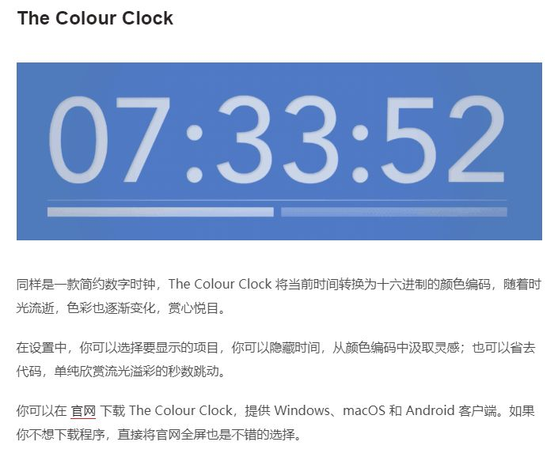
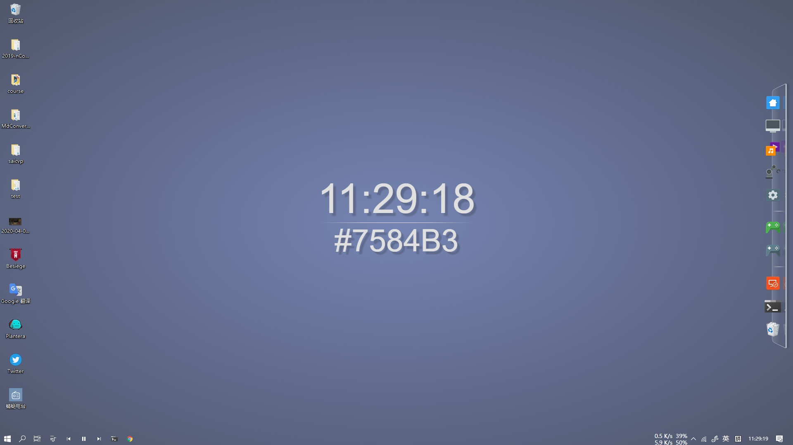
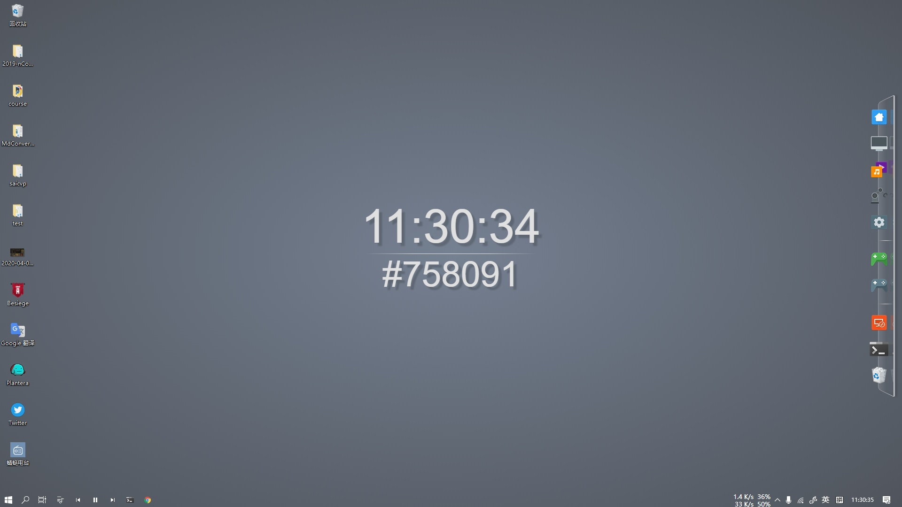
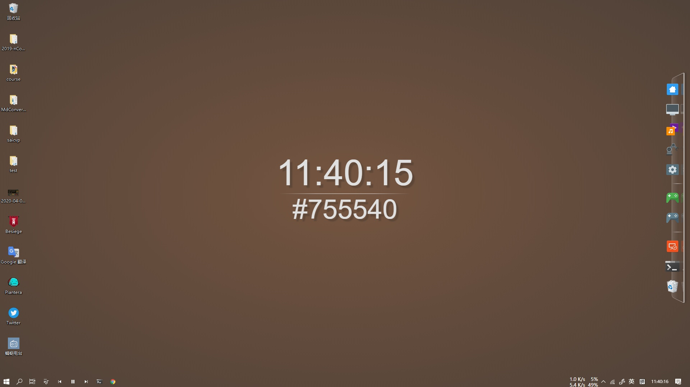

今天心血来潮又打开了 windows 的屏保, 无奈自带的屏保太少了, 在网上找到了一篇 17 年的老文:

[8 款屏保程序，让你的 Windows 锁屏每次都充满惊喜 - 少数派](https://sspai.com/post/41697)

​
其中有一个还不错, 背景颜色是随着时间变化的, 可惜它的官网已经死掉了. 于是打算自己写一个..

之后在某个第三方网站上找到一个同名屏保, 虽然不太一样, 效果也挺好

[The Colour Clock Screensaver for Windows & Mac](https://www.screensaversplanet.com/screensavers/the-colour-clock-374/)
​

准备复 (照) 现 (抄) 时突然想到, 都 2020 年了, 谁还用屏保啊, 那我写了岂不是白写... 干脆整个动态壁纸好了

根据上面的预览图, 自己又微调了一些样式, 开整

1. 时间和颜色是一一对应的, 并且根据原范围映射到 0-255 上, 确保大部分颜色均能被覆盖
2. 当分钟切换时, 秒数会从 59 跳至 00, 对应颜色会从 FF 跳至 00, 表现出来就是屏幕闪一下, 于是秒数就没有直接等于真实秒数来, 而是跟随真实秒数先从 0 到 59, 再从 59 到 0, 如此循环. 分钟数也是如此.
3. 背景用纯色是真的丑....于是加了个渐变
4. 时间和颜色的文字大小相同会对注意力中心造成干扰, 微调了两者的大小. 同时调整了一些样式, 使字体在不同颜色的背景上都醒目一些. 颜色值前加上了 #, 避免歧义
最终效果如下:

之后就是上传创意工坊了: [Steam 创意工坊 :: Color Clock](https://steamcommunity.com/sharedfiles/filedetails/?id=2042236733)

​
在线预览可以看这里: [colour-clock.netlify.com/](https://colour-clock.netlify.app/)

<iframe2 title="colour-clock.netlify.com" src="https://colour-clock.netlify.app/" />

大哥大嫂点个订阅吧 (逃

---

有兴趣的话也可以康一康我的另外一个壁纸: [Steam 创意工坊 :: Jumping Time - No Background](https://steamcommunity.com/sharedfiles/filedetails/?id=1857478898)

​
在线预览: [none title - jump-time-with-no-net.netlify.com](https://jump-time-with-no-net.netlify.app/)

## 历史记录

|Version| Action|Time|
|:-------:|:--------:|:-----------:|
|1.0|Init|2020-04-01 13:36|
|1.0|迁移至 blog|2020-04-28 20:48|