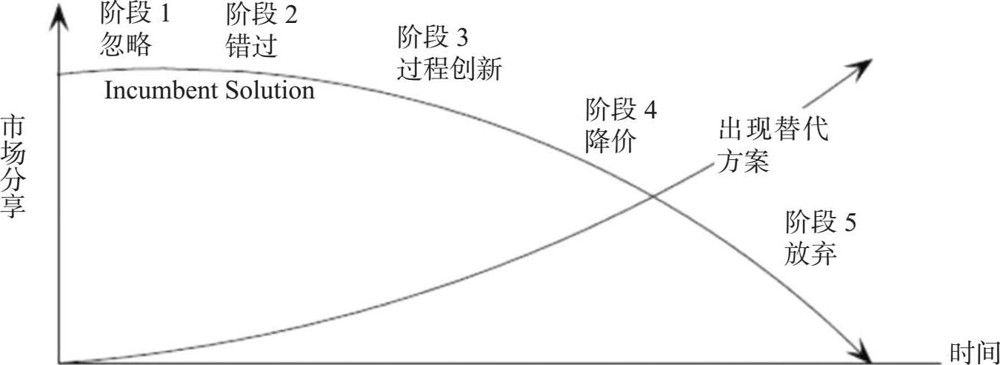

[lecture - SEE.ch03.lecture.pdf](files/2020/05/SEE.ch03.lecture.pdf)

chinese: [https://book.mihua.net/book/50/50832/65684.html](https://book.mihua.net/book/50/50832/65684.html)

## Goal

1. Understanding **ecosystem, platform lifecycles** using **dominant designs, S-curves, and diffusion curves**. 
2. Platform properties: **multi-sidedness, network effects, multi-homing, architecture, and governance**. 
3. Platform dynamics: **tipping, locking-in, competitive durability, and envelopment**. 
4. How platform businesses differ from product and service business. 
5. Why platforms need a mindset different from products and services.

## 3.1 核心概念 Core Concepts

### 生态系统 Ecosystem

* An environment consists of all the mutually dependent stakeholders, business units, and companies working in a particular area. 

* typical: producers & consumers(add value to consumed resources).

* software: software supplier & companies in different regions.

* permanent or temporary.

### 平台生命周期 Platform Lifecycle

the lifecycle of most technology innovations:

* 理想技术解决方案本身的出现。
* 沿着技术成熟度曲线的进展。
* 在潜在的最终用户群中的渗透。

适用于 App 和 平台. 都称为平台生命周期.

大多数技术创新的生命周期都分为三个阶段：理想的技术解决方案本身的出现，沿着技术成熟度路线发展，在终端用户中扩散。这些生命周期的特征也适用于平台和应用程序，所以我们一般将其描述为平台的生命周期的技术解决方案。图2.1说明了这三个阶段。

> 平台成长的三维模式

#### 主导设计的诞生 Emergence of a dominant design 

技术解决方案本身的出现经过两个不同的阶段，两者之间的转换标志着主导设计的出现（Anderson & Tushman，1990；Utterback，1996）。图2-2说明了这一点。当技术解决方案首次出现时，多家公司将进入多样化设计的竞争中。在平台市场早期阶段，各企业尝试设计具有不同特征、功能的平台，以评估市场的响应。因此，主要的设计阶段是由竞争对手们提供多样的解决方案，以满足同样的市场需求。由于这些竞争方案的不断完善，在某些时候一个设计最终将被直接或间接地作为标准广泛接受。即客户和生产商达成一定的共识，最终达成最佳的解决方案，满足客户的各种不同需求。这便成为行业的主导设计，经历了竞争对手的大规模退出和筛选。主导设计并不意味着每一个竞争者都使用相同的技术，而是它为满足用户的需求定义预期的规范。主导设计不一定是最优的技术解决方案，往往需要不断改进以吸引更广大的用户。

> 一个软件平台的前、后期优势设计的购买情况

#### S曲线和跨越 S-curves and leapfrogging

**技术成熟度曲线 Technology maturity curve**

一个技术解决方案的生命周期包括：

（1）入门阶段，紧随其后的是研发阶段；
（2）上升阶段，已经达到盈亏平，并开始获得利润；
（3）成熟阶段；
（4）衰退阶段，较少被应用。这类似于“S”形曲线，因此称为S曲线，如图2-3所示：

> 技术生命周期中的 S 曲线.

**流程创新取代产品创新 Process innovation replaces product innovation**

随着一种技术解决方案经过成熟阶段，进入下降阶段，竞争的焦点从产品创新转移到过程创新（见图2-4）（Adner & Levinthal，2001）。换句话说，竞争对手将他们的注意力放在如何改善生产和交付上，而不是试图改善解决方案本身。平台市场参与者必须知道是什么原因导致进入衰退期以及用什么方式来改进。通常是因为出现了一个有竞争力的技术解决方案，至少达到以前的技术解决方案所要求的，而且比之前的更好或更便宜。

大多数技术解决方案的消亡出现在S曲线的下降阶段。平台需要为那些依赖于它的企业选择技术解决方案，从而跨越到下一个S曲线。这意味着需要颠覆性的技术解决方案，替代现在市场上的技术解决方案。大多数尝试采用这种方式的公司惨遭失败，因为它们都是基于前任技术，其商业模式也是围绕现有技术基础，很难离开现有的技术解决方案。

**现有的技术方案对潜在的技术方案如何反应 Incumbent tech-solution reacts to potential replacement technology**

回想当时化学摄影受到数码摄影威胁时柯达首先作出的回应；文字处理器首次推出时的雷明顿打字机；在电子书首次出现时的传统图书出版商；在电报被发明时的驿马快递；智能手机出现时的佳能数码相机。回顾一下明尼苏达州蓬勃的采冰业的故事（见图2-5），这是一次又一次被忘记的错误示范。图2-5显示了19世纪冰箱出现时冰产业的状态。这个例子在很多行业适用，就像最近出现的许多替代技术解决方案，如电子书之于纸质书、数字音乐之于CD、互联网之于电话。现有企业往往忽略了潜在替代技术的威胁，认为它是无关的、低质量的，然后专注于进行过程创新，以更低的成本为客户提供依靠现有技术生成的产品，然后再大幅度降价，但最终失败（见图2-6）。

但是，从一个S曲线跨越到下一个S曲线需要嵌入不同类型架构的实物期权（实物期权理论详见第8章），进入相邻市场，转移目标市场，以及使用六个模块化运算。这需要思考软件平台的架构及其治理。本书中有关于这些工具的详细讲解，其中“跨越”被用来指跨越连续的S曲线。

#### 终端用户侧的技术扩散曲线 The technology diffusion curve on the end-user side

平台终端用户提供的技术解决方案采用的生命周期可以用Rogers（1995）的扩散曲线来描述，就像从供应商角度所描述的主导设计和S曲线的生命周期。如图2-7所示，技术解决方案的扩散始于采用技术的少数人而不是广泛使用的那些。这些少数的人跟随着那些早期使用者，这些人加起来约为潜在用户群的1/6。这就是技术创新中Geoffrey Moore所谓的“鸿沟”。只有跨越这道鸿沟，才能迎来之后的使用者。在管理技术的生命周期中，不同的进化属性应成为人们关注的焦点，这取决于解决方案所在的扩散曲线的五个阶段。同样地，治理的重点也必须转移到沿扩散曲线进化并将技术解决方案相匹配。

### 多边性 multi-sidedness

平台的一个重要属性是其多边性，其中每个“边”指的都是平台集聚的不同的利益相关者。例如，iOS平台汇集的应用程序开发者（一边）和终端用户（另一边）。通常会发现这两边直接交易要比平台交易花费更高的成本。该平台通过促进一边参与者与另一边参与者的互动，创造价值，图2-8说明了这一点。从理论上讲，双方可以直接交易，但需花费较高的成本。像平台一样，应用程序也可以演变成独立的平台或通过演进变得多元化而成为内含于另一个平台的平台（嵌套平台）。

多边市场长期以来存在于技术产业以外。

表2-2提供了这样的市场例子，一家公司充当做市商，促进需要彼此的两个不同群体之间的相互作用，但会发现找到两个不同的群体并促成相互交易的成本较高。一个软件平台，可以在两方之间作为做市商，带来很少单独存在软件平台市场的独特的能力和机会。两个或多个不同类型的参与者如果需要彼此直接交互，需要平台的连接。大多数多边平台是双边的。例如，应用程序开发者和终端用户是iOS的App Store平台的两边；第三方销售商和客户直接在亚马逊上交互。

不要混淆多边平台的服务概念。我们甚至不认为单边市场是真正的平台，但是它们有潜力成为多边平台。例如，文件共享服务保管箱主要有一个明显的参与者，即它的终端用户。它们并不直接与另一边的不同参与者交互，仅仅与梭箱中的其他用户交互。与此相反，日常中两组不同的参与者的双边网络是存在的，如信用卡（持卡人和商户）、视频游戏（游戏玩家和游戏制作人）和电影院（工作室和观众）。三边平台也变得越来越普遍。例如，苹果开始在iOS应用商店里提供连接三种不同类型群体的免费应用程序：终端用户、应用程序开发者和广告商。因此，多边性是引发更复杂的平台动力学的关键要求。

example

以多少面启动平台？
启动平台通常面临以下问题：应该吸引多少面的参与者，以及由哪一面的参与者实施补贴使平台达到临界规模。虽然表面看来，吸引尽可能多的双方可能是一个很好的策略，但是会带来以下两个问题：首先，同时吸引多方参与者不易于解决鸡蛋相生问题，解决这一问题的方式通常是先吸引平台一边的用户（这种策略在第4章中进行讨论）；其次，它可能会引起负的网络效应，而不是正的，这一致命的组合可能会使负的网络效应压倒正的。

### 网络效应 network effects

网络效应是指平台或应用程序一边的用户使得它对于另一边的用户更有价值。经济学家称之为网络外部性（Katz & Shapiro ，1994；Saloner & Shepard,1995）或梅特卡夫定律。现在，我们以Facebook的用户为例，第一个用户对于Facebook来说，是没有价值的，因为没有其他用户使用。而第二个用户的到来增加了第一个用户的价值。这意味着平台每增加一个用户都会显著增加其他用户的价值，因为这会增加平台用户的交互用户数量。例如，Facebook的十亿用户使它对之后的加入者更有吸引力（如图2-9所示）。该系统的价值几乎呈指数而不是线性增加（是用户数量的平方还是用户时间数量对数的平方，取决于梅特卡夫定律的考虑），由此每个附加用户潜在地增加了系统对其他用户的显著价值（见图2-10）。一旦这种网络效应被触发，该平台就可以进入自增强周期，尽管网络效应为企业进入平台设立了高门槛，同时也为平台企业创造了壁垒。

网络效应使得用户之间可以相互联系

网络效应成倍增加平台价值

网络效应一般是指正的网络效应，应有两个细微的属性：方向和片面性。方向可以是正或负。正的网络效应如前所述，负的网络效应是指系统每增加一个用户不能增加其他用户的价值。例如，一条高速公路，在高速公路上每一个额外的司机都会增加其他司机迅速通过公路的难度，从而减少其对现有公路的吸引力。同样地，你家附近每增加一个互联网用户，都会减少有线互联网的可用带宽，从你的角度来看，减少了宽带对你的价值。也有平台，拥有达到阈值的用户群之后同时显示出负的和正的网络效应。为确保网络效应是正的，需要十分注意平台结构（第5章），很多这种冲突之前是明显体现出来的。

网络效应的第二个属性是他们是同一侧还是交叉侧（如图2-11所示）。增加一个额外的参与者时，会出现同侧网络效应（如终端用户），即增加平台同侧用户的价值。例如，增加一个额外的Skype用户，会增加Skype对其他用户的价值（正同边网络影响）；一条繁忙的高速公路，增加一个司机，便降低了其对其他用户的吸引力（负同边网络效应）。增加一个额外的参与者时，也会出现交叉侧网络效应（如终端用户），即增加平台对另一边用户的价值。例如，随着越来越多的人买iPad，更多的开发商想要写iPad应用程序，这是一种积极的正交叉网络效果。

### 多重归属性 multi-homing

用户归属多个竞争平台.

### 临界点 tipping

用户数量必须到一定规模才能产生网络效应. 这个最小数量即为临界点 / 颠覆点.

### 锁定 lock-in

锁定是指平台让现有用户更愿意待在现有平台，而不是跳转到一个竞争对手的平台。锁定可以发生在消费级平台（如iOS，Android）和企业级平台（如SAP，PeopleSoft）。

### 竞争力的持久性 competitive durability

技术解决方案必须具备持久性，从而其使用者会长时间地使用它.

加强网络效应 / 积极增加用户的价值

### 进化 enveloment

当一个平台开始提供除已经存在的功能外的相邻平台拥有的功能时，我们称其开始了包络.

### 架构 architecture

架构是描述技术解决方案的结构的概念性蓝图，它描述了一个复杂系统的组成部分，包括它们做了什么，以及它们之间如何相互作用. 同时，从更高的层次描述系统的组件，以及组件的外部可见属性和它们之间的关系

### 治理 governace

治理泛指一个平台生态系统的决策。它包括三个方面：

1. 决策权如何在平台所有者和应用程序开发者之间分配
2. 平台所有者使用的正式和非正式的控制机制（例如，把关、性能指标、应用程序开发者应该遵守的规则、非正式的外来压力）
3. 定价结构，包括关于哪一方得到补贴的决定

## 3.2 指导原则 Guide Principles 

see [https://book.mihua.net/book/50/50832/65685.html](https://book.mihua.net/book/50/50832/65685.html)

## History

|Version| Action|Time|
|:-------:|:--------:|:-----------:|
|1.0|Init|2020-05-06 22:32|
|1.1|Finish|2020-05-25 15:33|