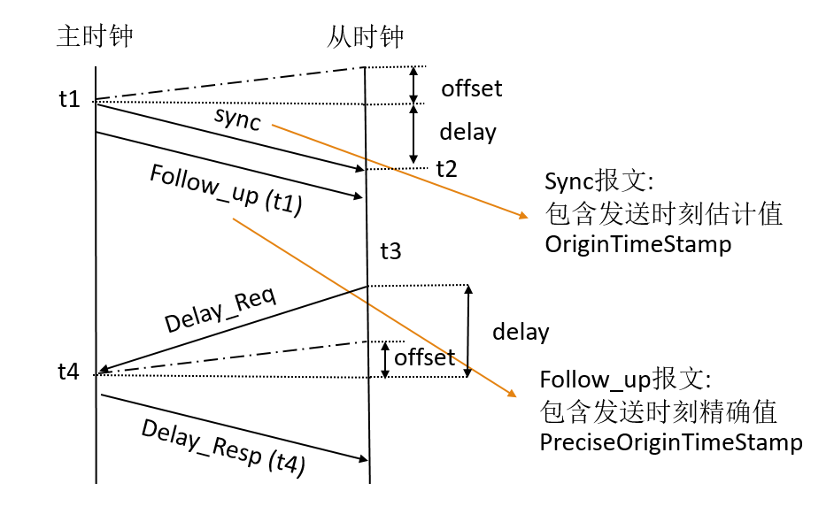

IEEE 1588, Precision Time Protocol (精确时间协议), 简称 PTP, 用于亚微秒级别时间同步精度, 于 2002 年发布 version 1, 2008 年发布 version 2.

其原理是 Delay Request-Response Mechanism (延时响应机制). 如下图所示: 

**其中共有以下几种报文:**

1. sync 同步报文
2. Follow_up 跟随报文
3. Delay_req 延迟请求报文
4. Delay_resp 延迟请求报文

**整个流程如下:**

1. 主时钟周期性的发出 sync 报文, 并记录下 sync 报文离开主时钟的精确发送时间 t1；

（此处 sync 报文是周期性发出, 可以携带或者不携带发送时间信息, 因为就算携带也只能是预估发送时间戳 originTimeStamp）

2. 主时钟将精确发送时间 t1 封装到 Follow_up 报文中, 发送给从时钟；

（由于 sync 报文不可能携带精确的报文离开时间, 所以我们在之后的 Follow_up 报文中, 将 sync 报文精确的发送时间戳  t1 封装起来, 发给从时钟）

3. 从时钟记录 sync 报文到达从时钟的精确时到达时间 t2；

4. 从时钟发出 delay_req 报文并且记录下精确发送时间 t3；

5. 主时钟记录下 delay_req 报文到达主时钟的精确到达时间 t4；

6. 主时钟发出携带精确时间戳信息 t4 的 delay_resp 报文给从时钟；

**时钟偏差 & 网络延时**

offset : 时钟间偏差（主从时钟之间存在时间偏差, 偏离值就是 offset, 图1 中主从时钟之间虚线连接时刻, 就是两时钟时间一致点）

delay : 网络延时（报文在网络中传输带来的延时）

从时钟可以通过 t1,t2,t3,t4 四个精确时间戳信息, 得到主从时钟偏差 offset 和传输延时 delay:

$$delay=\frac{(t_2-t_1)+(t_4-t_3)}{2}$$

$$offset=\frac{(t_2-t_1)-(t_4-t_3)}{2}$$

之后就可以修正本地时钟进行同步.

**PTP报文分类**

IEEE1588 把所涉及到的报文分为事件报文和通用报文, 分类依据是: 是否在收发报文时需要记录精确时间戳, 根据上文中所描述的几种报文, 可以进行如下分类: 

事件报文 (收发时候需要记录精确时间戳): sync 报文, delay_req 报文

通用报文 (收发时候不需要几率精确时间戳): follow_up 报文, delay_resp 报文

 

**Note**

1. 因为需要高同步精度, 选取的时间都是精确时间戳

2. sync 同步报文是周期性从主时钟向从时钟以广播的形式发出

3. 时钟偏差延时的计算在从时钟中进行, 所以需要把 t1,t2,t3,t4 四个时间戳信息都发往从时钟, 所以需要  follow_up 报文和  delay_resp 报文的存在

## 历史记录

|Version| Action|Time|
|:-------:|:--------:|:-----------:|
|1.0|Init|2020-07-05 14:40|