这篇论文是一门课的作业...原文地址在[这里](https://ieeexplore.ieee.org/document/1541513).

## SECTION I.Introduction 简介

Clock synchronization is needed in various home, office, and industrial automation applications. Synchronization allows transactions between distributed systems to be controlled on timely basis.

在各种家庭，办公室和工业自动化应用中都需要时钟同步。 通过同步，可以及时控制分布式系统之间的事务。

Basically, synchronization accuracy can be improved using two methods. First, existing hardware can be extended with a more accurate clock. Second, clocks can be synchronized to one accurate external clock. This paper focuses on the second method, which can be considered more cost efficient and scalable.

基本上，可以使用两种方法来提高同步精度。 首先，可以使用更精确的时钟扩展现有硬件。 其次，时钟可以与一个准确的外部时钟同步。 本文重点介绍第二种方法，可以认为它更具成本效益和可扩展性。

Applications in various environments are increasingly built using Local Area Network (LAN) technologies. IEEE 1588 is a standard for precise clock synchronization for networked measurement and control systems in the LAN environment [1]. The standard defines a Precision Time Protocol (PTP) developed for synchronizing independent clocks running on separate network nodes. The standard aims for submicrosecond accuracy, while higher accuracy is targeted by hardware implementation.

使用局域网（LAN）技术的各种环境中的应用程序越来越多。 IEEE 1588是LAN环境中联网的测量和控制系统的精确时钟同步的标准[1]。 该标准定义了精确时间协议（PTP），该协议是为同步在独立网络节点上运行的独立时钟而开发的。 该标准的目标是亚微秒精度，而硬件实现则以更高的精度为目标。

Wireless LANs (WLAN) extend wired networks with easier installation and freedom of movement. They introduce unique challenges for clock synchronization due to use of wireless error prone medium and the unpredictable operation of wireless Medium Access Control (MAC) protocol. The MAC protocol of IEEE 802.11 WLAN [2] uses contention based medium access that causes variable delays for packet transmissions. With a proper design, these inaccuracies can be avoided and the synchronization accuracy significantly improved.

无线局域网（WLAN）扩展了有线网络，使安装更加简便且移动自如。 由于使用容易出错的无线介质以及无线介质访问控制（MAC）协议的不可预测的操作，它们为时钟同步带来了独特的挑战。 IEEE 802.11 WLAN [2]的MAC协议使用基于竞争的媒体访问，该访问会导致数据包传输的可变延迟。 通过适当的设计，可以避免这些不准确性，并且可以显着提高同步精度。

The accuracy of a PTP implementation depends mainly on the accuracy of the timestamps used for synchronization. Timestamping can be done at the application layer, at an intermediate protocol, such as IP layer, in a device driver layer, MAC layer, or in hardware. Different timestamping methods are presented in Figure 1. Our earlier research [3] reports the performance of software based IEEE 1588 prototype on Windows platform. It uses only the application layer approach for timestamping the synchronization messages.

PTP实现的准确性主要取决于用于同步的时间戳的准确性。 时间戳记可以在应用程序层，中间协议（例如IP层），设备驱动程序层，MAC层或硬件中完成。 图1中显示了不同的时间戳方法。我们的早期研究[3]报告了Windows平台上基于软件的IEEE 1588原型的性能。 它仅使用应用程序层方法为同步消息添加时间戳。

This paper extends the previous work by a device driver, and hardware based timestamping methods. The paper presents two IEEE 1588 prototypes for WLAN. The first one is implemented using a Linux PC platform and IEEE 802.11 b WLAN adapter, with modifications to the network driver. The second prototype is implemented using an embedded Altera Excalibur development board. It implements the synchronization functionality using an embedded processor and Programmable Logic Device (PLD) circuits. Altera prototype is referred as the PLD prototype.

本文通过设备驱动程序和基于硬件的时间戳方法扩展了以前的工作。本文介绍了两个用于WLAN的IEEE 1588原型。第一个是使用Linux PC平台和IEEE 802.11 b WLAN适配器（对网络驱动程序进行了修改）实现的。第二个原型是使用嵌入式Altera Excalibur开发板实现的。它使用嵌入式处理器和可编程逻辑设备（PLD）电路实现同步功能。 Altera原型被称为PLD原型。

The paper is organized in the following way. Section II presents the related work on time synchronization with IEEE 1588. Section III gives an overview of the IEEE 1588 standard. Next, Section IV presents both the Linux PC driver based prototype and the PLD prototype, as well as their design and implementation. Also, the PLD clock adjustment algorithm is presented. Section V defines the measurement arrangements and gives the performance results. The final section concludes the paper.

本文的组织方式如下。第二节介绍了与IEEE 1588进行时间同步的相关工作。第三节概述了IEEE 1588标准。接下来，第四节介绍了基于Linux PC驱动程序的原型和PLD原型，以及它们的设计和实现。此外，介绍了PLD时钟调整算法。第五节定义了测量安排并给出了性能结果。最后一部分是本文的总结。

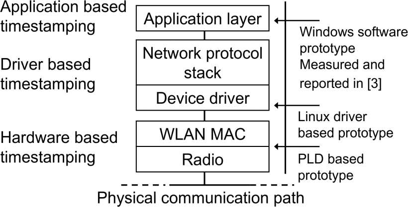

* Application based timestamping 基于应用程序的时间戳
* Driver based timestamping 基于驱动的时间戳
* Hardware based timestamping 基于硬件的时间戳
* Windows software prototype Measured and reported in [3] [3]中进行了测量和报告的Windows软件原型
* Linux driver based prototype with基于Linux驱动程序的原型
* PLD based prototype 基于PLD的原型
* Application layer 应用层
* Network protocol stack 网络协议栈
* Device driver 设备驱动
* WLAN MAC
* Radio 无线电
* Physical communication path 物理通讯路径

> **Figure 1.** Timestamping methods evaluated in this research. **图1.** 在本研究中评估的时间戳方法。

## SECTION II.Related Research 相关研究

An IEEE 1588 prototype with hardware based timestamping has been presented in [4]. It has been implemented for Ethernet LAN environment, and measured with two clocks communicating via a repeater and a switch. According to the measurements, it has 22 ns average offset with 9800 ns2 variance on a repeater network, and 49 ns average offset with 54000 ns2 variance on a switched network. Although good results have been achieved with the prototype, it is aimed on wired LAN. Our goal is to reach optimum accuracy on WLAN and evaluate the affect of different implementation methods in the WLAN environment.

[4]中提出了带有基于硬件时间戳的IEEE 1588原型。 它已针对以太网LAN环境实现，并通过两个通过中继器和交换机进行通信的时钟进行测量。 根据测量，它在中继器网络上具有22 ns的平均偏移和9800 ns2的方差，在交换网络上具有49 ns的平均偏移和54000 ns2的方差。 尽管使用该原型已取得了良好的结果，但它针对的是有线LAN。 我们的目标是在WLAN上达到最佳准确性，并评估WLAN环境中不同实施方法的影响。

IEEE 1588 synchronization over IEEE 802.11 b with hardware based timestamping have also been researched by Pakdaman et al. [8]. There was not enough information available about the experiment setups and results. Thus, comparison to our prototypes was not possible.

Pakdaman等人还研究了基于硬件时间戳的IEEE 802.11 b上的IEEE 1588同步。 [8]。 没有足够的有关实验设置和结果的信息。 因此，无法与我们的原型进行比较。

## SECTION III.IEEE 1588 Overview IEEE 1588概述

PTP divides the topology of a distributed system into network segments enabling direct communication between PTP clocks. These segments, denoted as communication paths, may contain repeaters and switches connecting same LAN technology. Devices connecting communication paths, such as routers, introduce possibly asymmetric and variable delay to the communication, and are therefore treated separately.

PTP将分布式系统的拓扑划分为多个网段，以实现PTP时钟之间的直接通信。 这些段（称为通信路径）可能包含连接相同LAN技术的转发器和交换机。 连接通信路径的设备（例如路由器）可能给通信带来不对称和可变的延迟，因此需要分别处理。

On each communication path a single clock is selected as a master while others are slave clocks synchronizing to it. The selection is done using the best master clock algorithm defined in the standard.

在每个通信路径上，一个时钟被选择为主时钟，而其他时钟则是与其同步的从时钟。 该选择是使用标准中定义的最佳主时钟算法完成的。

PTP messaging between a master clock and a slave clock is presented in Figure 2. The master clock sends a synchronization (sync) message once in every two seconds in a default configuration. The message contains information about the clock and an estimated timestamp tml of the message transmission time. The clock information contains the identification and the accuracy of the master clock. When a slave clock receives the sync message, it stores a timestamp tsl of the reception time. As it may be difficult to timestamp a sync message with an exact transmission time, the master clock can send a follow-up message, which contains a more precise value for the timestamp tml.

主时钟和从时钟之间的PTP消息传递如图2所示。在默认配置下，主时钟每两秒钟发送一次同步（sync）消息。 该消息包含有关时钟的信息以及消息传输时间的估计时间戳tml。 时钟信息包含主时钟的标识和准确性。 当从时钟接收到同步消息时，它存储接收时间的时间戳tsl。 由于可能很难用准确的传输时间来标记同步消息的时间戳，因此主时钟可以发送后续消息，该消息包含时间戳tml的更精确值。

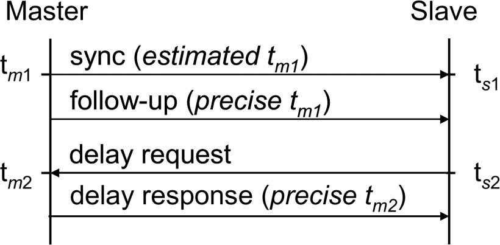

> **Figure 2.** PTP messaging.

A slave clock sends periodically a delay request message and stores its transmission time with a timestamp ts2. When a master clock receives the message, it sends a delay response message, which contains the timestamp tm2 of the reception time of the corresponding request message.

从时钟定期发送延迟请求消息，并以时间戳ts2存储其传输时间。 当主时钟接收到该消息时，它将发送一个延迟响应消息，其中包含相应请求消息的接收时间的时间戳tm2。

The slave clock calculates the master to slave delay dms and the slave to master delay dsm according to these timestamps as

从时钟根据以下时间戳计算主到从延迟dms和从到主延迟dsm

$$
d_{ms}=t_{s1}-t_{m1}
$$

$$d_{sm}=t_{m2}-t_{s2}$$

The slave clock calculates the estimation of the one way delay dw and the offset from master ofm using the results from (1) and (2) as

从时钟使用（1）和（2）的结果计算单向延迟dw的估计值与相对于主时钟的偏移量。

$$d_{w}={d_{ms}+d_{sm}\over 2}$$

$$o_{fm}=d_{ms}-d_{w}$$

The offset from the master is used to adjust the computer clock frequency and/or time. As continuous, strictly increasing time is required, the clock frequency adjustment is the only possibility.

与主机的偏移量用于调整计算机时钟频率和/或时间。 由于需要连续不断地严格增加时间，因此唯一可能的方法是调整时钟频率。

The accuracy of the PTP system is affected by the variation of the latencies in PTP messaging. These latencies are presented in Figure 3. The delay between the timestamping point and the sending of the first message bit to the medium is called the outbound latency while the inbound latency is a corresponding delay for received messages. Inbound and outbound latencies are affected by the operation of the PTP clock host computer, mainly by the delay fluctuation in the protocol stack. The closer the timestamp is taken from the transmission of the message, the smaller the latency is, and consequently the accuracy is also better. In the ideal case, the timestamps are taken in hardware when the message is actually sent and received, and the inbound and outbound latencies become zero. Regardless of the timestamping location, the implementation is required to correct the values of reported timestamps with the estimation of the corresponding latencies. The estimation method is outside the standard scope, but averaging is advised to be used. The approach that was used in our prototypes is described in the Section IV.

PTP系统的准确性受PTP消息传递延迟的变化影响。这些等待时间如图3所示。时间戳点与将第一个消息位发送到媒体之间的延迟称为出站等待时间，而入站等待时间是接收到的消息的相应延迟。入站和出站延迟受PTP时钟主机计算机的操作影响，主要受协议堆栈中的延迟波动影响。从消息的传输中获取时间戳越近，等待时间越短，因此准确性也更好。在理想情况下，时间戳是在硬件中实际发送和接收消息时使用的，入站和出站延迟为零。无论时间戳位置如何，都需要实现以估计相应的延迟来校正报告的时间戳的值。估算方法不在标准范围内，但建议使用平均值。第四节介绍了原型中使用的方法。

Transmission latency is the delay in the physical communication path. It depends on the used transmission technology and involved devices. For example using Access Point (AP) or a switch between the PTP clocks may cause variable transmission latency. This variation should also be taken into account by the PTP implementation. Practically this requires averaging of the timestamp values used for the calculations.

传输延迟是物理通信路径中的延迟。 这取决于所使用的传输技术和所涉及的设备。 例如，使用接入点（AP）或PTP时钟之间的切换可能会导致可变的传输延迟。 PTP实施也应考虑这种变化。 实际上，这需要对用于计算的时间戳值进行平均。

## SECTION IV.Prototype Implementations 原型实现

The main differentiating factor between the prototypes is the method how the timestamping is implemented. The Linux PC prototype timestamping uses the device driver while the PLD prototype does the timestamping using hardware. However, the both prototypes use the following methods for implementing the synchronization.

原型之间的主要区别因素是时间戳的实现方法。 Linux PC原型时间戳使用设备驱动程序，而PLD原型使用硬件进行时间戳。但是，两个原型都使用以下方法来实现同步。

The standard defines a follow-up message for sending a more precise estimate of the transmission time of the sync message. The follow-up message is used in both prototypes. The outbound and inbound latencies are estimated to be constant. This is a preferred method especially in the PLD prototype, since the latencies are practically zero.

该标准定义了一个后续消息，用于发送更精确的同步消息传输时间估计。在两个原型中都使用了后续消息。出站和入站延迟估计为常数。这是一种首选方法，尤其是在PLD原型中，因为等待时间实际上为零。

Both client clocks use the timestamps for calculating how the local clock has to be adjusted to achieve the synchronization with the master clock. The clock adjustment is implemented using an algorithm that is similar to the original algorithm used with the Windows SW prototype. It is a control algorithm based on the last measured ofm value and the previous value using the first derivate. Algorithm follows the ofm values and distributes the adjustment over a time period to provide continuous time. The algorithm used in the Windows SW prototype is described in [3].

两个客户端时钟都使用时间戳来计算如何调整本地时钟以实现与主时钟的同步。使用与Windows SW原型所使用的原始算法相似的算法来实现时钟调整。它是一种控制算法，它基于使用一阶导数的最后测得的m值和先前的值。算法遵循ofm值，并在一段时间内分配调整以提供连续时间。 Windows SW原型中使用的算法在[3]中进行了描述。

The performance of the prototypes is evaluated using an external reference pulse generator. It is connected to a serial port on both master and slave clocks. This is possible also in the PLD prototype since the Altera Excalibur development board contains a serial port with the same functionality as in a common PC serial port.

用外部参考脉冲发生器评估原型的性能。 它连接到主时钟和从时钟上的串行端口。 在PLD原型中这也是可能的，因为Altera Excalibur开发板包含一个串行端口，其功能与普通PC串行端口相同。

When the implementation receives a rising edge on a serial port Clear-To-Send (CTS) signal, it generates a reference timestamp. Reference timestamps are values of the local clock on the trigger event. Thus, they can be used for calculating the clock offsets. The generator creates approximately one pulse per second independently from the synchronization process.

当实现在串行端口“清除发送”（CTS）信号上接收到上升沿时，它将生成参考时间戳。 参考时间戳是触发事件上本地时钟的值。 因此，它们可用于计算时钟偏移。 发生器独立于同步过程每秒产生大约一个脉冲。

### A. Linux PC Prototype Linux PC 原型

Our first prototype is an implementation of the IEEE 1588 standard for Linux PC environment. Figure 4 presents the prototype architecture. It contains the PTP implementation module that has been implemented as a user mode application. The PTP implementation communicates with the peer clock using the sync, follow-up, delay request, and delay response messages. The messages are encoded and decoded in the PTP implementation, and transmitted using UDP/IP packets via the Sockets Application Programming Interface (API).

我们的第一个原型是针对Linux PC环境的IEEE 1588标准的实现。 图4展示了原型架构。 它包含已被实现为用户模式应用程序的PTP实现模块。 PTP实现使用同步，跟踪，延迟请求和延迟响应消息与对等时钟进行通信。 消息在PTP实现中进行编码和解码，并通过套接字应用程序编程接口（API）使用UDP / IP数据包进行传输。

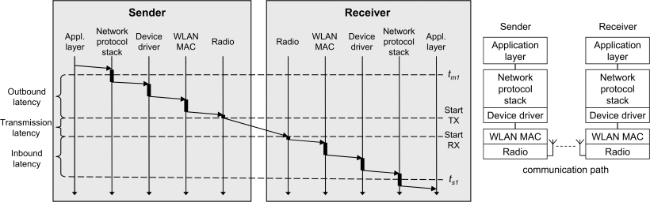

> **Figure 3.** Latencies involved with the PTP messaging. PTP消息传递涉及的延迟。

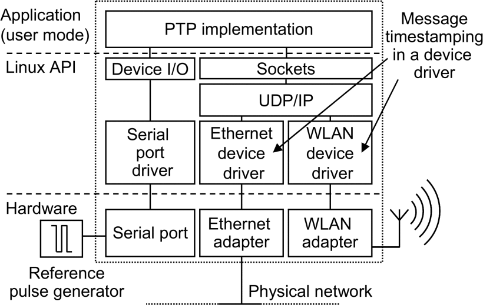

> **Figure 4.** Architecture of the Linux PC based prototype. 基于Linux PC的原型的体系结构。

In addition to the user mode application, both Ethernet and WLAN drivers have been slightly modified to generate timestamps on transmission and reception of PTP synchronization messages.

除用户模式应用程序外，对以太网和WLAN驱动程序都进行了略微修改，以在发送和接收PTP同步消息时生成时间戳。

The modified network drivers store a timestamp to a temporary variable when the network adapter raises an interrupt. The timestamp is stored when the raised interrupt is rx_frame or tx−done, and the frame contains a sync, a delay request, or response message. When the PTP implementation receives the message through UDP/IP protocol stack, it reads the timestamp from the device driver. Respectively, when the application needs the transmission time of the last PTP message, it reads the stored timestamp from the device driver.

当网络适配器引发中断时，修改后的网络驱动程序会将时间戳存储到临时变量中。 当引发的中断为rx_frame或tx-done，并且该帧包含同步，延迟请求或响应消息时，将存储时间戳。 当PTP实现通过UDP / IP协议栈接收消息时，它将从设备驱动程序中读取时间戳。 分别当应用程序需要最后一条PTP消息的传输时间时，它会从设备驱动程序中读取存储的时间戳。

The Linux PC prototype measurement setup is presented in Figure 5. The prototype consists of a master and slave clock, a reference pulse generator, and a connecting LAN or WLAN technology.

图5显示了Linux PC原型的测量设置。该原型包括一个主时钟和一个从时钟，一个参考脉冲发生器以及一个连接的LAN或WLAN技术。

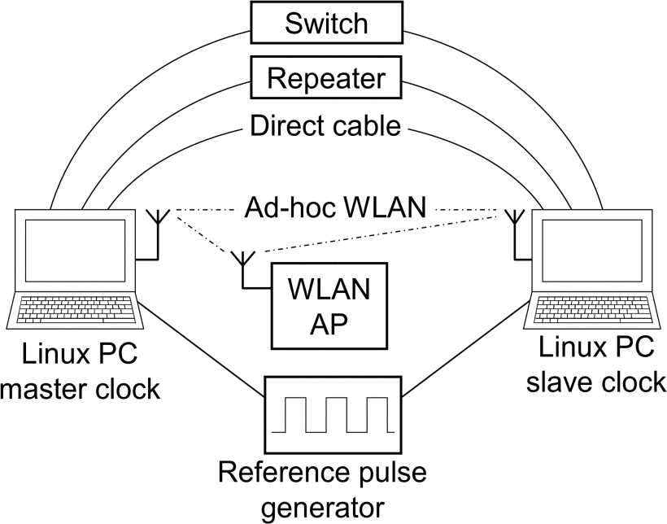

> **Figure 5.** Linux PC prototype topology and measurement arrangements. Linux PC原型拓扑和测量安排。

### B. PLD prototype PLD原型

Our second prototype is implemented using an Altera Excalibur EPXA1 [5] embedded development board. The prototype is presented in Figure 6. The board contains an ARM9 processor and PLD that are connected by AMBA Bus (AHB) and dual-port memory. A 2.4 GHz MAC'less Intersil HW 1151-EVAL radio transceiver [6] is connected to the development board with an expansion header. The transceiver contains only the radio implementation and on the radio interface it is fully compatible with the IEEE 802.11 b standard. This corresponds to a situation where the WLAN adapter manufacturer would implement the PTP functionality in a standard WLAN adapter.

我们的第二个原型是使用Altera Excalibur EPXA1 [5]嵌入式开发板实现的。 原型如图6所示。该板包含一个ARM9处理器和PLD，它们通过AMBA总线（AHB）和双端口存储器连接。 2.4 GHz无MAC Intersil HW 1151-EVAL无线电收发器[6]通过扩展接头连接至开发板。 收发器仅包含无线电实现，并且在无线电接口上与IEEE 802.11 b标准完全兼容。 这对应于WLAN适配器制造商将在标准WLAN适配器中实现PTP功能的情况。

On PLD, custom hardware accelerators and interfaces to access external devices have been implemented using VHDL.

在PLD上，已使用VHDL实现了自定义硬件加速器和用于访问外部设备的接口。

Figure 7 shows the PLD prototype functional architecture. An adaptation layer has been implemented below the PTP implementation module for necessary changes for porting the implementation to the ARM9 environment.

图7显示了PLD原型功能架构。 在PTP实施模块下方已实现了适配层，用于进行必要的更改以将实施移植到ARM9环境。

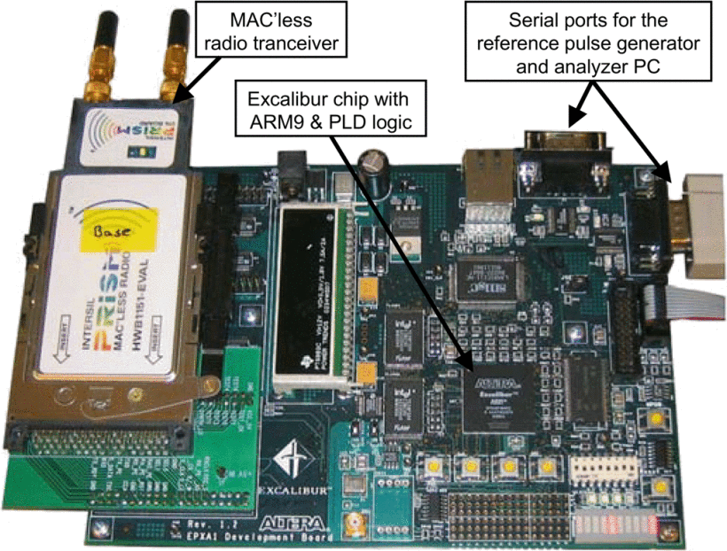

> **Figure 6.** PLD prototype implemented with Altera Excalibur EPXA1 development board. 使用Altera Excalibur EPXA1开发板实现的PLD原型。

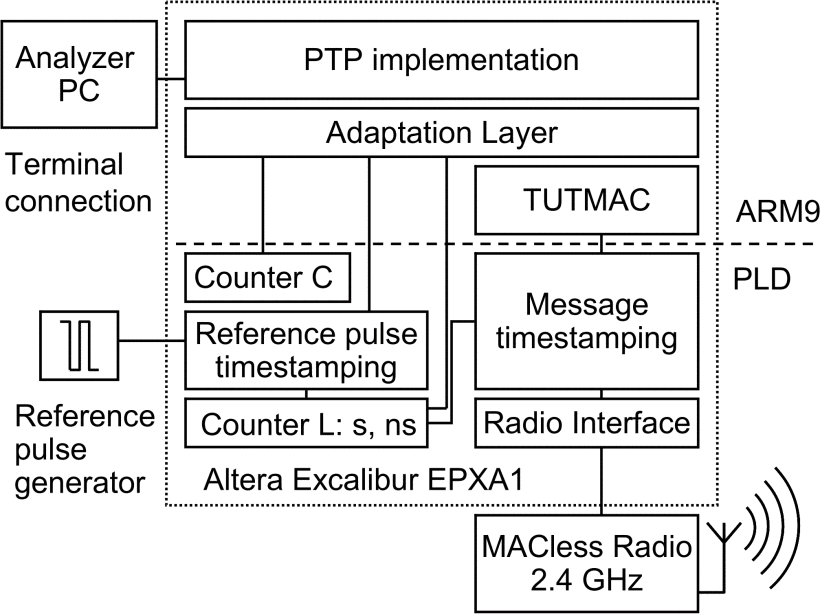

> **Figure 7.** Architecture of the PLD prototype including the reference pulse generator and the analyser PC used for measurements. PLD原型的体系结构，包括参考脉冲发生器和用于测量的分析仪PC。

The WLAN MAC protocol runs also in the ARM9 processor. The used MAC protocol is a test version of TUTMAC that is a research based custom WLAN protocol [7]. Although it is not an IEEE 802.11 MAC, it does not affect the results since the timestamping is done below the MAC layer. This corresponds to a situation where Carrier Sense Multiple Access with Collision Avoidance (CSMA/CA) mechanism in IEEE 802.11 MAC waits until the medium is free and sends the packet. Because timestamping is done after the MAC layer, the packet has a correct timestamp regardless of the medium access waiting time. Moreover, even a packet collision and retransmission does not cause inaccuracy to the results with the PLD prototype. The retransmitted packet is simply timestamped again instead of using the old timestamp.

WLAN MAC协议也在ARM9处理器中运行。 所使用的MAC协议是TUTMAC的测试版本，它是基于研究的自定义WLAN协议[7]。 尽管它不是IEEE 802.11 MAC，但由于时间戳是在MAC层下完成的，因此不会影响结果。 这对应于一种情况，其中IEEE 802.11 MAC中的带冲突避免的载波侦听多路访问（CSMA / CA）机制要等到介质空闲并发送数据包。 因为时间戳是在MAC层之后完成的，所以无论介质访问等待时间如何，数据包都具有正确的时间戳。 而且，即使是数据包冲突和重传也不会导致PLD原型的结果不准确。 重传的数据包只是简单地加上时间戳，而不是使用旧的时间戳。

The timestamping is implemented on PLD with three modules: the message timestamping, counter L, and reference pulse timestamping. Additionally, a counter C is used when adjusting the local clock frequency.

时间戳记通过三个模块在PLD上实现：消息时间戳记，计数器L和参考脉冲时间戳记。 另外，在调整本地时钟频率时使用计数器C。

The message timestamping has a direct read access to the interface signals from the radio. The radio gives a signal about transmitted and received messages between the last preamble bit of the frame header and the first data bit using the TX _ RDY signal on transmission and the RX _ RDY signal on reception. When TX _ RDY or RX _ RDY signal is set, the module stores the value of the counter as a timestamp. This is precisely the point where timestamp should be taken according to the standard.

消息时间戳可以直接读取来自无线电的接口信号。 无线电在发送时使用TX _ RDY信号，在接收时使用RX _ RDY信号在帧头的最后前同步码位和第一个数据位之间提供有关已发送和已接收消息的信号。 当设置TX_RDY或RX_RDY信号时，模块将计数器的值存储为时间戳。 这正是应该根据标准进行时间戳记的时间点。

The counter L is the local clock of the prototype. It consists of two counters, one 32 bit counter for seconds and another 32 bit counter for nanoseconds.

计数器L是原型的本地时钟。 它由两个计数器组成，一个32位计数器为秒，另一个32位计数器为纳秒。

Reference pulse timestamping is used for measuring the prototype performance. It receives pulses from the external reference pulse generator, and creates timestamps by reading the counter value. Timestamps are given to the PTP implementation module that sends them to an analyzer PC using a RS232 terminal connection. Reference pulses are not used by the PTP implementation for synchronization in any way. They are simply used for measuring the accuracy of the prototype implementation.

参考脉冲时间戳用于测量原型性能。 它接收来自外部参考脉冲发生器的脉冲，并通过读取计数器值来创建时间戳。 将时间戳提供给PTP实施模块，该模块使用RS232终端连接将其发送到分析仪PC。 PTP实施不以任何方式将参考脉冲用于同步。 它们仅用于测量原型实现的准确性。

The prototype topology and test arrangements are shown in Figure 8. The reference pulse generator triggers the PLD implementation to create a reference timestamp. The analyzer PC is connected to both clocks via RS232 connection. It collects the reference timestamps and clock values to calculate the accuracy of the prototype.

原型拓扑和测试安排如图8所示。参考脉冲发生器触发PLD实现以创建参考时间戳。 分析仪PC通过RS232连接连接到两个时钟。 它收集参考时间戳和时钟值以计算原型的准确性。

## SECTION V.Measurement Results 测量结果

Two laptop PCs and two embedded development boards were used in the measurements. Test equipment details are presented in Table 1. Both laptop PCs were equipped with 10/100 Mbit/s Ethernet NICs and 11 Mbit/s 802.11 b WLAN adapters. In Linux measurements, the 500 MHz laptop was used as a master clock and the 700 MHz laptop as a slave clock. The development boards were equipped with 11 Mbit/s WLAN transceiver radio cards that do not include the MAC protocol.

测量中使用了两台笔记本电脑和两个嵌入式开发板。 表1列出了测试设备的详细信息。两台笔记本电脑均配备了10/100 Mbit / s以太网NIC和11 Mbit / s 802.11 b WLAN适配器。 在Linux测量中，500 MHz便携式计算机用作主时钟，700 MHz便携式计算机用作从属时钟。 开发板配备了11 Mbit / s WLAN收发器无线卡，不包含MAC协议。

In each test run, the clocks were first set to different times. The length of each test was about 15 minutes on Linux and ten minutes on PLD. At first, about 5 minutes was needed before the slave clock is stabilized, depending on the original clock offset. The reference timestamps generated before the slave clock was stabilized were ignored. The rest of the corresponding timestamps were compared and the difference of each timestamp pair was calculated. The clock offset for a single test run is defined as the average of the timestamp differences. Each test run was repeated 10 times. The average offset presented in the results for a set of test runs is the average value of the 10 test run offsets, and the variance is the corresponding variance of the test run offsets.

在每个测试运行中，首先将时钟设置为不同的时间。 在Linux上，每个测试的时间约为15分钟，在PLD上，则为10分钟。 首先，从时钟稳定之前需要大约5分钟，具体取决于原始时钟偏移。 从时钟稳定之前生成的参考时间戳将被忽略。 比较其余的相应时间戳，并计算每个时间戳对之间的差异。 单个测试运行的时钟偏移定义为时间戳差异的平均值。 每个测试运行重复10次。 一组测试运行结果中显示的平均偏移是10个测试运行偏移的平均值，方差是测试运行偏移的相应方差。

The long stabilization time for the slave clock is caused by the averaging used for minimizing the affect of variation in inbound, outbound, and transmission latencies, as well as the fact that the clock adjustment algorithm is implemented to adjust the clock slowly. This way the adjustment algorithm is more stable during the normal operation. Generally, the required stabilization time depends mainly on the amount of variation in the latencies. Thus, the required time is shorter for the PLD implementation. It would also be possible to shorten the stabilization time to a less than a minute. The limiting factor is the learning of the master clock frequency because it requires several sync and delay messages to be transmitted between the clocks.

从时钟的稳定时间长是由于平均化所致，该平均化用于最大程度地减少入站，出站和传输延迟的变化的影响，以及时钟调整算法实现为缓慢调整时钟的事实。 这样，调整算法在正常操作期间更加稳定。 通常，所需的稳定时间主要取决于延迟的变化量。 因此，PLD实施所需的时间较短。 也可以将稳定时间缩短到不到一分钟。 限制因素是主时钟频率的学习，因为它需要在时钟之间传输多个同步和延迟消息。

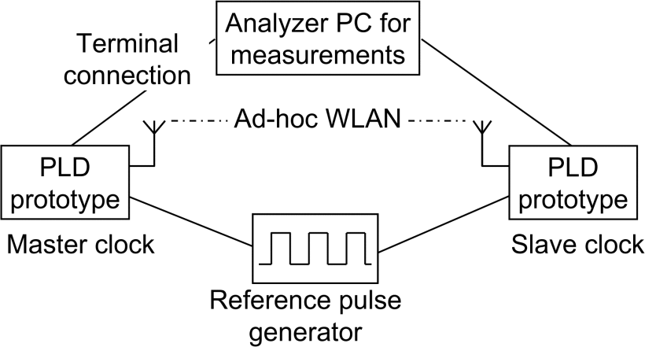

> **Figure 8**. PLD prototype topology and measurement arrangements. PLD原型拓扑和测量安排。

> **TABLE I.** Test equipment. 测试设备。

|Equipment|Description|
|---|---|
|Laptop PC 1|Intel Pentium III 500 MHz WinXP|
|Laptop PC 2|Intel Pentium III 700 MHz WinXP| 
|Direct cable|10 Mbit/s half-duplex|
|Repeater|10 Mbit/s MIL-4710H half-duplex|
|Switch|100 Mbit/s Cisco Catalyst 3500 Series XL full- duplex|
|WLAN AP|11 Mbit/s Nokia A020 802.11b WLAN AP|
|WLAN adapter|11 Mbit/s Nokia C110 802.11b|
|Development board|Altera Excalibur EPXA1 Development board|
|Radio on PLD|Intersil PRISM MAC’less Radio|

|设备|说明|
| --- | --- |
|笔记本电脑1 |英特尔奔腾III 500 MHz WinXP |
|笔记本电脑2 |英特尔奔腾III 700 MHz WinXP |
|直接电缆| 10 Mbit / s半双工|
|转发器| 10 Mbit / s MIL-4710H半双工|
|交换机| 100 Mbit / s Cisco Catalyst 3500系列XL全双工|
|WLAN AP | 11 Mbit / s诺基亚A020 802.11b WLAN AP |
|WLAN适配器| 11 Mbit / s诺基亚C110 802.11b |
|开发板| Altera Excalibur EPXA1开发板|
| PLD上的广播| Intersil PRISM MACless广播|

Five transmission technologies were used to analyze Linux PC implementation accuracy. The used technologies were direct Ethernet cable, repeater (hub) network, switched network, ad-hoc WLAN, and WLAN AP. The PLD implementation accuracy was analyzed on ad-hoc WLAN topology.

使用五种传输技术来分析Linux PC的实现准确性。 使用的技术是直接以太网电缆，中继器（hub）网络，交换网络，ad-hoc WLAN和WLAN AP。 在ad-hoc WLAN拓扑上分析了PLD的实现准确性。

The achieved accuracy of the Linux PC prototype with each technology was evaluated according to measurement arrangements presented in Figure 5. The results of each test run are presented in Figure 9. According to the measurements, the average offset reached using a direct cable connection was 1.8 μs while the variance was 0.7 μs². A repeater network is almost as accurate as the direct cable connection with 1.9 μs average offset and 0.1 μs² variance. A switched network enables 0.95 μs average offset with 0.3 μs² variance.

根据图5所示的测量布置，评估了使用每种技术所达到的Linux PC原型的精度。图9给出了每个测试运行的结果。根据测量，使用直接电缆连接所达到的平均偏移为1.8 微秒，而方差为0.7微秒。 中继器网络几乎与直接电缆连接一样精确，平均偏移为1.9μs，方差为0.1μs²。 开关网络可实现0.95μs的平均偏移，方差为0.3μs²。

In WLAN, the ad-hoc operation enables 0.66 μs average offset with 0.2 μs² variance. The WLAN AP enables the average offset of 4.6 μs with 2.5 μs² variance.

在WLAN中，ad-hoc操作可实现0.66μs的平均偏移，方差为0.2μs²。 WLAN AP使平均偏移为4.6μs，方差为2.5μs²。

Summary of the results is presented in Figure 10. For comparison, it also contains the previous Windows software measurements reported in [3]. Although different operating systems were used, both setups were measured using the same laptop PCs. The accuracy of all setups has increased several microseconds with the driver based timestamping, except for the AP setup. It shows that when AP is involved, most errors come from the delay variation in AP instead of the outbound and inbound latencies.

结果摘要如图10所示。为了进行比较，它还包含[3]中报告的以前的Windows软件度量。 尽管使用了不同的操作系统，但是两种设置都是使用同一台笔记本电脑进行测量的。 使用基于驱动程序的时间戳，除AP设置外，所有设置的精度都提高了几微秒。 它表明，当涉及到AP时，大多数错误来自AP的延迟变化，而不是出站和入站延迟。

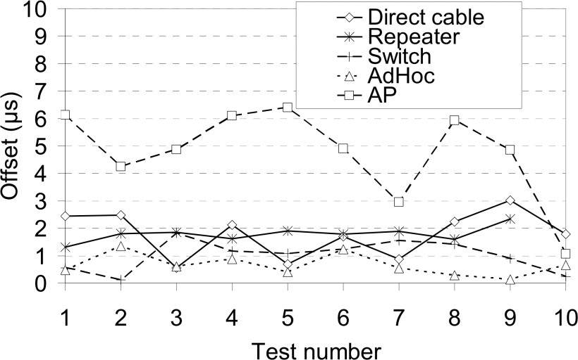

**Figure 9** Achieved offsets for the Linux PC prototype with different LAN technologies.

采用不同LAN技术的Linux PC原型获得了补偿。

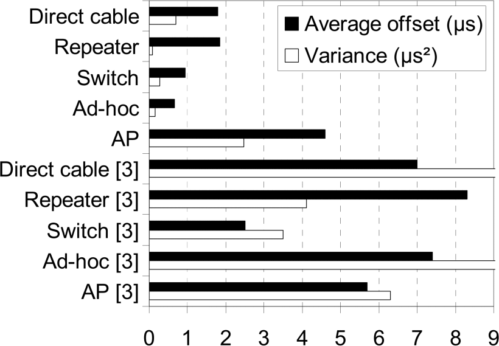

> **Figure 10** Summary of the Linux based prototype measurements compared to measurements in [3].

与[3]中的测量结果相比，基于Linux的原型测量结果的摘要。

The PLD implementation accuracy was evaluated according to the test arrangement shown in Figure 8. It uses an ad-hoc WLAN between the master and slave clock. The result is shown in Figure 11. According to the measurements the reached average offset was 1.1 ns with 3.1 ns2 variance. The synchronization accuracy is almost three decades better than with Linux PC implementation. The extremely high accuracy of this prototype results mainly from reducing the outbound and inbound latencies using hardware for the timestamping. The use of ad-hoc topology also reduces the variation in the transmission latency, since there are no additional devices involved.

根据图8所示的测试安排评估了PLD实现的准确性。它在主时钟和从时钟之间使用了ad-hoc WLAN。 结果如图11所示。根据测量，平均偏移为1.1 ns，方差为3.1 ns2。 同步精度比Linux PC实施高出近三十年。 该原型的极高准确性主要是由于使用硬件进行时间戳来减少出站和入站延迟。 自组织拓扑的使用还减少了传输延迟的变化，因为不涉及其他设备。

Usage of WLAN AP between the clocks would increase the variation in the transmission latency and decrease the accuracy. However, in [3] we presented a method called external echo that was used to completely remove the inaccuracy caused by AP. This method is based on the normal operation of an IEEE 802.11 WLAN AP. When the master clock sends a message to the slave, it is first transmitted to AP and AP transmits it to the slave. However, each transmission from the AP to the slave can also be received by the master clock because both use the same IP multicast address. The master clock takes a precise timestamp for the sync message from the reception of the frame send by AP. The precise timestamp is transmitted with the follow-up message. Combining the hardware implemented timestamping and the external echo method can be used to implement nanosecond accuracy also in the WLAN AP topology.

在时钟之间使用WLAN AP将增加传输延迟的变化并降低准确性。 然而，在[3]中，我们提出了一种称为外部回波的方法，该方法用于完全消除由AP引起的不准确性。 此方法基于IEEE 802.11 WLAN AP的正常运行。 当主时钟将消息发送到从属设备时，首先将其发送到AP，然后AP将其发送给从属设备。 但是，主时钟也可以接收从AP到从站的每次传输，因为两者都使用相同的IP多播地址。 主时钟从AP发送的帧接收中为同步消息采用精确的时间戳。 精确的时间戳与后续消息一起发送。 结合硬件实现的时间戳和外部回声方法，也可以在WLAN AP拓扑中实现纳秒精度。

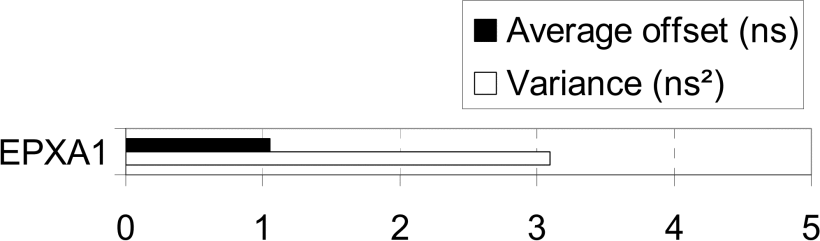

> **Figure 11** The PLD based prototype results.

基于PLD的原型结果。

## SECTION VI.Conclusions 结论

Two IEEE 1588 prototypes for WLAN were presented in this paper. The first one was implemented using a Linux PC platform and timestamps the synchronization messages in the device driver. The second prototype was implemented using an embedded development board and hardware based timestamping. The accuracy of the prototypes was measured in different setups and compared to previous work with software based timestamping prototype.

本文介绍了两个用于WLAN的IEEE 1588原型。 第一个是使用Linux PC平台实现的，并对设备驱动程序中的同步消息加了时间戳。 第二个原型是使用嵌入式开发板和基于硬件的时间戳来实现的。 在不同的设置下测量了原型的准确性，并与基于软件的带时间戳的原型进行了比较。

According to the results, the microsecond accuracy achieved by the network device driver based timestamping can be further increased to nanosecond level by implementing the timestamping with hardware. Timestamping below the MAC protocol effectively reduces the measurement errors caused by the master and slave clock implementation even in the WLAN environment and significantly improves the synchronization accuracy. Only significant error source left is the network devices between the clocks.

根据结果，通过使用硬件实施时间戳，可以将基于网络设备驱动程序的时间戳实现的微秒精度进一步提高到纳秒级。 在MAC协议下加时间戳，即使在WLAN环境中，也可以有效减少由主时钟和从时钟实现引起的测量误差，并显着提高同步精度。 剩下的唯一重要错误源是时钟之间的网络设备。

Combining the hardware based timestamping and a method for removing the accuracies caused by AP is left for the further development. Nanosecond scale accuracy enables the implementation of time critical applications also using WLAN as a transmission medium. Since the time critical applications are increasingly implemented using wireless technologies, it is essential that also WLAN device manufacturers would implement the PTP functionality in their products.

将基于硬件的时间戳和消除由AP引起的精度的方法结合起来有待进一步开发。 纳秒级的精度还可以使用WLAN作为传输介质来实现对时间要求严格的应用程序。 由于时间紧迫的应用越来越多地使用无线技术来实现，因此WLAN设备制造商也必须在其产品中实现PTP功能。

## REFERENCES

[1] IEEE std. 1588-2002 “IEEE Standard for a Precision Clock Synchronization Protocol for Networked Measurement and Control Systems”, 2002

[2] IEEE Std 802.11-1997 “Wireless Lan Medium Access Control (MAC) And Physical Layer (PHY) Specifications”, 1997

[3] Juha Kannisto, Timo Vanhatupa, Marko Hännikäinen, Timo D. Hämäläinen, ”Precision Time Protocol Prototype on Wireless LAN”, International Conference on Telecommunications (ICT 2004), August 1- 6, 2004, Fortaleza, Ceara, Brazil, pp. 1236 - 1245.

[4] Eidson, J.C.; Kang Lee, “Sharing a common sense of time”, Instrumentation & Measurement Magazine, IEEE , Volume 6, Issue 1, March 2003, pp. 26 – 32

[5] Altera Corporation, [Online], Available: http://www.altera.com

[6] Intersil, 2.4GHz 11Mbps MACless DSSS Radio HW1151-EVAL,

[Online], Available: http://www.intersil.com

[7] Petri Kukkala, Väinö Helminen, Marko Hännikäinen, Timo Hämäläinen,
”UML 2.0 Implementation of an Embedded WLAN Protocol”, IEEE International Symposium on Personal, Indoor and Mobile Radio Communications (PIMRC’2004), 2004

[8] A. Pakdaman, J. Eidson, T. Cooklev, "IEEE 1588 over IEEE 802.11b", IEEE 802.11 interim meeting, Berlin, Germany, Sept. 2004, [Online], Available: http://www.ieee802.org/11/DocFiles/04/11-04-1080-00- 0wng-ieee-1588-over-ieee-802-11.ppt

## 历史记录

|Version| Action|Time|
|:-------:|:--------:|:-----------:|
|1.0|Init|2020-07-05 15:32|