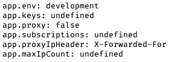

[KOA 中文文档](https://koa.bootcss.com/)

KOA 是由 Express 原班人马打造的新 Web 框架. 

## Hello World

```bash
yarn add koa
```

then

```JavaScript
var koa = require('koa');
var app = new koa();

app.use(async ctx => {
  ctx.body='Hello, World';
})
app.listen(3000);
```


## 应用程序

### 级联

```JavaScript
const Koa = require('koa');
const app = new Koa();

// logger

app.use(async (ctx, next) => {
  console.log('func1 start');
    await next();
    const rt = ctx.response.get('X-Response-Time');
    console.log(`${ctx.method} ${ctx.url} - ${rt}`);
  console.log('func1 end');
});

// x-response-time

app.use(async (ctx, next) => {
  console.log('func2 start');
    const start = Date.now();
    await next();
    const ms = Date.now() - start;
    ctx.set('X-Response-Time', `${ms}ms`);
  console.log('func2 end');
});

// response

app.use(async ctx => {
  console.log('func3 start');
    ctx.body = 'Hello World';
  console.log('func3 end');
});

app.listen(3000);
```

&nbsp;

```bash
~/Desktop/lkoa ❯ node "/Users/admin/Desktop/lkoa/main.js"       ✘ INT 3m 11s 14:39:01
func1 start
func2 start
func3 start
func3 end
func2 end
GET /44 - 2ms
func1 end
```


KOA 1 时代是用 Generate 函数来做的, 到二代改了, 这差不多相当于 yield 的影子吧.

遇到 `next()` 实际上是先跳至下一个 use, 之后再跳回来 (有 await). 如果把第一个 await 去掉, 结果会是下面这样(异步):

```bash
~/Desktop/lkoa ❯ node "/Users/admin/Desktop/lkoa/main.js"        ✘ INT 3m 59s 14:43:38
func1 start
func2 start
func3 start
func3 end
GET /44 - 
func1 end
func2 end
```


### 设置

应用程序设置是 app 实例上的属性, 官方文档给了几个设置的例子:
 
* app.env 默认是 NODE_ENV 或 "development" 
* app.keys 签名的 cookie 密钥数组 
* app.proxy 当真正的代理头字段将被信任时 
* 忽略 .subdomains 的 app.subdomainOffset 偏移量，默认为 2 
* app.proxyIpHeader 代理 ip 消息头, 默认为 X-Forwarded-For 
* app.maxIpsCount 从代理 ip 消息头读取的最大 ips, 默认为 0 (代表无限)

这有个例子:

```javascript
app.use(async ctx => {
  ctx.body = `app.env: ${app.env}
app.keys: ${app.keys}
app.proxy: ${app.proxy}
app.subscriptions: ${app.subscriptions}
app.proxyIpHeader: ${app.proxyIpHeader}
app.maxIpCount: ${app.maxIpCount}
`});
```

结果如下:




修改设置有两种方式, 一种是构造时修改:

```js
const Koa = require('koa');
const app = new Koa({ proxy: true });
```

另一种是动态修改:

```js
const Koa = require('koa');
const app = new Koa();
app.proxy = true;
```

### app.listen(...)

语法糖: 

```js
app.listen(3000);
// 等同于
http.createServer(app.callback()).listen(3000);
```

因此可以同时监听多个端口. 同样, `app.callback()` 也可以挂载到 `Connect/Express` 中.

### app.use(function)

支持链式调用. 如下:

```js
app.use(someMiddleware)
  .use(someOtherMiddleware)
  .listen(3000)
```

### app.context

是 ctx 的原型, 如下例子所示:

```js
app.context.db = 'this is db';
app.use(async ctx => {
  ctx.body = `db: ${ctx.db}`
});
```


### 错误处理

```js
app.on('error', (err, ctx) => {
  log.error('server error', err, ctx)
});
```

## 上下文 Context 

这部分见[官方文档](https://koa.bootcss.com/#-context-)

这是一个 ctx 的例子

```json
{
    "request": {
        "method": "GET",
        "url": "/44",
        "header": {
            "host": "localhost:3000",
            "connection": "keep-alive",
            "cache-control": "max-age=0",
            "dnt": "1",
            "upgrade-insecure-requests": "1",
            "user-agent": "Mozilla/5.0 (Macintosh; Intel Mac OS X 10_15_5) AppleWebKit/537.36 (KHTML, like Gecko) Chrome/83.0.4103.116 Safari/537.36",
            "accept": "text/html,application/xhtml+xml,application/xml;q=0.9,image/webp,image/apng,*/*;q=0.8,application/signed-exchange;v=b3;q=0.9",
            "sec-fetch-site": "none",
            "sec-fetch-mode": "navigate",
            "sec-fetch-user": "?1",
            "sec-fetch-dest": "document",
            "accept-encoding": "gzip, deflate, br",
            "accept-language": "zh,en;q=0.9,zh-CN;q=0.8",
            "cookie": "xxxxxxxxxxxxxxxxx"
        }
    },
    "response": {
        "status": 404,
        "message": "Not Found",
        "header": {}
    },
    "app": {
        "subdomainOffset": 2,
        "proxy": false,
        "env": "development"
    },
    "originalUrl": "/44",
    "req": "<original node req>",
    "res": "<original node res>",
    "socket": "<original node socket>"
}
```


## 历史记录

|Version|Action|Time|
|:-------:|:--------:|:-----------:|
|1.0|Init|2020-07-07 12:24|