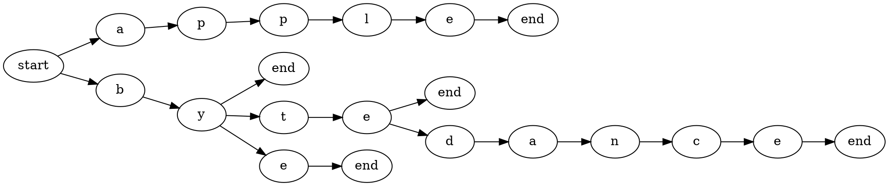

[](https://www.npmjs.com/package/kori)

项目地址: [Github](https://github.com/acdzh/kori)

## 预期

前些天在做一个 mock 组件, 需要对一些函数像按照路由进行调用, 大概像下面这样:

```javascript
// register
router.get('/user/id/:id/', ({id}) => {
  console.log(id);
});

router.post('/test/', () => {
  console.log('this is a test');
});

// use
router.handle('https://www.example.com/user/id/123456/');
```

预期仅仅使用路由组件的核心部分功能 - 路由分配算法. 但是问题是现在的路由组件要么和 http 耦合起来要么和组件耦合起来, 找了一天还是打算自己造个轮子出来算了 (其实就是懒得找)

一晚上糊了个库出来 (

## 原理

有几种常见的匹配路由的方式, 第一种一种是简单的字典匹配, 这种方式最大的优点是实现简单, 把要注册的路由挨个在字典中注册一下就完成了. 但是这种方式也有缺点, 就是不灵活. 像上面例子中的 `id` 匹配就很难做到. 另外一种方式是使用正则匹配, `React-Router` 就是这种方式, 这里先不讨论.

还有一种方式就是使用前缀树算法.

## 前缀树 (Trie) 算法

前缀树本质上是一个 DFA, 这是一个前缀树的例子:

> 使用 apple, by, bye, byte, bytedance 构造一棵前缀树.



我们可以轻易地实现这棵树.

## 实现

### Node

与上面的示例不同, 我们用一个节点 (Node) 来表示一个单词 (word), 而不是一个字符.

```javascript
/**
* The trie's node
*
* @constructor
* @param {String} word this part of path.
* @param {Boolean} [isWild = false] if is wild, eg. app/user/{id}.
*/
function Node(word, isWild = false) {
  this.word = word;
  this.isWild = isWild;
  this.children = [];
  this.father = null;
  this.canEnd = false;
  this.callback = null;
}
```

一个节点有下面几个属性:

**word:** 记录这个节点所代表的词;

**isWild:** 是否是通配符. 例如这个节点是由 `{id}` 构造的, `isWild === true`, 否则 `isWild === false`;

**children:** 孩子结点;

**father:** 父亲结点. 实际上本来是没有必要在有孩子结点属性的情况下再加上一个父亲结点属性, 但是后面会用到回溯, 可以更方便一些;

**canEnd:** 是否可以结束;

**callback:** 在当前位置结束的回调函数;

另外还有以下方法:

```javascript
Node.prototype.equals = function(node) {
  return (
    this.word === node.word this.isWild === node.isWild
  );
};


Node.prototype.match = function(word) {
  if (this.word === '*') return true;
  if (this.isWild) return true;
  if (this.word === word) return true;
  return false;
};


Node.prototype.getUrl = function() {
  const getPart =  ({ word, isWild }) => isWild ? `{${word}}` : word;
  let url = this.isWild ? getPart(this) : this.word;
  let node = this.father;
  while (node) {
    url = `${getPart(node)}/${url}`;
    node = node.father;
  }
  return url;
};


Node.prototype.debug = function(depth = 0) {
  const part = `${this.isWild ? '\{' : ''}${this.word}${this.isWild ? '\}' : ''}`;
  if (depth === 0) {
    console.log(` ┌  ${part}`);
  } else {
    const blank = [...new Array(depth)].map(() => ' │ ').join('').slice(0, -2) + '├─ ';
    console.log(blank + part);
  }
  for (let i = 0; i < this.children.length; i++) {
    this.children[i].debug(depth + 1);
  }
};
```
这些方法的作用显而易见, 不再赘述.

### Trie

```javascript
function Trie() {
  this.root = new Node('', false);
}
```

Trie 只有一个记录根结点的属性. 其重要部分在于其方法.

我们需要为 Trie 实现两个方法, `addRouter` 和 `getRouter`, 分别为添加路由和获取路由. 前者用于往前缀树中添加一条新的路由, 后者用于使用 url 尝试在前缀树中进行匹配.

#### addRouter

```javascript
/**
* add a path to this trie.
*
* @param {String} path if it doesn't start with '/', it will be added a '/'.
* @param {Function} callback callback function.
*/
Trie.prototype.addRouter = function(path, callback) {
  // ...
};
```

添加路由相对简单一些. 首先我们对传进来的 path 进行格式化并做一些必要的准备工作:

```javascript
if (path[0] === '/') {
  path = path.slice(1);
};
const parts = path.split('/');
const partsLength = parts.length;

let currentNode = this.root;
```

之后将 path 按 `/` 分割, 在已有的树上进行寻找, 如果匹配到结点就前进到该结点, 否则就新建一个子结点, 再前进到该子结点上. 最后在最后一个结点上挂上我们传入的回调函数即可. 

另外还需要稍微注意一下 `{word}` 和 `*`.

```javascript
for (let i = 0; i < parts.length; i++) {
    let word = parts[i];
    let isEnd = i === partsLength - 1 || word === '*';
    let length = word.length;
    let isWild = false;
    
    if (length > 1 && word[0] === '{' && word[length - 1] === '}') {
      isWild = true;
      word = word.slice(1, length - 1);
    }
    let tempNode = new Node(word, isWild);

    const foundNode = currentNode.children.find(node => node.equals(tempNode));

    if (foundNode) {
      if (isEnd) {
        foundNode.callback = callback;
        foundNode.canEnd = true;
      } else {
        currentNode = foundNode;
      }
    } else {
      if (isEnd) {
        tempNode.callback = callback;
        tempNode.canEnd = true;
      }
      currentNode.children.push(tempNode);
      tempNode.father = currentNode;
      currentNode = tempNode;
    }

    if (isEnd) break;
  }
```

#### getRouter

获取路由的算法和插入路由基本上是一致的. 但是需要注意的是, 因为我们有通配符 `*` 的存在, 所以在匹配失败时不能直接退出, 而是应该进行回溯, 去验证之前有没有出现过 `*`. 如果之前没有出现过 `*` 的话, 这时才能认定为匹配是失败的.

为什么不在第一次遇到 `*` 就成功返回呢? 考虑以下情况: 我们的路由是 `/a/*, /a/b/c/d`, 我们传入的 url 是 `/a/b/c/f`. 在我们第一次遇到 `*`时, 实际上并不能确定除了这条路由之外, 其他路由就一定不匹配. 我们的原则是匹配最深的路由优先, 而不是像 Gin 一样一条长路由就直接阻断其他的短路由. (在 Gin 中无法像 express 一样同时定义 `/app/static` 和 `/app/*` 两条路由, 嗯, 这非常反人类 (x

因此查找部分实现如下:

```javascript
for (let i = 0; i < parts.length; i++) {
  let word = parts[i];
  const matchNode = currentNode.children.find(node => node.word !== '*' && node.match(word));

  if (matchNode) {
    haveMatched = true;
    if (matchNode.isWild) {
      keys[matchNode.word] = word;
    }
    currentNode = matchNode;
  } else {
    const starNode = currentNode.children.find(node => node.word === '*');
    if (starNode) {
      return {
        node: starNode,
        keys,
        splat: parts.slice(i).join('/'),
      };
    }
    // looc back for '*'
    for (let j = i - 1; j >= 0; j--) {
      currentNode = currentNode.father;
      const starNode = currentNode.children.find(node => node.word === '*');
      if (starNode) {
        return {
          node: starNode,
          keys,
          splat: parts.slice(j).join('/'),
        };
      }
    }
    return nullResult;
  }
}
```

### Kori

再之后就是实现 Kori 的方法了. 实际上 Kori 只是对 `['get', 'post', ...]` 等方法分别建了一颗前缀树. 同时再加上一些格式化的代码就 👌 了.

```javascript
var qs = require('qs');
var parse = require('url-parse');
var Trie = require('./trie');

const methods = [
  'get', 'post', 'put', 'head', 'delete',
  'options', 'trace', 'copy', 'lock', 'mkcol',
  'move', 'purge', 'propfind', 'proppatch', 'unlock',
  'report', 'mkactivity', 'checkout', 'merge', 'm-search',
  'notify', 'subscribe', 'unsubscribe', 'patch', 'search', 'connect',
];

/**
*
* @constructor
*/
function Kori(base) {
  this.methods = Object.create(null);
}

/**
* set a route, support chain call.
*
* @param {String} path
* @param {String} method case insensitive。
* @param {Function} callback callback function.
*/
Kori.prototype._setRouter = function(path, method, callback) {
  if(!this.methods[method]) this.methods[method] = new Trie();
  this.methods[method].addRouter(path, callback);
  return this;
};

/**
* handle a function request
*
* @param {String} path
* @param {String} method case insensitive.
* @param {Object[]} ...args transparent transmission parameters.
*/
Kori.prototype.handle = function(url, method, ...args) {
  const parsedUrl = parse(url);
  const {pathname: path, query} = parsedUrl;
  method = method.toLowerCase();

  const trie = this.methods[method];
  if (!trie) { 
    throw new Error('not match');
    return;
  }

  const result = trie.getRouter(path);
  if (!result.node) {
    throw new Error('not match');
    return;
  }

  const { node, keys, splat }= result;
  const callback = node.callback;
  return callback({
    url,
    path,
    match: node.getUrl(),
    keys, 
    splat, 
    query: qs.parse(query.slice(1)),
    method,
  }, ...args);
};

methods.forEach(method => {
  Kori.prototype[method] = function(path, callback) {
    return this._setRouter(path, method, callback);
  }
});
```

## 其他

本来这里该有一些性能测试之类的东西, 但是并没有 (x

## 历史记录

|Version| Action|Time|
|:-------:|:--------:|:-----------:|
|1.0|Init|2020-08-12 17:41|