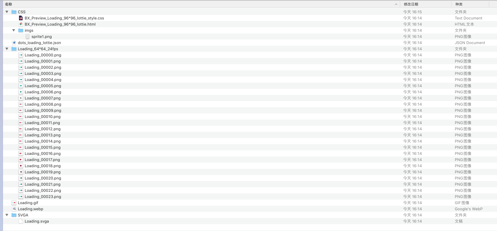
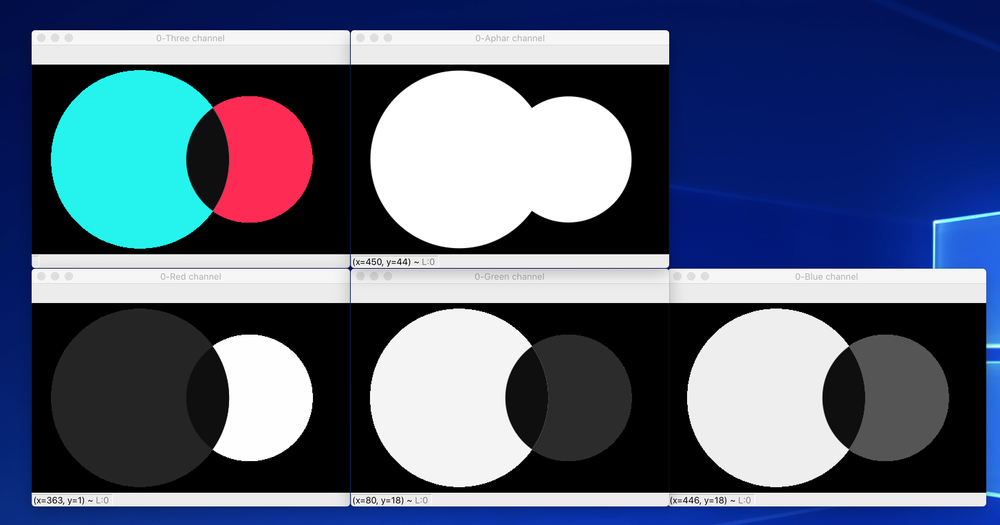
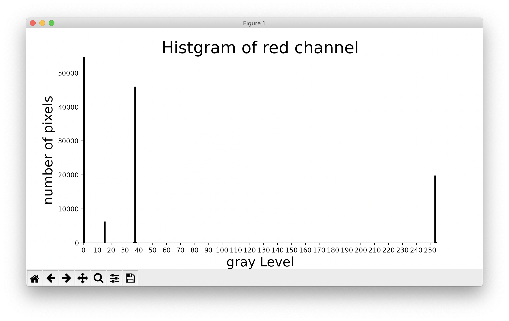
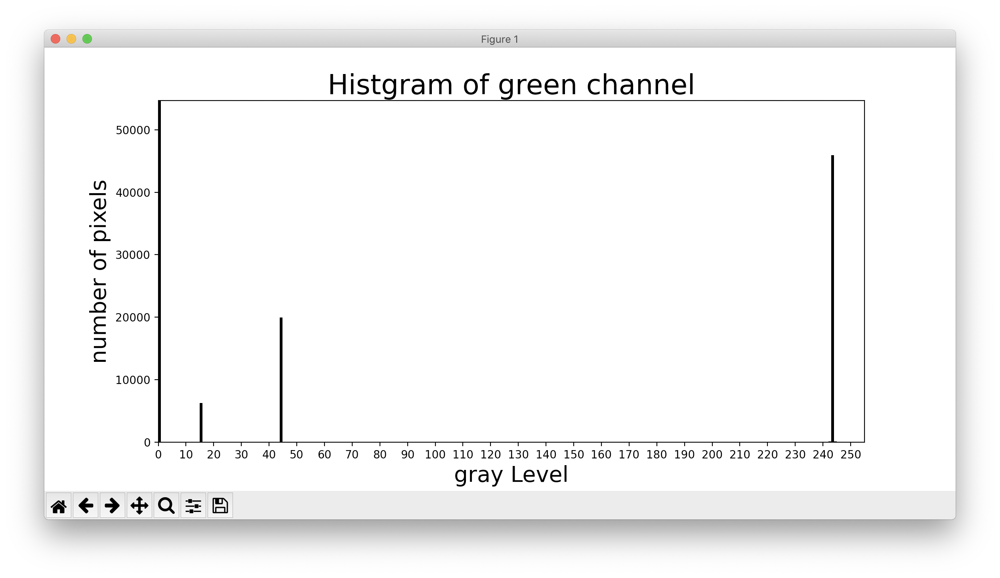
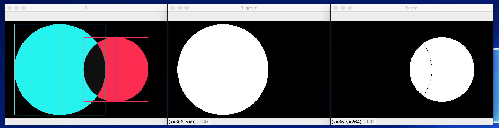

这个是上个月的事情了, 现在记录一下. 上个月有有一个需求, 要求用 SVG 实现 Tiktok 的 Loading 动画. 这个动画的 Gif 如下所示:


既然有 Gif 有为什么要再用 SVG 实现一遍呢, 还是因为这个 gif 太大了, 足足有 24KB..

## SVG

有关 svg 的实现这里不进行叙述. 基本上是三个 `circle` 和两个 `mask` 实现的.

每个 circle 的属性有三个, `cx`, `cy`, `r`.

## 动画

上面的 svg 还只是静态的, 要动起来的话需要获得每个 circle `cx`, `cy`, `r` 的变化函数. 找设计师要动画, 本来以为能有 ae 文件, 结果得到了这么一堆:



一看就知道是 ae 导出的 lottie 文件, webp 文件, gif 文件, 没法用的 svga 文件, 糊糊的逐帧图, 还有一张雪碧图, 再看一眼大小, 一个都不能用. 本来想从 ae 文件里直接看使用的动画函数, 设计师也找不到, 好在那张雪碧图足够清晰, 干脆直接在图上量出来每一帧的数据好了.

第一步是切图, 这个简单:

```python
import cv2

img = cv2.imread('sprite.png', cv2.IMREAD_UNCHANGED)
print(img.shape)
num = 0
for i in range(10):
  for j in range(6):
    print(640 * i, 640 * (i + 1), 640 * j, 640 * (j + 1))
    img_t = img[640 * i : 640 * (i+1), 640 * j : 640 * (j+1)]
    print(img_t.shape)
    cv2.imwrite(f'imgs/{num}.png', img_t)
    num += 1
```

得到了 60 张高清大图.

## 测量

之后需要对每帧进行测量. 这里的情况比较简单, 两个球是不同的颜色, 只需要分离通道后二值化即可.

选择一帧, 分离通道进行分析.

```python
img = cv2.imread('./imgs/20.png', cv2.IMREAD_UNCHANGED)
img = img[tb:bb+1, lb:rb+1] # 裁剪背景
Bch, Gch, Rch, Ach = cv2.split(img)
cv2.imshow(f'{num}-Three channel',img)
cv2.imshow(f'{num}-Blue channel',Bch)
cv2.imshow(f'{num}-Green channel',Gch)
cv2.imshow(f'{num}-Red channel',Rch)
cv2.imshow(f'{num}-Aphar channel',Ach)
```




分离绿色圆形可以使用红色通道, 分离红色球可以使用绿色通道.

分析两个通道的直方图.

```python
def analize(ch, type="none"):
  cols,rows = ch.shape
  pixelSequence = ch.reshape([rows*cols,])
  numberBins = 256

  plt.figure()
  manager = plt.get_current_fig_manager()
  histogram,bins,patch = plt.hist(pixelSequence,numberBins,facecolor='black',histtype='bar')

  y_maxValue = np.max(histogram)
  plt.axis([0, 255, 0, y_maxValue])
  plt.xlabel("gray Level", fontsize=20)
  plt.ylabel('number of pixels', fontsize=20)
  plt.title(f'Histgram of {type} channel', fontsize=25)
  plt.xticks(range(0, 255, 10))
  plt.show()

analize(Rch, 'red')
analize(Gch, 'green')
```





从图中可以发现, 我们需要红色通道的 10 - 40 部分, 绿色通道的 10 - 50 部分.

关于二值化, opencv 有一个专门的函数 [`cv2.threshold()`](https://docs.opencv.org/master/d7/d4d/tutorial_py_thresholding.html), 不过这个函数更多的是用来计算阈值的, 而且接收的参数也只包含一个阈值, 并不支持一个灰度区间, 这里的逻辑还是需要自己来写.

这是处理红色通道的函数, 粗暴地用了遍历, 不过图片大小可以接受, 就不进行优化了:

```python
def getGreenFromRch(Rch):
  h,w = Rch.shape
  thresh = Rch.copy().reshape(h*w)
  for i in range(h*w):
      if 10 < thresh[i] < 40:
          thresh[i] = 255
      else:
          thresh[i] = 0
  thresh = thresh.reshape(h,w)
  return thresh
```

最终结果如下:



每帧都进行同样的处理, 就得到了我们要的 CSS 动画帧:

```css
/* 非真实数据 */

@keyframes red-animation {
  0% {cx: 10px; r: 20px; }
  1.666% {cx: 12px; r: 21px; }
  3.333% {cx: 13px; r: 22px; }

  /* ...... */

  96.666% {cx: 13px; r: 22px; }
  98.333% {cx: 12px; r: 21px; }
  100% {cx: 11px; r: 20px; }
}
@keyframes green-animation {
  /* ...... */
}
```

## 历史记录

|Version| Action|Time|
|:-------:|:--------:|:-----------:|
|1.0|Init|2020-10-19 15:44|