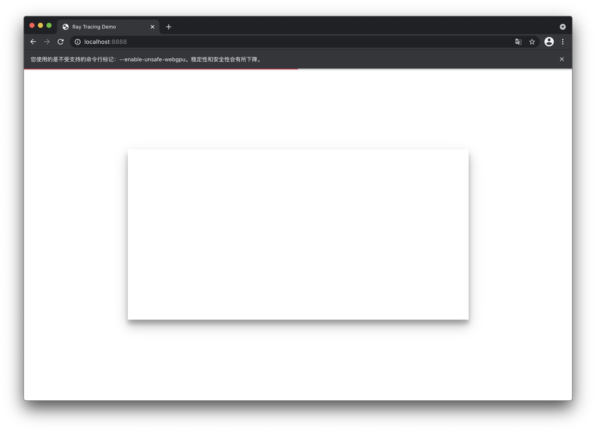
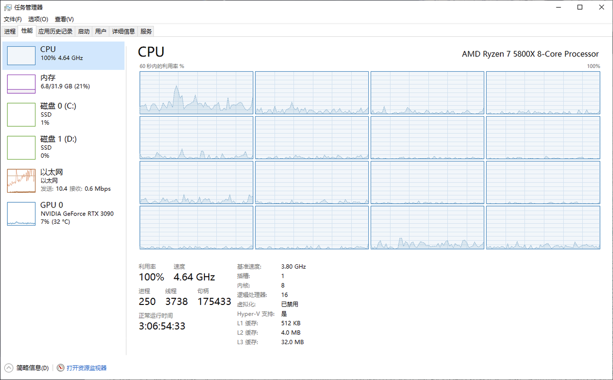
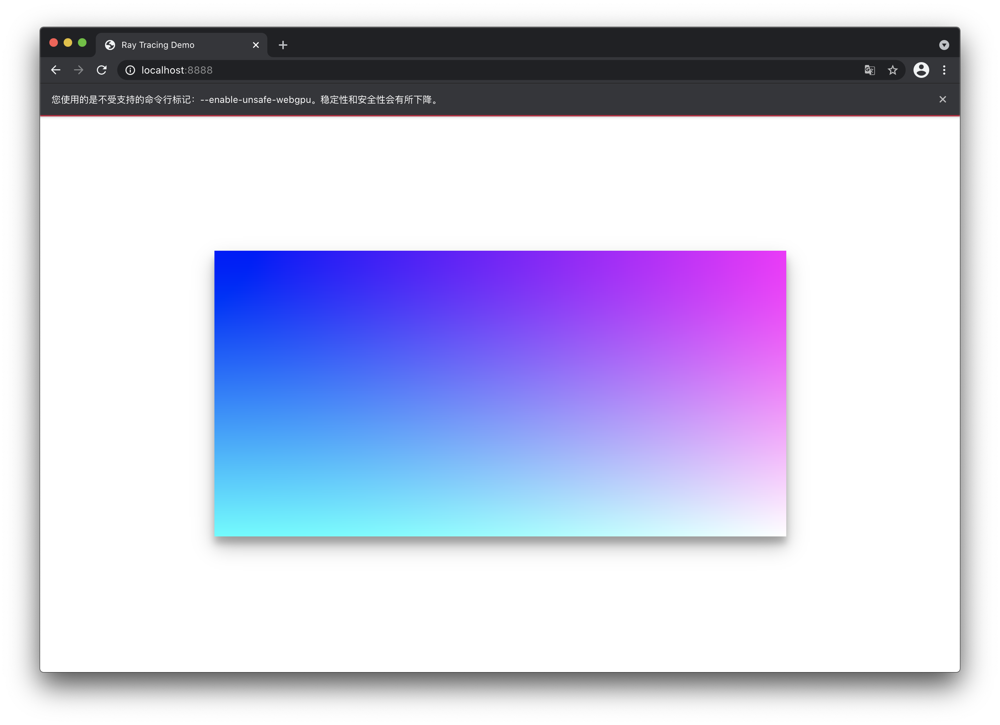
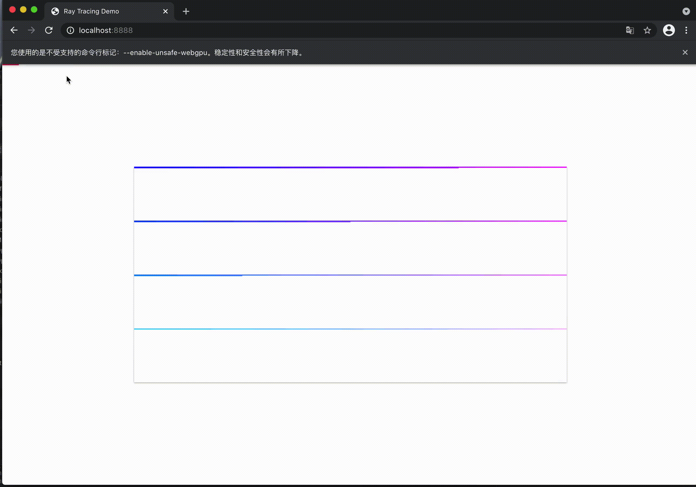
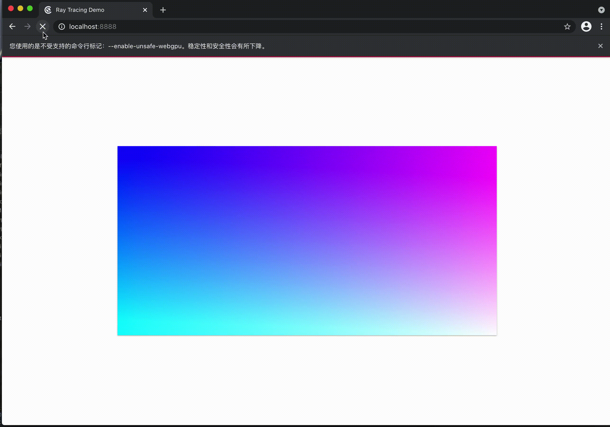
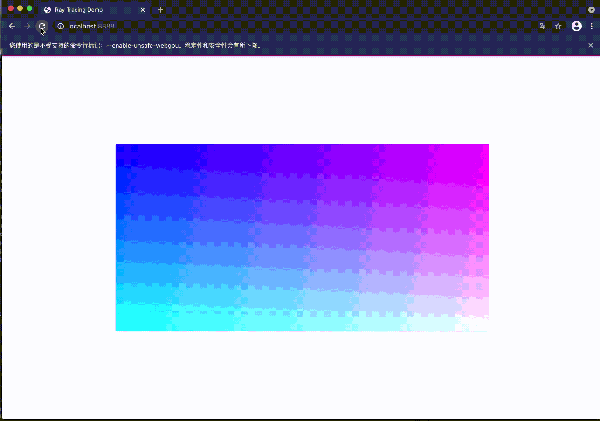

接上文 [十分钟学会光线追踪](/tec/2020-12/ray_tracing_in_10_minutes/)

该系列是 *Peter Shirley* 的 *[Ray Tracing in One Weekend](https://raytracing.github.io/books/RayTracingInOneWeekend.html)* 一书的 typescript 实现, 实现过程中参考了一些 https://zhuanlan.zhihu.com/p/42218384 的代码, 感谢.

## 准备工作

### 页面结构

首先, 构建一个用于展示的场景. 我们需要一个 canvas 用来展示最终的结果, 以及一个用来展示进度的进度条.

`index.html`

```html
<!DOCTYPE html>
<html lang="en">
  <head>
    <title>Ray Tracing Demo</title>
    <meta charset="UTF-8">
    <link rel="stylesheet" href="./atomic.css">
    <link rel="stylesheet" href="./app.css">
    <meta name="viewport" content="width=device-width, initial-scale=1">
  </head>

  <body>
    <div class="w-full h-full relative background-white" id="app">
      <div class="processbar" id="processbar"></div>
      <canvas class="absolute-center material-card-shadow-1" id="cv"></canvas>
    </div>
    <script src="/dist/app.js"></script>
  </body>
</html>
```

`app.css` 和 `atomic.css` 都是一些简单的样式, 就不贴在这里了, 现在的效果如下所示.




之后新建一个 webpack 配置文件用来编译 typescript:

`webpack.config.js`

```js
var path = require('path')

module.exports = {
  entry: {
    'app': path.resolve(__dirname, './src/app.ts'),
    'task.worker': path.resolve(__dirname, './src/task.worker.ts')
  },
  output: {
    path: path.resolve(__dirname, './dist'),
    publicPath: '/dist/',
    filename: '[name].js',
    chunkFilename: 'chunk/[id]_[chunkhash:8].chunk.js'
  },
  devServer: {
    port: 8888,
  },
  devtool: "source-map",
  module: {
    rules: [{
      test: /\.tsx?$/,
      use: 'ts-loader',
      exclude: /node_modules/
    }]
  },
  resolve: {
    "extensions": ['.js', '.css', '.ts']
  }
}
```

配置文件有两个入口, 一个是我们的主逻辑, 另一个是渲染进程. 我们不希望渲染阻塞页面, 因此需要将此工作交给 worker 去做, 这也是上面我们添加进度条这个元素的原因.

### 主逻辑

在 `app.ts` 中, 我们首先需要获取进度条和 canvas, 设定宽高. 然后初始化 task.

`app.ts`

```ts
const height = 400;
const width = 800;

let complete = 0;
const area = width * height;

const bar = document.getElementById('processbar') as HTMLDivElement;

const canvas = document.getElementById('cv') as HTMLCanvasElement;
canvas.height = height;
canvas.width = width;

const ctx = canvas.getContext('2d');
const image = ctx.createImageData(width, height);
```

在初始化 task 之前, 先定义两个容器类:

`Pixel.ts`

```ts
export default class Pixel {
  r: number;
  g: number;
  b: number;
  a: number;

  x: number;
  y: number;

  constructor(x: number, y: number) {
    this.x = x;
    this.y = y;
    this.r = this.g = this.b = this.a = 0;
  }
}
```

`RenderTask.ts`

```ts
import Pixel from './Pixel'

export default class RenderTask {
  pixels: Pixel[];
  position: number;
  width: number;
  height: number;

  constructor(pixels: Pixel[], width: number, height: number) {
    this.pixels = pixels;
    this.height = height;
    this.width = width;
  }
}
```

这里定义了两个类, 一个是用来简单描述像素的 `Pixel`, 另一个是描述队列的 `RenderTask`, `Pixel` 会被 `RenderTask` 打包装箱之后一批批送给 worker 去渲染.

接着是初始化任务, 用一个双层循环遍历每一个像素, 当一个 task 的任务装满 len 之后或者没有剩余像素之后就送去函数`performTask`.

```ts
const initTasks = (
  ctx: CanvasRenderingContext2D,
  width: number,
  height: number,
  workersCount: number
) => {
  const len = Math.ceil(area / workersCount);
  let task = new RenderTask([], width, height);

  for (let y = 0; y < height; y++) {
    for (let x = 0; x < width; x++) {
      task.pixels.push(new Pixel(x, y));
      if (task.pixels.length >= len || y * width + x === area - 1) {
        performTask(task);
        task = new RenderTask([], width, height);
      }
    }
  }
};

initTasks(ctx, width, height, 16);
```

这里的 worker 数建议按处理器来, 确保每一个核都能跑满 100% 才是最吼的. 就像下面这样, 因为到了后期随着计算量增加, 渲染会越来越慢....



`performTask` 接受一个 task, 同时为这个 task 建一个 worker, 将 task 发送到这个 worker 中执行, 并处理 worker 传回的完成的 task, 交由我们定义的 handlers 处理.

```ts
const performTask = (task: RenderTask) => {
  const worker = new Worker('./dist/task.worker.js');
  worker.postMessage({
    method: 'render',
    args: [task]
  });

  worker.onmessage = (res: {
    data: { method: string; args: any[] }
  }) => {
    const { method, args } = res.data

    if (workerMessageHandlersMap[method]) {
      workerMessageHandlersMap[method](worker, ...args)
    } else {
      alert(`app : can't find method (${method})`)
    }
  };
};
```

我们定义了两个 message handler, 他们的逻辑基本上是相同的, 不过一个用来处理 worker 传回来的部分 task, 另一个则用来处理这个 worker 完全完成所有任务时的情况. 

>这里从 worker 接收的 task 并不一定就是当初传进去的那一个 task. 后面会解释这一点.

```ts
type WorkerMessageHandlerType = (work: Worker, task?: RenderTask) => void;
type WorkerMessageHandlersMapType = {
  partComplete: WorkerMessageHandlerType;
  allComplete: WorkerMessageHandlerType;
};

const workerMessageHandlersMap: WorkerMessageHandlersMapType = {
  partComplete: (_, task) => {
    task.pixels.forEach((v, i) => {
      const position = (v.x + v.y * task.width) * 4;
      image.data[position] = v.r;
      image.data[position + 1] = v.g;
      image.data[position + 2] = v.b;
      image.data[position + 3] = v.a;
    })

    complete += task.pixels.length;
    setBar(complete / area);
    ctx.putImageData(image, 0, 0)
  },

  allComplete: (worker, task) => {
    if (task) {
      task.pixels.forEach((v) => {
        const position = (v.x + v.y * task.width) * 4;
        image.data[position] = v.r;
        image.data[position + 1] = v.g;
        image.data[position + 2] = v.b;
        image.data[position + 3] = v.a;
      })

      complete += task.pixels.length;
      setBar(complete / area);
      ctx.putImageData(image, 0, 0);
    }

    worker.terminate();
  }
};
```

到此 `app.ts` 的逻辑就结束了, 之后是我们给 worker 执行的逻辑.

## 渲染逻辑

首先我们接受 app 传过来的消息并处理. 这里也是定义了一个 handler render, 它用来计算每一个像素, 并返回计算后的结果.

```ts
type AppMessageHandlerType = (task?: RenderTask) => void;
type AppMessageHandlersMapType = {
  render: AppMessageHandlerType;
}

const appMessageHandlersMap: AppMessageHandlersMapType = {
  render: (task) => {
    const { pixels, width, height } = task;
    pixels.forEach((v, i) => {
      renderPixel(v, width, height);
    }); 
    (<any>postMessage)({
      method: 'allComplete',
      args: [task],
    });
  }
};

onmessage = e => {
  const { method, args = [] } = e.data;
  if (appMessageHandlersMap[method]) {
    appMessageHandlersMap[method](...args);
  } else {
    console.log(`taskWorker: can't find method (${method})`);
  }
};
```

`renderPixel` 这个函数我们先放一个占位在这里.

```ts
const renderPixel = (v: Pixel, width: number, height: number) => {
  v.r = (v.x / width) * 255;
  v.g = (v.y / height) * 255;
  v.b = 255;
  v.a = 255;
};
```

之后就可以看到效果如下图所示.




现在的代码有一个问题, 每个 worker 都是渲染完之后丢回 app, 我们要把进度条用起来, 因此对 render 做个小改动, 每次渲染完一部分像素就传回 app.

```ts
  render: (task: RenderTask) => {
    const { pixels, width, height } = task;
    const len = 400;

    let res = new RenderTask([], width, height);
    pixels.forEach((v, i) => {
      renderPixel(v, width, height);
      res.pixels.push(v);
      if (res.pixels.length >= len) {
        (<any>postMessage)({
          method: 'partComplete',
          args: [res]
        });
        res = new RenderTask([], width, height);
      }
    });

    (<any>postMessage)({
      method: 'allComplete',
      args: [res]
    });
  },
```

原文在这里提到:

>在后期在 chrome 内渲染的时候，计算量大了经常会提示内存不足。然后检查代码也没觉着哪内存溢出。觉得或许是 chrome 没有及时回收掉垃圾，于是用 setTimeout 中断任务后，问题就没了。

对应的改动如下:

```ts
  render: (task: RenderTask) => {
    const { pixels, width, height } = task;
    const len = 400;

    let res = new RenderTask([], width, height);

    const doTask = (i: number) => {
      for (let j = 0; j < len && i + j < pixels.length; j++) {
        renderPixel(pixels[i + j], width, height);
        res.pixels.push(pixels[i + j]);
      }

      (<any>postMessage)({
        method: 'partComplete',
        args: [res],
      });

      res = new RenderTask([], width, height);

      if (i + len < pixels.length) {
        return setTimeout(() => {
          doTask(i + len);
        }, 0);
      } else {
        (<any>postMessage)({
          method: 'allComplete',
          args: [res],
        });
      }
    }

    doTask(0);
  },
```

现在的效果如下所示:




最后 `initTask` 那里再做一个小改动, 这一部分就算完成了. 现在是将 canvas 按顺序分成四部分, 交给四个 worker 渲染. 这样可能会导致不同的 worker 之间计算任务差别过大, 因此需要随机分配像素给各个 worker.

改动如下:

```ts
const initTasks = (
  ctx: CanvasRenderingContext2D,
  width: number,
  height: number,
  workersCount: number
) => {
  const tasks: RenderTask[] = new Array(workersCount).fill(new RenderTask([], width, height));

  for (let y = 0; y < height; y++) {
    for (let x = 0; x < width; x++) {
      tasks[Math.floor(Math.random() * workersCount)].pixels.push(new Pixel(x, y));
    }
  }
  tasks.forEach(task => {
    performTask(task);
  })
};
```




或者像原文的方式, 看起来更随机一些, 观感也更好一些.

```ts
const initTasks2 = (ctx: CanvasRenderingContext2D, width: number, height: number, workersCount: number) => {
  const len = Math.ceil(area / workersCount);

  const pixels: Pixel[][] = [];
  for (let y = 0; y < height; y++) {
    pixels.push([]);
    for (let x = 0; x < width; x++) {
      pixels[y].push(new Pixel(x, y));
    }
  }

  let task = new RenderTask([], width, height);
  while (pixels.length) {
    const y = Math.floor(Math.random() * (pixels.length - 0.0001));
    const pxs = pixels[y];
    const x = Math.floor(Math.random() * (pxs.length - 0.0001));
    const px = pxs.splice(x, 1)[0];
    
    task.pixels.push(px);
    if (pxs.length == 0) {
      pixels.splice(y, 1);
    }

    if (task.pixels.length >= len || pixels.length == 0) {
      performTask(task);
      task = new RenderTask([], width, height);
    }
  }
}
```



到此这一部分就结束了.

## 历史记录

|Version| Action|Time|
|:-------:|:--------:|:-----------:|
|1.0|Init|2021-03-07 01:28:19|
