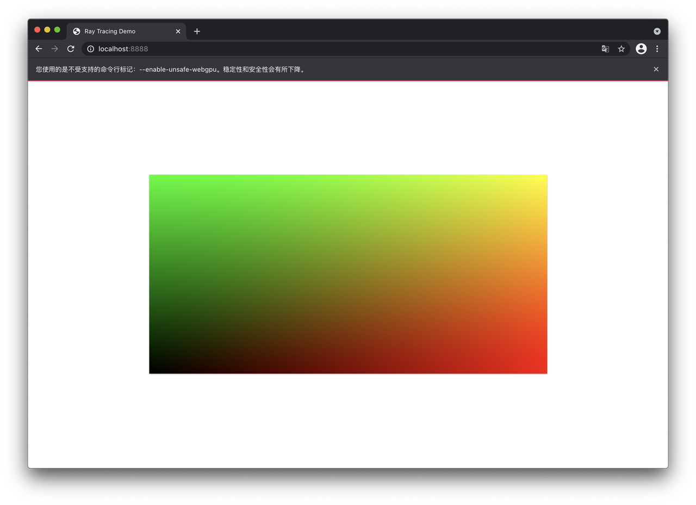
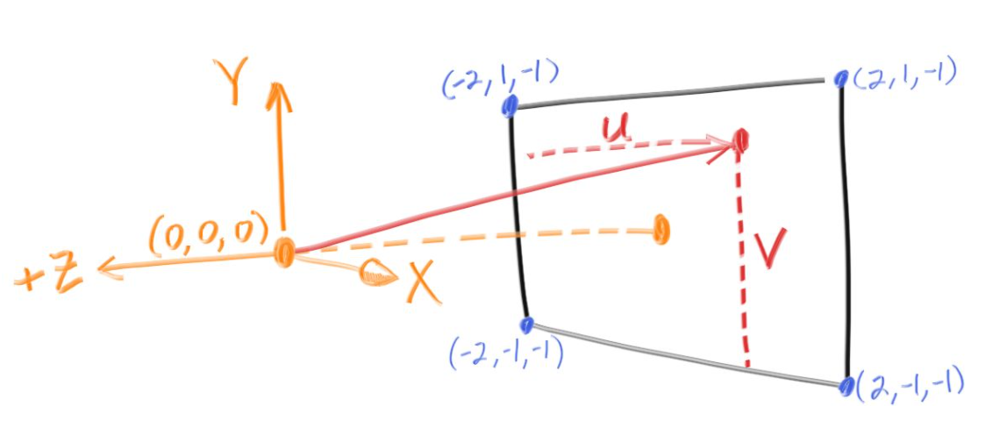
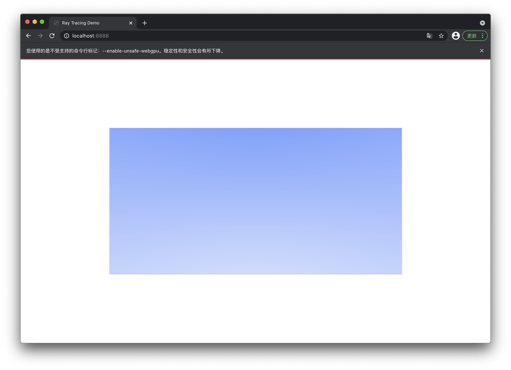
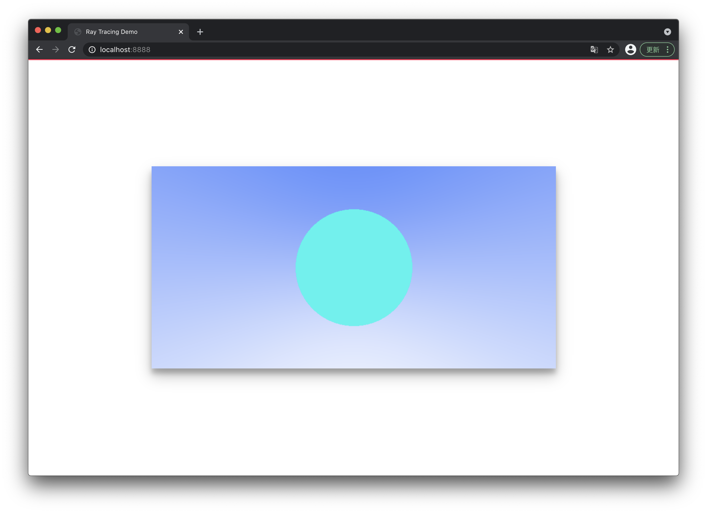
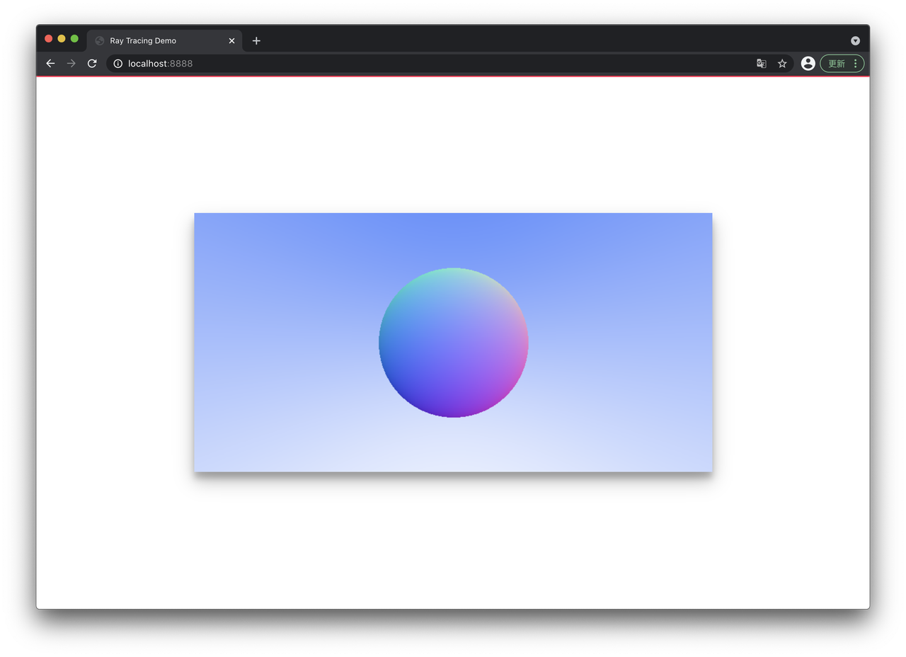
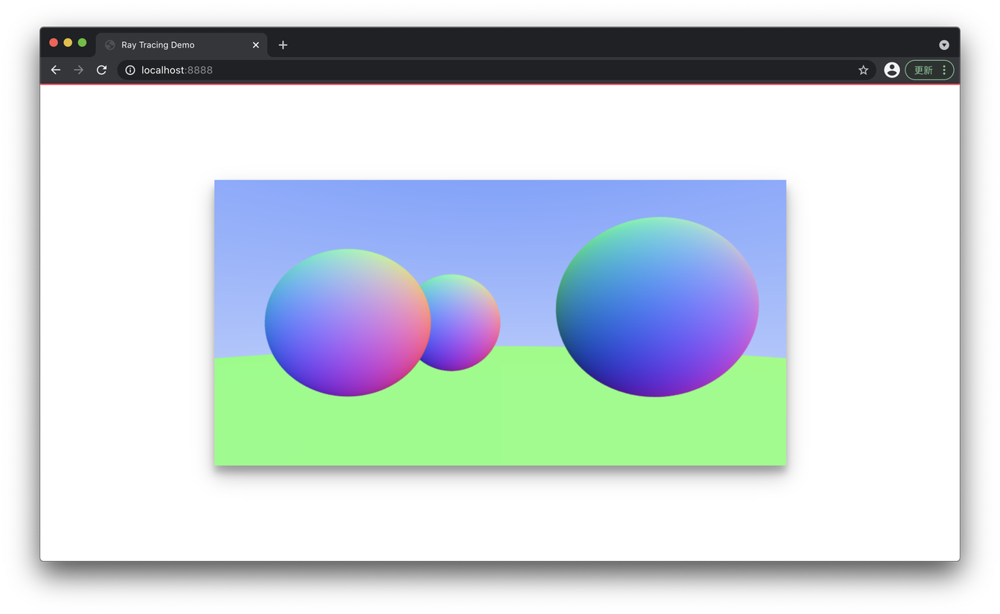

## 坐标系

### 画布坐标系

上一节中已经有了一个根据坐标来渲染的函数 `rederPixel`, 现在我们把它抽象一下, 具体渲染的逻辑交给别的函数去做.
重新定义画布坐标系, 向右为 x 正方向, 范围从 0 到 1, 向上为 y 正方向, 范围也是 0 到 1. 因为透明度基本用不到, 直接写死就可以.

```ts
const color = (x: number, y: number) => {
  return [x, y, 0];
}

const renderPixel = (
  v: Pixel,
  width: number,
  height: number) => {
  [v.r, v.g, v.b] = color(v.x / width, 1 - v.y / height).map(v => Math.floor(v * 255));
  v.a = 255;
}
```



### 空间坐标系

#### 向量

我们定义一个向量类 `Vec3`, 既能装 `x, y, z` 坐标, 也能顺便装一下 `r, g, b` 色值. 再定义一堆三维向量的运算.

```ts
export default class Vec3 {
  e0: number
  e1: number
  e2: number

  constructor(e0 = 0, e1 = 0, e2 = 0) {
    this.e0 = e0
    this.e1 = e1
    this.e2 = e2
  }

  static fill(v: number): Vec3 {
    return new Vec3(v, v, v);
  }

  static add(v1: Vec3, v2: Vec3): Vec3 {
    return new Vec3(v1.e0 + v2.e0, v1.e1 + v2.e1, v1.e2 + v2.e2);
  }

  static sub(v1: Vec3, v2: Vec3): Vec3 {
    return new Vec3(v1.e0 - v2.e0, v1.e1 - v2.e1, v1.e2 - v2.e2);
  }

  static mul(v1: Vec3, v2: Vec3): Vec3 {
    return new Vec3(v1.e0 * v2.e0, v1.e1 * v2.e1, v1.e2 * v2.e2);
  }

  static div(v1: Vec3, v2: Vec3): Vec3 {
    return new Vec3(v1.e0 / v2.e0, v1.e1 / v2.e1, v1.e2 / v2.e2);
  }

  static dot(v1: Vec3, v2: Vec3): number {
    return v1.e0 * v2.e0 + v1.e1 * v2.e1 + v1.e2 * v2.e2
  }

  static cross(v1: Vec3, v2: Vec3): Vec3 {
    return new Vec3(
      (v1.e1 * v2.e2 - v1.e2 * v2.e1),
      (v1.e0 * v2.e2 - v1.e2 * v2.e0) * (-1),
      (v1.e0 * v2.e1 - v1.e1 * v2.e0)
    )
  }

  add(v: Vec3 | number) {
    if (typeof v === 'number') {
      return Vec3.add(this, Vec3.fill(v));
    }
    return Vec3.add(this, v);
  }

  sub(v: Vec3 | number) {
    if (typeof v === 'number') {
      return Vec3.sub(this, Vec3.fill(v));
    }
    return Vec3.sub(this, v);
  }

  mul(v: Vec3 | number) {
    if (typeof v === 'number') {
      return Vec3.mul(this, Vec3.fill(v));
    }
    return Vec3.mul(this, v);
  }

  div(v: Vec3 | number) {
    if (typeof v === 'number') {
      return Vec3.div(this, Vec3.fill(v));
    }
    return Vec3.div(this, v);
  }


  squaredLength() {
    return this.e0 ** 2 + this.e1 ** 2 + this.e2 ** 2;
  }

  length() {
    return this.squaredLength()**(1/2);
  }

  unitVec() {
    return this.div(Vec3.fill(this.length()));
  }

  toArray(): number[] {
    return [this.e0, this.e1, this.e2];
  }
}
```

#### 光线

下面实现一个光线追踪的核心类, `Ray` 光线类, 包括光线的起始点和方向, 以及一个计算在 `t` 时间后光线位置的方法.

```ts
import Vec3 from './Vec3';

export default class Ray {
  origin: Vec3;
  direction: Vec3;

  constructor(origin: Vec3, direction: Vec3) {
    this.origin = origin;
    this.direction = direction.unitVec();
  }

  getPoint(t: number) {
    return this.origin.add(this.direction.mul(t));
  }
}
```

`direction` 理论上是单位向量, 所以这里的 `t` 名义上是时间, 实际上与坐标系中的距离是一比一对应的 (速度为 1, 后续涉及到运动模糊时会详细这部分). 

#### Camera

接着我们先实现一个简陋的摄像机, 用来发出光线. 这个类包括两部分, 摄影机的位置和发出光线的范围, 如下图.

```ts
import Vec3 from './Vec3'
import Ray from './Ray';

export default class Camera {
  origin: Vec3;
  vertical: Vec3;
  horizontal: Vec3;
  leftBottom: Vec3;

  constructor(origin: Vec3, leftBottom: Vec3, horizontal: Vec3, vertical: Vec3) {
    this.origin = origin;
    this.leftBottom = leftBottom;
    this.vertical = vertical;
    this.horizontal = horizontal;
  }

  getRay(x: number, y: number): Ray {
    return new Ray(
      this.origin,
      this.leftBottom
        .add(this.horizontal.mul(Vec3.fill(x)))
        .add(this.vertical.mul(Vec3.fill(y)))
        .sub(this.origin));
  }
}
```



`origin` 是摄像机的坐标, `leftBottom` 是左下角的坐标, 而 `vertical` 和 `horizontal` 则是两个向量. 上图所示的摄像机构造如下:

```ts
const camera = new Camera(
  new Vec3(0, 0, 0), //origin
  new Vec3(-2, -1, -1), //leftBottom
  new Vec3(4, 0, 0), //horizontal: Vec3(2, -1, -1) - Vec3(-2, -2, -1)
  new Vec3(0, 2, 0) //vertical: Vec3(-2, 1, -2) - Vec3(-2, -1, -2)
);
```

另外 `Camera` 类还有一个获取光线的方法, 这里接受两个 $$[0, 1]$$ 的参数 (即上面提到的画布坐标), 并将它们映射到我们摄像机的投影范围上.

### 背景

下面就可以开始正式渲染了. 首先我们需要一张背景, 同时作为整个场景的光源来使用. 我们希望这张背景径向渐变, 可以根据每一点的光线方向的单位向量来生成背景颜色. 令每一条光线的单位向量 `unitDirection`, 我们可以简单计算`unitDirection` 的 y 的取值范围. 设摄像机的范围矩形 (我也不知道这个东西取个什么名好) 从上面中点为 $A$, 下边终点为 $B$, 摄像机位置为点 $O$, 那么

$$
\overrightarrow{OA} = [0, 1, 0]
$$

$$
\overrightarrow{OB} = [0, -1, 0]
$$

$$
\hat{OA} = [0, 1, 0]
$$

$$
\hat{OB} = [0, -1, 0]
$$

因此该取值范围是 $[-1, 1]$, 归一化到 $[0, 1]$ 即可. 之后我们写一个简单的蓝白渐变, 如下

```ts
import Px from '../lib/Pixel';
import Ray from '../lib/Ray';
import Vec3 from '../lib/Vec3';
import Camera from '../lib/Camera';

const camera = new Camera(
  new Vec3(0, 0, 10), //origin
  new Vec3(-2, -1, -1), //leftBottom
  new Vec3(4, 0, 0), //horizontal
  new Vec3(0, 2, 0) //vertical
);

export default (x: number, y: number) => {
  const r = camera.getRay(x, y);
  const unitDirection = r.direction.unitVec();
  const t = (unitDirection.e1 + 1) / 2;

  // color
  const res =  Vec3.add(
    new Vec3(1, 1, 1).mul(1 - t),
    new Vec3(0.3, 0.5, 1).mul(t)
  );

  return res.toArray();
}
```



## 形状

### SDF

射线与三角形求交是光线追踪渲染中计算量最大的部分, 这也是光线追踪最大的瓶颈. Nvidia 从 Turing 架构开始为 GPU 加入了 RT core, 用来处理求交, 这也是 RTX 显卡的名称来源. 在我们的玩具 demo 中, 没有复杂的模型, 因此光线与物体的碰撞检测需要交给每个形状自己判断. 因此我们抽象出一个 Hitable 接口和一个 HitRecord 类分别用来求交和记录求交结果. 代码如下

```ts
import Ray from '../base/Ray';
import HitRecord from './HitRecord';

export default interface Hitable {
  hit: (ray: Ray, t_min: number, t_max: number) => HitRecord;
}
```

`Hitable` 接口只提供定义, 具体由各个形状自行实现. 

```ts
import Vec3 from '../base/Vec3';

export default class HitRecord {
  t: number;
  p: Vec3;
  normal: Vec3;

  constructor(t = 0, p: Vec3 = new Vec3(0, 0, 0), normal: Vec3 = new Vec3(0, 0, 0)) {
    this.t = t;
    this.p = p;
    this.normal = normal;
  }
}
```

`HitRecord` 记录了时间参数 `t`, 碰撞发生的位置 `p`, 以及碰撞处的法线方向 `normal`.

### 球

下面我们实现一个球. 显然一个球需要两个值: 球心和半径.

```ts
import Vec3 from "../base/Ray";

export default class Sphere {
  center: Vec3;
  radius: number

  constructor(center: Vec3, r: number) {
    this.center = center;
    this.radius = r;
  }
}
```

此外就需要实现 `Hitable` 接口. 设光线起始点为 $O(x_O, y_O, z_O)$, 方向为向量 $\vec{d}=[d_x, d_y, d_z]$, 假设 $t$ 时间时与球表面相交, 此时光线位置为 $P(x_P, y_P, z_P)$, 那么:

$$
\overrightarrow{NP} =t\vec{d} = [ td_x, td_y, td_z] = [x_P, y_P, z_P]
$$

设球心坐标为 $C(x_C, y_C, z_C)$, 半径为 $r$ 此时满足 $||\overrightarrow{CP}|| = r$. 而

$$
\overrightarrow{CP} = \overrightarrow{CN} + \overrightarrow{OP} =  [x_O-x_C, y_O-y_C, z_O-z_C] + [td_x, td_y, td_z]
$$

综上有一元二次方程:

$$
(td_x+(x_O-x_C))^2 + (td_y+(y_O-y_C))^2 + (td_z +(z_O-z_C))^2 = r^2
$$

整理得:

$$
(\vec{d} \cdot\vec{d})t^2 + 2(\vec{d}\cdot\overrightarrow{OC})t + (\overrightarrow{OC}\cdot\overrightarrow{OC} - r^2) = 0
$$

解此方程即可.

```ts
hit(ray: Ray, t_min: number, t_max: number) {
  const oc = Vec3.sub(ray.origin, this.center);
  const a = Vec3.dot(ray.direction, ray.direction);
  const b = Vec3.dot(oc, ray.direction) * 2;
  const c = Vec3.dot(oc, oc) - this.radius ** 2;

  const Δ = b ** 2 - 4 * a * c;

  if (Δ >= 0) {
    const sqrtΔ = Math.sqrt(Δ);
    let t = (-b - sqrtΔ) / (2 * a);

    if (t > t_min && t < t_max) {
      const p = ray.getPoint(t);
      return new HitRecord(t, p, p.sub(this.center).div(this.radius));
    }

    t = (-b + sqrtΔ) / (2 * a);
    if (t > t_min && t < t_max) {
      const p = ray.getPoint(t);
      return new HitRecord(t, p, p.sub(this.center).div(this.radius));
    }
  }

  return null;
}
```

现在我们把这个球添加到空间里, 规定当光线打到球上时, 就返回绿色.

```ts
const camera = new Camera(
  new Vec3(0, 0, 0), //origin
  new Vec3(-2, -1, -1), //leftBottom
  new Vec3(4, 0, 0), //horizontal
  new Vec3(0, 2, 0) //vertical
);

const ball = new Sphere(new Vec3(0, 0, -1), 0.5)

export default (x: number, y: number) => {
  const r = camera.getRay(x, y);
  const hit = ball.hit(r, 0, Infinity);
  let res: Vec3;

  if (hit) {
    res = new Vec3(37 / 255, 244 / 255, 238 / 255);
  } else {
    const unitDirection = r.direction.unitVec();
    const t = (unitDirection.e1 + 1) / 2;
    res =  Vec3.add(
      new Vec3(1, 1, 1).mul(1 - t),
      new Vec3(0.3, 0.5, 1).mul(t)
    );
  }

  return res.toArray();
}
```



可以稍微修改一下, 用颜色来表示 `hit` 法线方向:

```
  if (hit) {
    res = hit.normal.add(1).mul(0.5);
  }
```



### [蒙特卡洛方法](https://zh.wikipedia.org/wiki/%E8%92%99%E5%9C%B0%E5%8D%A1%E7%BE%85%E6%96%B9%E6%B3%95)降噪

现在的样子看起来还好, 后期场景复杂以及引入漫反射等随机光线行为时, 可能会因为光线数量不够产生大量噪点. 因此我们可以通过一个点多重采样的方式来进行降噪.

```ts
  const n = 2000;
  [v.r, v.g, v.b] = new Array(n)
    .fill(0)
    .map(m => color((v.x + Math.random()) / width, 1 - (v.y + Math.random()) / height))
    .reduce((res, v) => res.map((item, i) => (item += v[i])), [0, 0, 0])
    .map(v => Math.floor((v / n) * 255.99));
  v.a = 255;
```

### 多个物体

下面我们实现一个 `HitList`, 这个类存储一个实现了 `Hitable` 接口的物体的数组, 自己也实现了 `Hitable` 接口, 用来计算一系列物体的 `Hit` 情况.

```ts
export default class HitList {
  list: Hitable[];

  constructor(hitables: Hitable[]) {
    this.list = hitables;
  }

  hit(ray: Ray, t_min: number, t_max: number) {
    let closestT = t_max;
    let hit: HitRecord = null;

    this.list.forEach(v => {
      const hitTemp = v.hit(ray, t_min, t_max);
      if (hitTemp && hitTemp.t < closestT) {
        hit = hitTemp;
        closestT = hitTemp.t;
      }
    });

    return hit;
  }
}
```

`HitList` 实现 `Hitable` 接口比较简单粗暴, 直接计算所有物体的 `hit`, 取最小者.

现在可以再添加几个球了, 顺便调整一下相机位置:

```ts
const camera = new Camera(
  new Vec3(0, 0, 1), // origin
  new Vec3(-2, -1, -1), // leftBottom
  new Vec3(4, 0, 0), // horizontal
  new Vec3(0, 2, 0) // vertical
);

const world = new HitList([
  new Sphere(new Vec3(-0.5, 0, -2), 0.5),
  new Sphere(new Vec3(1, 0.1, -1), 0.6),
  new Sphere(new Vec3(-1, 0, -1), 0.5),
  new Sphere(new Vec3(0, -100.5, -1), 100), // world
]);

const hit = world.hit(r, 0, Infinity);
```



## 历史记录

|Version| Action|Time|
|:-------:|:--------:|:-----------:|
|1.0|Init|2021-03-18 15:30:02|
