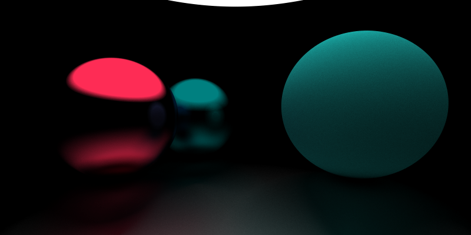

## 反射与材质

### 反射

我们可以根据碰撞点, 法线计算出反射后的新光线.


首先是新光线的方向, 先求出光线在法线上的分向量, 之后用入射光线的方向减去两倍这个分向量即为反射光线的方向.


显然 $\vec{v'} = \cfrac{\vec{v}\cdot\vec{n}}{||n||^2}\vec{n} = (\vec{v}\cdot\vec{n})\vec{n}$ (法线向量是单位向量)

那么 $\vec{v''} =\vec{v} -2 \vec{v'}$, 且 $||\vec{v''}|| = ||\vec{v}||$

因此我们可以定义一个函数用来求光线反射后的方向

```ts
export const reflect = (v: Vec3, n: Vec3): Vec3 => v.sub(n.mul(Vec3.dot(v, n) * 2));
```

给类 `Ray` 添加 `reflect` 方法

```ts
  reflect(hit: HitRecord): Ray {
    return new Ray(hit.p, reflect(this.direction, hit.normal));
  }
```

修改 `Hitable` 接口, 同时返回反射后的光线.

```ts
export type HitResult = [HitRecord,Ray];

export default interface Hitable {
  hit: (ray: Ray, t_min: number, t_max: number) => HitResult;
}
```

修改 `Sphere` 类和 `HitList` 类.

```ts
  hit(ray: Ray, t_min: number, t_max: number): HitResult {
    // ......
      if (t > t_min && t < t_max) {
        const p = ray.getPoint(t);
        const hit = new HitRecord(t, p, p.sub(this.center).div(this.radius));
        return [hit, ray.reflect(hit)];
      }

      t = (-b + sqrtΔ) / (2 * a);
      if (t > t_min && t < t_max) {
        const p = ray.getPoint(t);
        const hit = new HitRecord(t, p, p.sub(this.center).div(this.radius));
        return [hit, ray.reflect(hit)];
      }
      //......
  }

  hit(ray: Ray, t_min: number, t_max: number): HitResult {
    let closestT = t_max;
    let res: HitResult= null;

    this.list.forEach(v => {
      const resTemp = v.hit(ray, t_min, t_max);
      if (resTemp && resTemp[0].t < closestT) {
        res = resTemp;
        closestT = resTemp[0].t;
      }
    });

    return res;
  }
```

之后我们提供一个递归算法用来追踪光线路径.

```ts
const trace = (sence: Hitable, r: Ray, step = 0): Vec3 => {
  if (step > 40) return new Vec3(0, 0, 0);
  const hit = sence.hit(r, 0.0000000001, Infinity);
  let res: Vec3;

  if (hit) {
    res = trace(sence, hit[1], ++step);
  } else {
    // background (light)
    const unitDirection = r.direction.unitVec();
    const t = (unitDirection.e1 + 1) / 2;
    res = Vec3.add(new Vec3(1, 1, 1).mul(1 - t), new Vec3(0.3, 0.5, 1).mul(t));
  }
  return res;
}
```

相应修改一下 `color` 函数

```ts
export default (x: number, y: number) => trace(world, camera.getRay(x, y), 0).toArray();
```

效果如下 (相机移动到了 $[0, 0, 1]$, 第一个球移动到了 $[-\cfrac{1}{2}, 0, -2]$)


之所以求交的范围最小值不取 0 是为了消除掉从物体表面发出的光线与自己碰撞导致无限反射的影响. 否则会出现下面的错误图像:


`step > 40` 控制反射次数, 如果一条光线反射了很多次还没接触到光源(这里的光源是背景), 就意味着这里是没有光照的地方, 直接令颜色为黑. 下面是一些取值和对应的效果.

`step > 0`: 光线不进行反射


`step > 1`: 追踪光线一次反射


`step > 2`: 追踪光线两次反射


`step > 5`: 追踪光线 5 次反射


### 反射率

现在的物体还是百分百反射光线的, 因此需要我们给一个反射系数.

```
res = trace(sence, hit[1], ++step).mul(0.6);
```


有点意思了.

### 材质

材质描述了光线在物体表面是如何反射的, 以及对颜色的影响 (光线衰减). 我们定义一个`Material` 接口.

```ts
export type Attenuation = Vec3;
export type ScatterResult = [Ray, Attenuation];

export default interface Material {
  scatter: (rayIn: Ray, hit: HitRecord) => ScatterResult;
}
```

接着我们实现一个金属材质

```ts
import Material, { Attenuation } from './Material.interface'
import Ray from '../base/Ray'
import HitRecord from '../shape/HitRecord'
import Vec3 from '../base/Vec3'

export default class Metal implements Material {
  albedo: Vec3;

  constructor(albedo: number | Vec3) {
    this.albedo = new Vec3(0, 0, 0).add(albedo);
  }

  scatter(rayIn: Ray, hit: HitRecord):[Ray,Attenuation] {
    return [rayIn.reflect(hit), this.albedo];
  }
}
```

修改 `Hitable` 接口

```ts
export type HitResult = [HitRecord,Ray, Attenuation];

export default interface Hitable {
  material?: Material;
  hit: (ray: Ray, t_min: number, t_max: number) => HitResult;
}
```

修改 `Sphere` 类

```ts
export default class Sphere implements Hitable {
  center: Vec3;
  radius: number;
  material: Material;

  constructor(center: Vec3, r: number, material: Material) {
    this.center = center;
    this.radius = r;
    this.material = material; // ++
  }

  hit(ray: Ray, t_min: number, t_max: number): HitResult {
    const oc = Vec3.sub(ray.origin, this.center);
    const a = Vec3.dot(ray.direction, ray.direction);
    const b = Vec3.dot(oc, ray.direction) * 2;
    const c = Vec3.dot(oc, oc) - this.radius ** 2;

    const Δ = b ** 2 - 4 * a * c;

    if (Δ >= 0) {
      const sqrtΔ = Math.sqrt(Δ);
      let t = (-b - sqrtΔ) / (2 * a);

      if (t > t_min && t < t_max) {
        const p = ray.getPoint(t);
        const hit = new HitRecord(t, p, p.sub(this.center).div(this.radius));
        const [rayOut, attenuation] = this.material.scatter(ray, hit); // ++
        return [hit, rayOut, attenuation]; // ++
      }

      t = (-b + sqrtΔ) / (2 * a);
      if (t > t_min && t < t_max) {
        const p = ray.getPoint(t);
        const hit = new HitRecord(t, p, p.sub(this.center).div(this.radius));
        const [rayOut, attenuation] = this.material.scatter(ray, hit); // ++
        return [hit, rayOut, attenuation]; // ++
      }
    }

    return null;
  }
}
```

修改 `trace` 函数

```ts
res = trace(sence, hit[1], ++step).mul(hit[2]);
```

最后把材质信息添加到球里

```ts
const world = new HitList([
  new Sphere(new Vec3(-0.5, 0, -2), 0.5, new Metal(new Vec3(0, 0.502, 0.502))),
  new Sphere(new Vec3(1, 0.1, -1), 0.6, new Metal(new Vec3(0.145, 0.957, 0.933))),
  new Sphere(new Vec3(-1, 0, -1), 0.5, new Metal(new Vec3(0.996, 0.173, 0.333))),
  new Sphere(new Vec3(0, -100.5, -1), 100, new Metal(0.6)),
]);
```


### 漫反射


并不是所有的物体都是镜面的, 此时反射的法线并不一定是反射点表面的几何法线, 而是有一定偏移.
我们定义一个生成随机单位向量的函数.

```ts
const randomInUnitSphere = () =>
  new Vec3(Math.random(), Math.random(), Math.random()).mul(2.0).sub(new Vec3(1, 1, 1)).unitVec();
```

再给 `Metal` 加上漫反射强度属性 `fuzz`.

```ts
export default class Metal implements Material {
  albedo: Vec3;
  fuzz: number;

  constructor(albedo: number | Vec3, fuzz = 10) {
    this.albedo = new Vec3(0, 0, 0).add(albedo);
    this.fuzz = fuzz;
  }

  scatter(rayIn: Ray, hit: HitRecord): [Ray, Attenuation] {
    const ray = rayIn.reflect(hit);
    ray.direction = ray.direction.add(randomInUnitSphere().mul(this.fuzz))
    return [ray, this.albedo];
  }
}
```

修改材质

```ts
const world = new HitList([
  new Sphere(new Vec3(-0.5, 0, -2), 0.5, new Metal(new Vec3(0, 0.502, 0.502), 0.5)),
  new Sphere(new Vec3(1, 0.1, -1), 0.6, new Metal(new Vec3(0.145, 0.957, 0.933), 1.2)),
  new Sphere(new Vec3(-1, 0, -1), 0.5, new Metal(new Vec3(0.996, 0.173, 0.333), 0.2)),
  new Sphere(new Vec3(0, -100.5, -1), 100, new Metal(0.6)),
]);
```


因为光源(背景) 是蓝色的原因, 物体有一定色差. 在白色光源下是这样的


灰色光源会更加自然一些


### 理想散射材质

上面叙述的是镜面材质的反射, 而理想散射材质则颜色与反射光无关, 从任意角度看都是一样的. 其颜色仅仅由漫反射决定.

新建理想散射材质 `Lambertian` 类, 其 `scatter` 方法返回的光线方向就是沿法线方向添加随机偏移得到的.

```ts
export default class Lambertian implements Material {
  albedo: Vec3;

  constructor(albedo: number | Vec3) {
    this.albedo = new Vec3(0, 0, 0).add(albedo);
  }

  scatter(_: Ray, hit: HitRecord): [Ray, Attenuation] {
    const ray = new Ray(hit[0].position, hit.normal.add(randomInUnitSphere()));
    return [ray, this.albedo];
  }
}

```


如果不使用环境光而是使用一个球型光源的话, 对比更加明显



## 历史记录

|Version| Action|Time|
|:-------:|:--------:|:-----------:|
|1.0|Init|2021-03-18 15:37:58|
