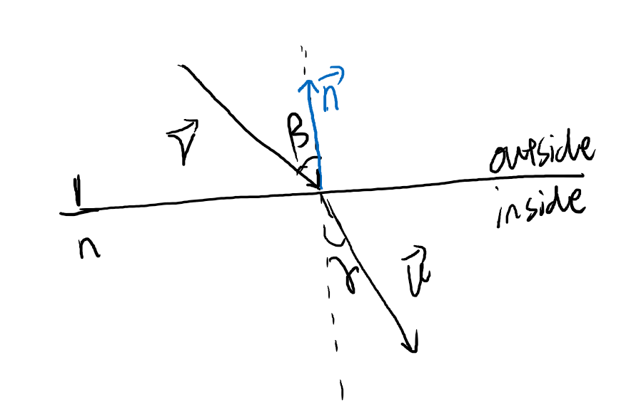
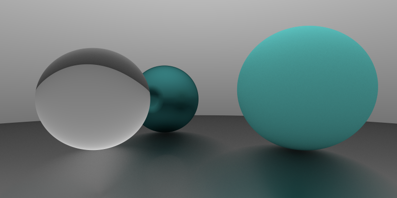
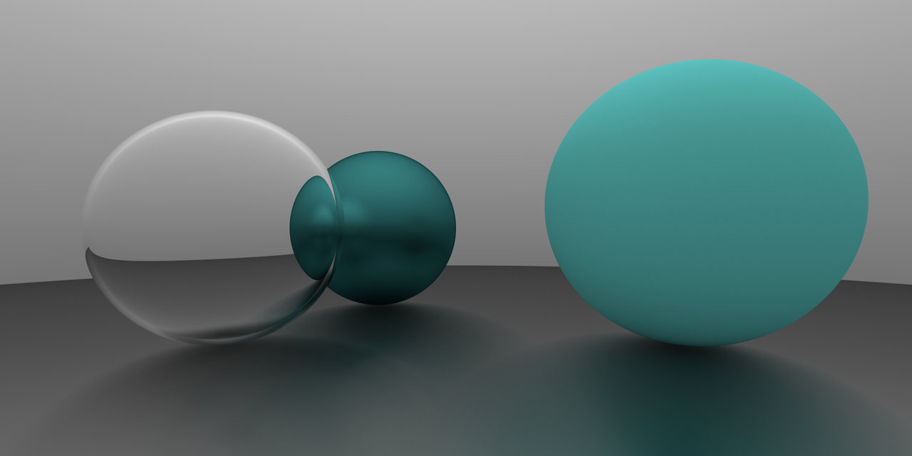
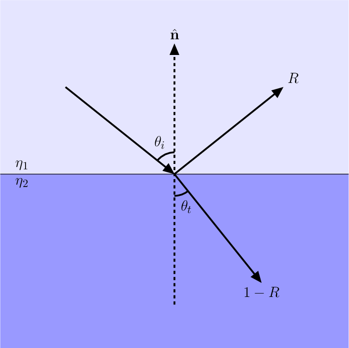
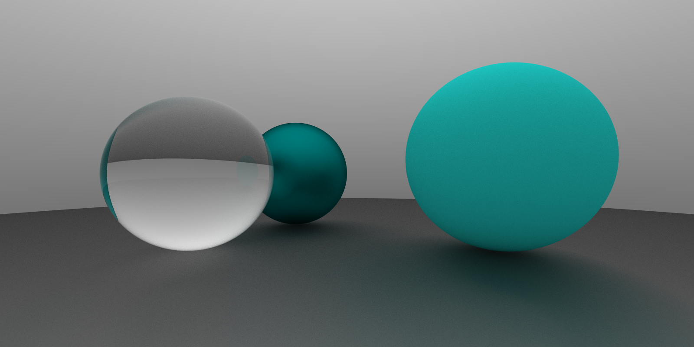
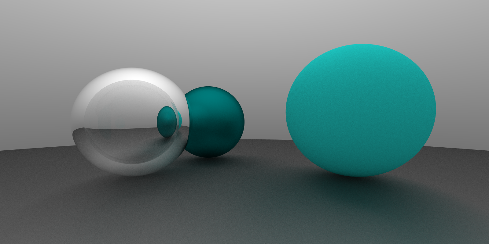

## 折射

### [斯涅尔定律](https://zh.wikipedia.org/wiki/%E6%96%AF%E6%B6%85%E5%B0%94%E5%AE%9A%E5%BE%8B)



我们需要一个折射函数, 入参为入射光线方向向量 $\vec{v}$ 和法线向量 $\vec{n}$, 以及材质的折射率.

折射率 $n=\cfrac{\sin(\beta)}{\sin(\gamma)}$.

我们有 $\cos(\beta) = - \cfrac{\vec{v}\cdot\vec{n}}{||\vec{v}||||\vec{n}||} = - \vec{v}\cdot\vec{n}$.

即 $\sin^2(\beta)=1-\cos^2(\beta)=1- (\vec{v}\cdot\vec{n})^2$.

那么 $\sin^2(\gamma)=n^2\sin^2{\beta}=(1- (\vec{v}\cdot\vec{n})^2)n^2$, $\cos^2(\gamma)=1-n^2\sin^2{\gamma}=1-(1- (\vec{v}\cdot\vec{n})^2)n^2$ 满足 $1-(1- (\vec{v}\cdot\vec{n})^2)n^2 \ge 0$ 时, 才会发生折射.

下面我们求出射光线方向 $\vec{u}$. 设 $\vec{u}$ , $\vec{v}$ 在法线上的投影分别为 $\vec{u'}$ 和 $\vec{v'}$ , 在切线上的投影分别为 $\vec{u''}$ 和 $\vec{v''}$,
显然有 $\vec{v'}=-\cos(\beta)\vec{n}$, $\vec{v''} = \vec{v} - \vec{v'}=\vec{v}+\cos(\beta)\vec{n}$.

$\vec{u'}=-\cos(\gamma)\vec{n}$, 以及 $\cfrac{\vec{u''}}{\sin(\gamma)}=\cfrac{\vec{v''}}{\sin(\beta)}$, 即 $\vec{u''}=\cfrac{\sin{\gamma}}{\sin{\beta}}\vec{v''}=n\vec{v''}$.

那么 $\vec{u}=\vec{u'}+\vec{u''}=-\cos(\gamma)\vec{n}+n(\vec{v}+\cos(\beta)\vec{n})=n(\vec{v}-(\vec{v}\cdot\vec{n})\vec{n})-\cos(\gamma)\vec{n}$.

函数如下

```ts
const refract = (v: Vec3, n: Vec3, refractivity: number) => {
  const vDotN = Vec3.dot(v, n);
  const cos2γ = 1.0 - (1 - vDotN ** 2) * refractivity ** 2;

  if (cos2γ < 0) {
    return null;
  } else {
    return v
      .sub(n.mul(vDotN))
      .mul(refractivity)
      .sub(n.mul(Math.sqrt(cos2γ)));
  }
};
```

对于折射率, 光线离开物体时折射率需取倒数. `Ray` 中的折射函数实现如下, 当不发生折射时就进行反射.

```ts
  refract(hit: HitRecord, refractivity: number) {
    const { normal } = hit;

    const isRayGoOut = Vec3.dot(this.direction, normal) > 0;
    const res = refract(
      this.direction,
      isRayGoOut ? normal.mul(-1) : normal,
      isRayGoOut ? refractivity : 1 / refractivity
    );

    if (res) {
      return new Ray(hit.p, res);
    } else {
      return this.reflect(hit);
    }
  }
```

新建一个透明材质 `Dielectric`.

```ts
export default class Dielectric implements Material {
  albedo: Vec3;
  refractivity: number;

  constructor(albedo: Vec3 | number, refractivity: number) {
    this.albedo = new Vec3(0, 0, 0).add(albedo);
    this.refractivity = refractivity;
  }

  scatter(rayIn: Ray, hit: HitRecord): [Ray, Attenuation] {
    return [rayIn.refract(hit, this.refractivity), this.albedo];
  }
}
```

给最左边的球换上新材质

```ts
new Sphere(new Vec3(-1, 0, -1), 0.5, new Dielectric(new Vec3(1, 1, 1), 1.8))
```



当折射率为 0.7 时, 效果如下



### 菲涅耳方程

实际上, 即使不发生全反射, 仍然会有部分光线发生反射. 菲涅尔方程描述了此时折射强度与反射强度的关系. 如下图所示, 反射比为 $R\in[0, 1]$, 折射比为 $T = 1 - R$, $T\in[0, 1]$



对于电介质而言, 有如下方程

$$
R_s=(\cfrac{\cos\theta_i-n\cos\theta_t}{\cos\theta_i+n\cos\theta_t})^2
$$

$$
R_p=(\cfrac{\cos\theta_t-n\cos\theta_i}{\cos\theta_t+n\cos\theta_i})^2
$$

$R_s$ 和 $R_p$ 分别表示入射光的 s 偏振和 p 偏振的反射比. 一般情况下, 不考虑偏振时, 我们认为入射光的反射比

$$
R= \cfrac{R_s + R_p}{2}
$$

这个方程可以使用菲涅耳-施里克近似法进行近似:

$$
R(\theta) \approx R(0) + (1 - R(0))(1 - \cos(\theta_i))^5
$$

>https://learnopengl.com/PBR/Theory Fresnel equation节

```ts
const schlick = (cosine: number, refractivity: number): number => {
  const r0 = ((1 - refractivity) / (1 + refractivity)) ** 2;
  return r0 + (1 + r0) * (1 - cosine) ** 5;
};
```

更新折射方法

```ts
  refract(hit: HitRecord, refractivity: number) {
    const { normal } = hit;

    const isRayGoOut = Vec3.dot(this.direction, normal) > 0;
    const consine = isRayGoOut ?
      refractivity * Vec3.dot(this.direction, hit.normal) :
      -1 * Vec3.dot(this.direction, hit.normal);

    const res = refract(
      this.direction,
      isRayGoOut ? normal.mul(-1) : normal,
      isRayGoOut ? refractivity : 1 / refractivity
    );

    if (res && Math.random() > schlick(consine, refractivity)) {
      return new Ray(hit.p, res);
    } else {
      return this.reflect(hit);
    }
  }
```
效果如下, 注意透明球的右侧的绿色反光. (后来发现这里有错误, 这两张图是在后面更新摄像机实现后重新渲染的, 因此视角与前面稍有不一致)



当折射率为 0.7 时, 效果如下



## 历史记录

|Version| Action|Time|
|:-------:|:--------:|:-----------:|
|1.0|Init|2021-03-18 16:44:19|
|1.1|修正菲涅耳方程效果示意图|2021-03-23 17:34:31|
