## 前言

十分钟学会光线追踪并不是夸大其词, 因为这里要介绍的书的原名就叫 *Ray Tracing in a Weekend*, 不涉及实现的话, 十分钟足够了. 另外相比较于传统的光栅化渲染, 光线追踪原理是更好理解的, 不同于光栅化大量的模拟与近似, 光线追踪选择了直接模拟真实世界的物理法则, 相比之下更加真实.

作为一种近年来新出现的技术, 光线追踪对游戏和渲染画质的提升是巨大的, 下面是在游戏 Minecraft 中打开和关闭光线追踪后的对比.

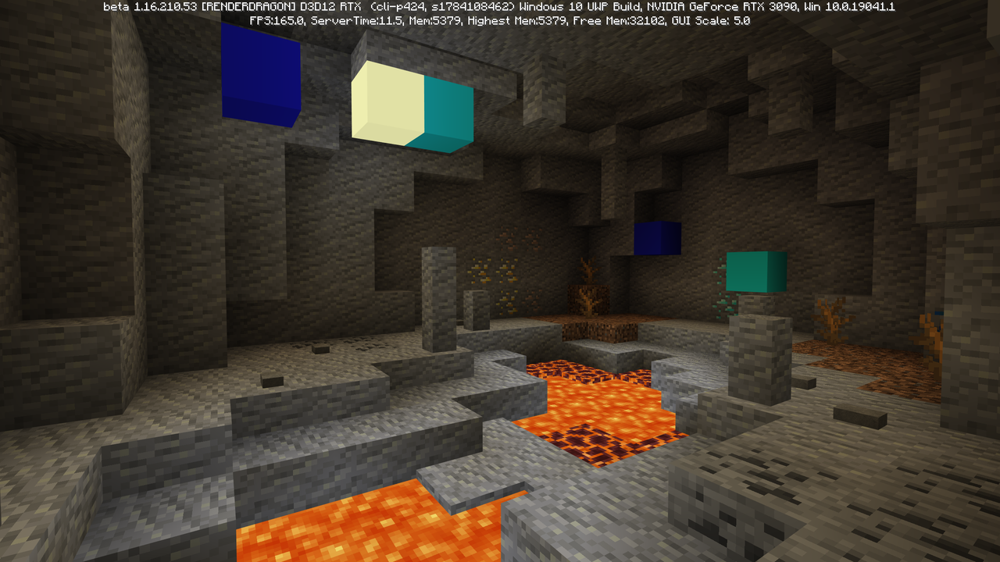

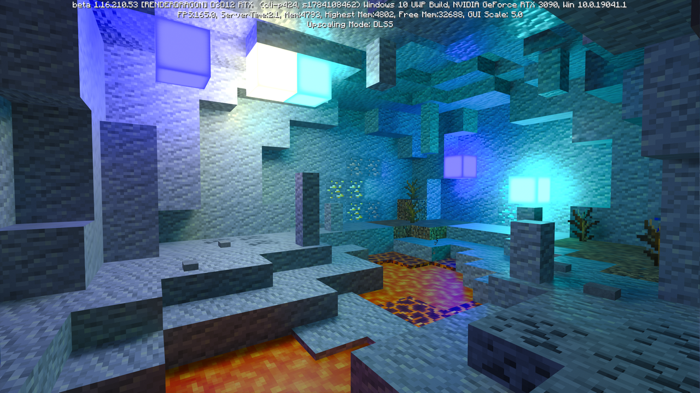

> 截图均来自 Nvidia 官方地图: 颜色、光照与阴影 RTX

可以看得出来, 在光线与颜色方面, 光线追踪提供了更加贴近现实的体验, 尤其是反射 (岩浆上青金石的反光) 与不同颜色光线互相影响 (萤石和紧挨着的钻石块) 产生的效果上.

## 光栅化与光线追踪

### 光栅化 (Rasteriztion) 

光栅化是指直接通过投影, 将三维世界中的物体直接映射到二维的屏幕上.

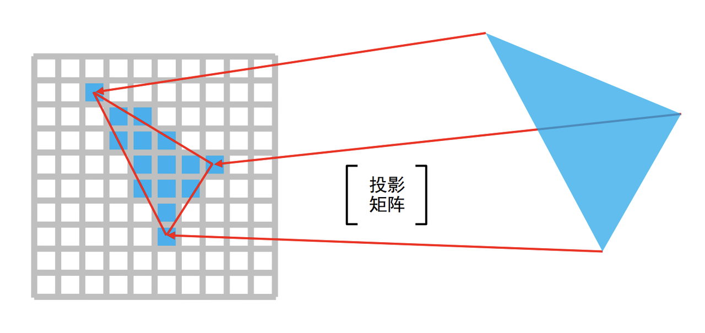

在实际的渲染过程中, 光栅化需要获得场景中每个三角形的顶点坐标, 通过矩阵变换将这些坐标映射到屏幕空间之上, 进行逐像素着色, 最后通过图形在空间中的先后关系来计算出该图形在屏幕上是否可见.

光栅化 (rasteriztion) 这个词翻译得有些奇怪, 它实际上表达的是**栅格化 / 像素化**的意思, 其实就是把空间中的矢量图形转化成平面上的像素点的过程.

从上面的渲染过程的描述中, 我们不难发现, 光栅化处理形状是没有任何问题的, 但是在处理光和颜色 (光是颜色的来源) 方面有一定的欠缺. 因此在很多效果上表现十分困难. 尤其是现实生活中最为常见的影子, 光的反射 (尤其是镜子), 折射与衍射, 颜色的混合等效果上, 光栅化表现起来十分头痛, 但是往往这些东西对观感的影响又是十分巨大的. 

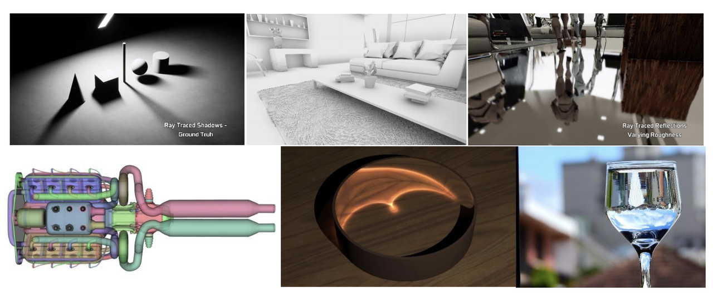

> 配图来自 Nvidia https://on-demand.gputechconf.com/gtc-cn/2018/pdf/CH8804.pdf

光栅化渲染是一项非常古老的技术了, 在几十年的发展中, 为了解决上面的问题, 人们打了许多补丁 (如 SSAO, SSR等技术). 但是最根本上解决这个问题的, 还是光线追踪的发展.

### 光线跟踪 (Ray tracing)

在谈光线追踪之前, 我们先回顾一下现实世界中,我们是怎么看到物体的. 这个原理很简单, 光源发射出某种颜色的光线, 光线照在物体上, 发生一系列反射以及颜色的变化, 最后射进人眼, 于是我们就看到了物体.

如果模拟这个过程来渲染的话, 我们需要从光源出发, 向每个方向发射出成千上亿条射线, 这些射线穿越整个图像序列. 在这个过程中, 我们对图像序列进行采样, 获取颜色信息, 依据光线吸收模型将颜色值进行累加, 直至光线穿越整个图像序列, 到达摄像机, 最后得到的颜色值就是渲染图像的颜色.

但是这是很难实现的, 就现在的算力而言, 我们不可能模拟整个过程, 尤其是在场景中有多个光源的时候. 另外, 光源发出的大量光线最终只会有一小部分到达摄像机, 这个过程有很多不需要的计算, 造成了大量的浪费, 也是无法承受的.

**光路是可逆的**, 因此, 将上述光线的传播过程反过来, 既不会造成浪费, 也有着比较好的效果, 就成了今天的光线追踪技术.

光线追踪渲染时, 光线不再是从光源发出的了, 而是从摄像机发出的. 光线从摄像机出发, 经过一系列反射最终到达光源, 整个过程反过来就是光线的真实路径.

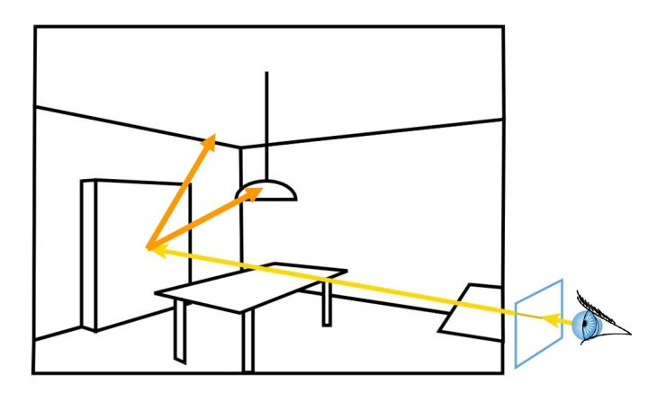

这里[有篇文章](https://zhuanlan.zhihu.com/p/29418992)详细地介绍了全局光照技术的流派及发展历史, 感兴趣的可以去详细了解一下.
因为光线追踪在一定程度上模拟了光线, 因此在渲染一些与光有关的效果时有着光栅化不可比拟的优势.

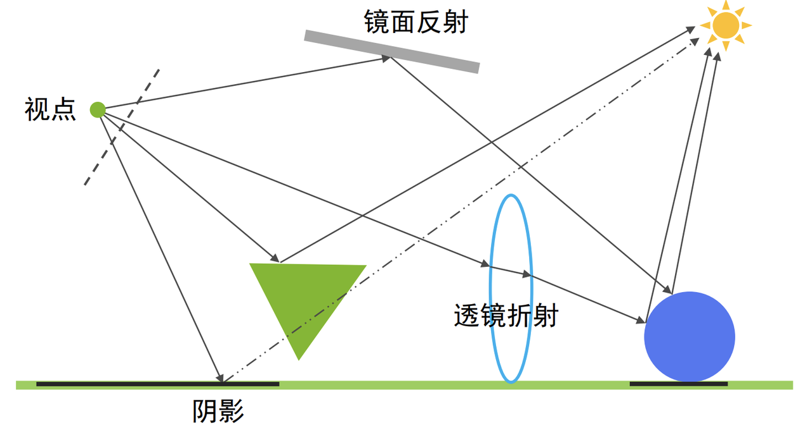

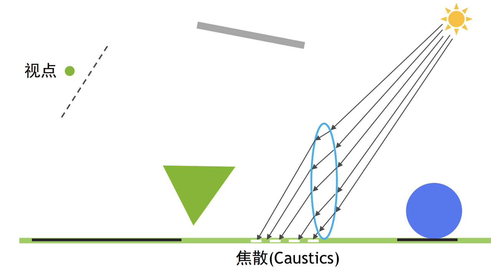

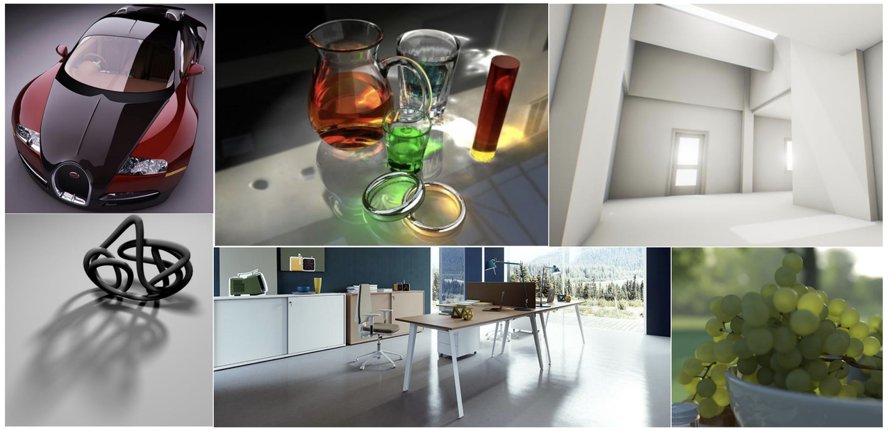

> 图片来自 Nvidia https://on-demand.gputechconf.com/gtc-cn/2018/pdf/CH8804.pdf

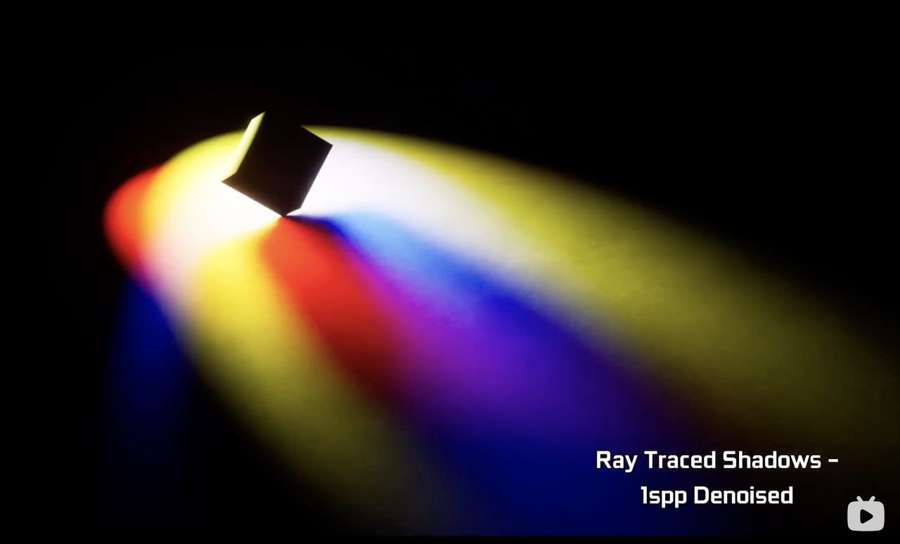

### 实时光线追踪

光线追踪最大的问题是, 运算量太大了. 光线在场景中的反射需要大量的与物体之间的求交计算, 而且还无法光栅化一样可以并行计算. 因此早期的光线追踪只能是离线渲染. 直到 Nvidia 的 20 系显卡首次引入了 RT 核心来加速求交计算, 才使得光线追踪在一定程度上成为可能.

即便如此, 光线追踪还有着比较大的性能问题, 在光线不够的情况下, 渲染出的场景中会出现大量的噪点, 因此实时的光线追踪在光线数做出妥协的同时, 需要用降噪技术来消除画面上的瑕疵.

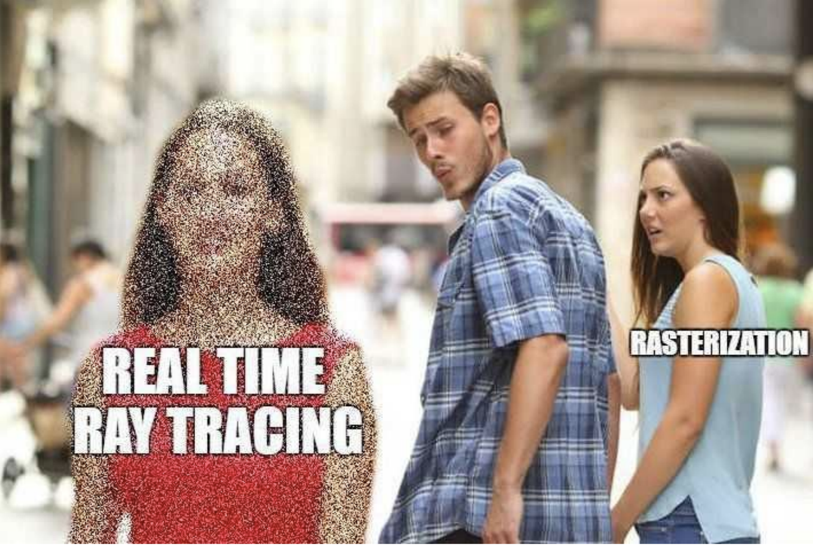

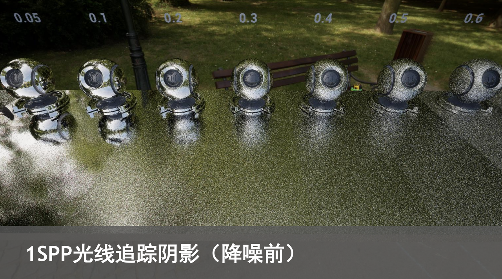

> 图片来自 Nvidia https://on-demand.gputechconf.com/gtc-cn/2018/pdf/CH8804.pdf

## 动手实现一个光线追踪渲染器

光线追踪的原理异常简单, 用几句话就可以说清楚. 因此实现一个自己的渲染器也是件非常轻松的事 (相比于传统渲染), 如果不考虑性能的话.

有许多教程, 但其中最新手友好的还是 *Peter Shirley* 的 *Ray Tracing in One Weekend* 这本书(小册子?).  该系列有三本书, 另外两本分别是 *Ray Tracing: The Next Week* 和 *Ray Tracing: The Rest Of Your Life* (已烂尾). 第一本就是本文的内容, 教你如何从零开始写出一个玩具型的渲染器.

这三本书可以在 https://github.com/RayTracing/raytracing.github.io 找到.

这一系列也有许多翻译和推荐的文章, 以及其他语言的实现.

https://zhuanlan.zhihu.com/p/24332329

https://zhuanlan.zhihu.com/p/36238483

https://zhuanlan.zhihu.com/p/321878263

https://www.duoheliangshui.xyz/2020/04/10/20041001/

在实现过程中, 参考最多的是 https://zhuanlan.zhihu.com/p/42218384 .

最后放个最终的效果图在这里

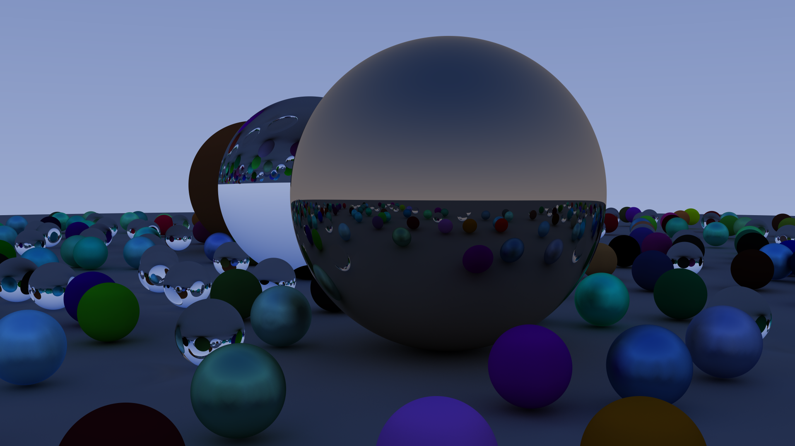

原图大小 1920x1080, 每像素采样数为 2000 次, 最大反射次数为 400 次, 与原教程相比没有实现景深. 在 AMD 5800x 上的渲染用时是 73分钟......

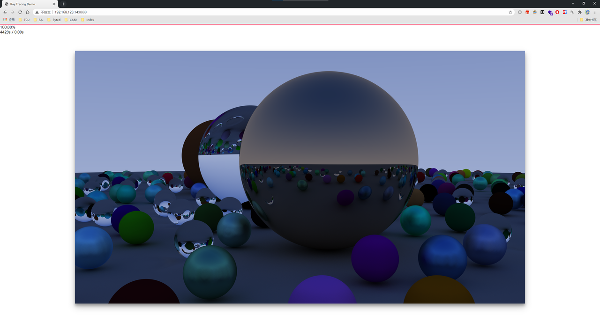

这里有个缩水版的线上 demo: https://loving-allen-4ec035.netlify.app/

具体的实现过程 (typescript 实现) 限于篇幅放在了这篇文章里, 有兴趣的话可以去看一看: [两天实现光线追踪](/tec/2020-12/realize_ray_tracing_in_two_days)

## 历史记录

|Version| Action|Time|
|:-------:|:--------:|:-----------:|
|1.0|Init|2021-03-05 14:59:20|
