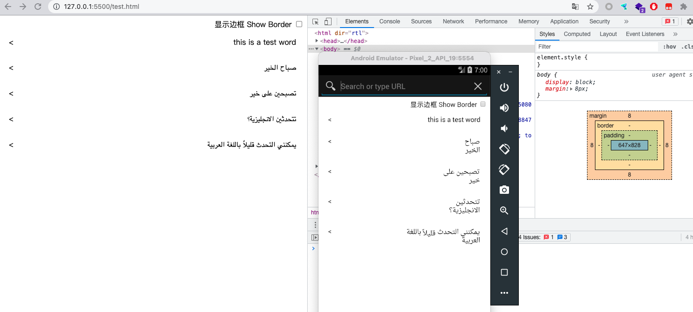

首先我们有一些原子和公共样式:

```css
.w-4 { width: 4px; }
.w-full { width: 100%; }
.h-full { height: 100%; }
.margin-0 { margin: 0; }
.padding-0 { padding: 0; }
.padding-16 { padding: 16px; }
.flex { display: flex; }
.flex-1 { flex: 1 1 0%; }
.flex-shrink-0 { flex-shrink: 0; }
.justify-between { justify-content: space-between; }
```

之后看下这个例子:

```html
<ul class="list margin-0 padding-0">
  <li class="item flex padding-16 justify-between">
    <span class="text">this is a test word</span>
    <div class="icon flex-shrink-0" >&gt;</div>
  </li>
  <li class="item flex padding-16 justify-between">
    <span class="text">صباح الخير</span>
    <div class="icon flex-shrink-0" >&gt;</div>
  </li>
  <li class="item padding-16 flex justify-between">
    <span class="text">تصبحين على خير</span>
    <div class="icon flex-shrink-0" >&gt;</div>
  </li>
  <li class="item padding-16 flex justify-between">
    <span class="text">تتحدثين الانجليزية؟</span>
    <div class="icon flex-shrink-0" >&gt;</div>
  </li>
  <li class="item padding-16 flex justify-between">
    <span class="text">يمكنني التحدث قليلاً باللغة العربية</span>
    <div class="icon flex-shrink-0" >&gt;</div>
  </li>
</ul>
```
<div style="width: 100%; text-align: center; display: flex; flex-direction: column; align-items: center;">
  <iframe src="./v1.html" style="height: 200px; min-width: 300px; width: 375px; max-width: 100%; margin-bottom: 10px;"></iframe>
  <a href="./v1.html" target="_blank">🔗 点此在新窗口中查看效果</a>
</div>

一切看起来似乎都是那么美好, 但是在 Android 4.4 下预览就有问题了: 



主要是因为 Android 4.4 无法正确判断阿拉伯语的宽度, 因此在 `justify-between` 下阿拉伯语无法撑开. 解决办法可以给 span 元素增加属性 `width: 100%` 或者 `flex: 1 1 0%` 手动帮其撑开一下. 这样表现就和上面预览一致了.

----

|Version| Action|Time|
|:-------:|:--------:|:-----------:|
|1.0|Init|2021-08-31 16:55:32|
